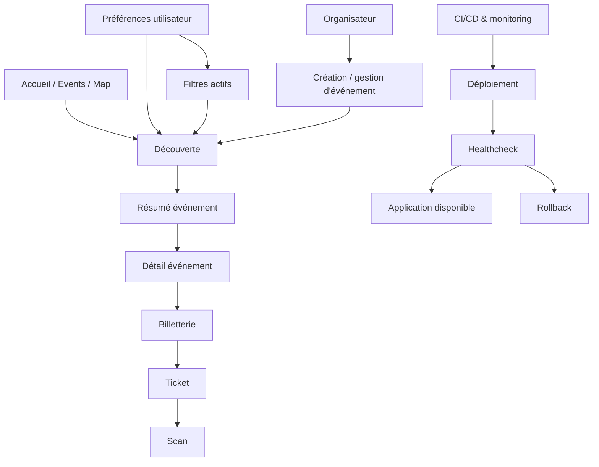

---
## `docs/02-vue-fonctionnelle/flux-metier.md`

---

# Flux métier

## Objectif de cette section

Cette page décrit les flux métier principaux du projet ONY, c’est-à-dire les enchaînements d’actions et de décisions qui structurent le fonctionnement du produit.

Contrairement à une simple liste de fonctionnalités, un flux métier permet de comprendre :

- ce qui déclenche une action ;
- quelles informations sont manipulées ;
- quel est le résultat attendu ;
- quels modules interviennent dans le parcours.

## Vue d’ensemble

Les flux métier les plus importants à ce stade sont :

1. découverte d’un événement
2. personnalisation par préférences et filtres
3. consultation d’un événement
4. achat / génération d’un billet
5. contrôle d’un billet
6. création ou gestion d’un événement côté organisateur
7. supervision technique du produit

---

## 1. Flux métier de découverte d’un événement

### Déclencheur

L’utilisateur ouvre l’application, l’accueil, la page événements ou la map.

### Étapes

- chargement d’un ensemble d’événements visibles ;
- prise en compte éventuelle des préférences utilisateur ;
- affichage sous forme de cartes, de listes ou de marqueurs ;
- tri contextuel ;
- interaction par carte, catégorie ou recherche ;
- ouverture éventuelle d’un résumé rapide.

### Résultat attendu

L’utilisateur identifie un événement pertinent à proximité ou selon ses centres d’intérêt.

### Modules impliqués

- authentification (si utilisateur connecté)
- préférences utilisateur
- événements
- catégories
- lieux
- carte
- composants de résumé

---

## 2. Flux métier de personnalisation

### Déclencheur

L’utilisateur possède des préférences ou applique de nouveaux filtres.

### Étapes

- lecture des catégories ou paramètres utilisateur ;
- application de filtres sur une vue de découverte ;
- possibilité de modifier les filtres courants ;
- possibilité de vider les filtres ;
- possibilité de réappliquer les préférences persistées.

### Résultat attendu

La vue affichée devient plus pertinente selon le contexte utilisateur, sans nécessairement modifier les préférences enregistrées.

### Modules impliqués

- profils
- user_preferences
- catégories
- carte
- liste événements
- recherche / filtres

---

## 3. Flux métier de consultation détaillée

### Déclencheur

L’utilisateur clique sur une carte, un résumé ou un événement sur la map.

### Étapes

- ouverture d’un résumé rapide ou accès direct au détail ;
- affichage des informations principales de l’événement ;
- consultation du lieu, de la date, du prix et de la description ;
- exposition des actions possibles.

### Résultat attendu

L’utilisateur dispose de suffisamment d’informations pour décider d’agir ou non.

### Modules impliqués

- événements
- lieux
- catégories
- page détail
- composants de résumé
- navigation

---

## 4. Flux métier de billetterie

### Déclencheur

L’utilisateur décide de participer à un événement ou d’obtenir un billet.

### Étapes

- déclenchement du parcours d’achat / réservation ;
- validation du contexte événement ;
- création du billet ;
- rattachement du billet à l’utilisateur et à l’événement ;
- affichage du ticket dans l’espace dédié.

### Résultat attendu

L’utilisateur dispose d’un billet consultable, lié à l’événement concerné.

### Modules impliqués

- événements
- tickets
- utilisateur connecté
- paiement simulé ou logique Stripe selon le parcours
- espace billets

---

## 5. Flux métier de scan

### Déclencheur

Un billet est présenté à l’entrée d’un événement ou dans un contexte de contrôle.

### Étapes

- lecture du QR code ou du billet ;
- recherche du ticket correspondant ;
- validation du droit d’accès ;
- traçabilité du scan ;
- retour visuel sur le statut.

### Résultat attendu

Le billet est validé ou rejeté de manière claire et exploitable.

### Modules impliqués

- tickets
- ticket_scans
- scan
- événements
- utilisateurs / rôles autorisés

---

## 6. Flux métier organisateur

### Déclencheur

Un utilisateur demande ou obtient un statut organisateur puis souhaite gérer un événement.

### Étapes

- demande de rôle organisateur ou vérification du statut ;
- accès à un espace dédié ;
- création ou modification d’un événement ;
- rattachement des informations structurantes ;
- publication dans le catalogue d’événements.

### Résultat attendu

Un organisateur peut faire apparaître ou mettre à jour un événement dans l’application.

### État actuel

Ce flux existe déjà partiellement mais reste à clarifier et à consolider dans ses règles métier.

### Modules impliqués

- profils
- organizer_requests
- événements
- lieux
- catégories
- pages organization

---

## 7. Flux métier de supervision technique

### Déclencheur

Un déploiement, une alerte ou un healthcheck nécessite une vérification.

### Étapes

- exécution du pipeline ou d’un script ;
- construction / déploiement ;
- healthcheck applicatif ;
- redémarrage PM2 si nécessaire ;
- alerte Discord ;
- rollback si échec du déploiement.

### Résultat attendu

L’application reste disponible ou revient à un état stable en cas d’incident.

### Modules impliqués

- GitLab CI/CD
- scripts de déploiement
- PM2
- Discord webhook
- healthchecks
- logs

---

## Vue d’ensemble des flux

