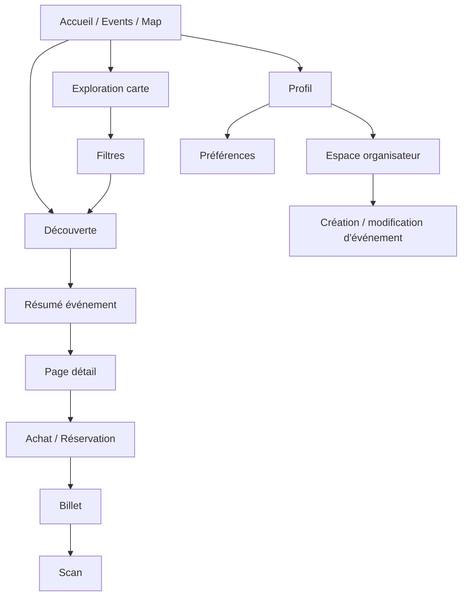

---
## `docs/02-vue-fonctionnelle/parcours-principaux.md`
---
# Parcours principaux

## Objectif de cette section

Cette page décrit les parcours principaux portés par ONY dans son état actuel.
Elle permet de comprendre comment l’utilisateur se déplace dans l’application et quelles sont les grandes chaînes d’action qui structurent le produit.

Le projet étant encore en évolution, l’objectif est de documenter les parcours réellement utiles et déjà largement engagés.

## Vue d’ensemble

Les parcours les plus structurants à ce stade sont :

1. **découverte d’événements**
2. **consultation du détail**
3. **exploration par carte et filtres**
4. **achat / récupération de billet**
5. **consultation des billets**
6. **scan de billet**
7. **gestion du profil**
8. **parcours organisateur**

## 1. Parcours de découverte d’événements

C’est le parcours central du produit.

### Point d’entrée

L’utilisateur arrive sur :

- l’accueil ;
- la page `/events` ;
- ou la carte.

### Étapes principales

- découverte des sections de contenu ;
- consultation des événements recommandés ou proches ;
- affichage de cartes événement ;
- ouverture d’un résumé rapide ;
- exploration selon la proximité ou les filtres.

### Finalité

L’objectif de ce parcours est de permettre à l’utilisateur de repérer rapidement des événements pertinents sans passer immédiatement par une page détail complète.

## 2. Parcours de consultation du détail événement

Ce parcours prolonge la découverte par un accès plus complet à l’information.

### Étapes

- sélection d’un événement depuis une carte, une liste ou la map ;
- ouverture d’un résumé court ou d’un détail ;
- accès à la page détail complète ;
- consultation :
  - du titre ;
  - du lieu ;
  - de la date ;
  - de l’horaire ;
  - du prix ;
  - de la description ;
  - des actions principales.

### Finalité

Le détail sert à aider l’utilisateur à décider s’il souhaite :

- poursuivre vers la réservation / le billet ;
- enregistrer mentalement ou fonctionnellement l’événement ;
- retourner à l’exploration.

## 3. Parcours d’exploration par carte

La carte est le cœur d’expérience d’ONY.

### Étapes

- affichage initial des événements sur carte ;
- lecture des marqueurs ;
- interaction avec les filtres ;
- recentrage éventuel sur la position utilisateur ;
- utilisation d’une catégorie ou d’une recherche ;
- synchronisation avec la liste “Plus d’événements”.

### Spécificités

Ce parcours met en avant :

- la proximité ;
- le contexte géographique ;
- l’exploration plus intuitive qu’une simple liste textuelle.

### Finalité

Permettre à l’utilisateur de naviguer spatialement dans l’offre événementielle.

## 4. Parcours de filtrage

Le filtrage complète le parcours carte et listing.

### Entrées possibles

- préférences utilisateur ;
- catégories ;
- filtres appliqués depuis la map ;
- navigation contextuelle depuis l’accueil.

### Logique

Le produit distingue :

- les **préférences persistées** de l’utilisateur ;
- les **filtres d’exploration temporaires** utilisés pendant la navigation.

### Finalité

Fournir un résultat plus pertinent sans modifier à chaque fois les préférences de fond de l’utilisateur.

## 5. Parcours d’achat / récupération de billet

Le produit intègre un parcours de ticketing simulé, déjà bien avancé dans sa logique visible.

### Étapes

- accès à un événement ;
- consultation des informations utiles ;
- action d’achat / réservation ;
- génération d’un billet ;
- association éventuelle à un QR code ;
- récupération dans l’espace billets.

### Finalité

Simuler ou préparer un parcours complet entre découverte et possession d’un ticket.

## 6. Parcours “Mes billets”

Ce parcours permet à l’utilisateur de retrouver les billets obtenus.

### Étapes

- navigation vers l’espace billets ;
- consultation d’une liste ou de cartes tickets ;
- accès à l’information essentielle du billet ;
- utilisation du QR code si nécessaire.

### Finalité

Permettre à l’utilisateur de conserver un accès simple à ses billets.

## 7. Parcours de scan de billet

Ce parcours concerne surtout la validation côté événement.

### Étapes

- accès à l’écran de scan ;
- lecture du ticket ;
- contrôle du code ;
- validation ou refus selon la logique prévue.

### Finalité

Servir de base à un contrôle d’accès événementiel.

## 8. Parcours de gestion du profil

Ce parcours regroupe les opérations liées à l’identité utilisateur.

### Étapes

- accès à la page profil ;
- consultation ou modification d’informations personnelles ;
- gestion éventuelle des préférences ;
- consultation de certaines options ou raccourcis.

### Finalité

Permettre à l’utilisateur de personnaliser son expérience et d’accéder à ses informations.

## 9. Parcours organisateur

Ce parcours est présent dans le projet mais encore en phase de consolidation.

### Étapes visées

- demande ou statut organisateur ;
- accès à un espace dédié ;
- création d’événement ;
- modification ;
- gestion des informations liées à l’événement.

### Finalité

Ouvrir le produit à un usage plus complet côté publication et gestion.

## Vue synthétique des parcours

---
