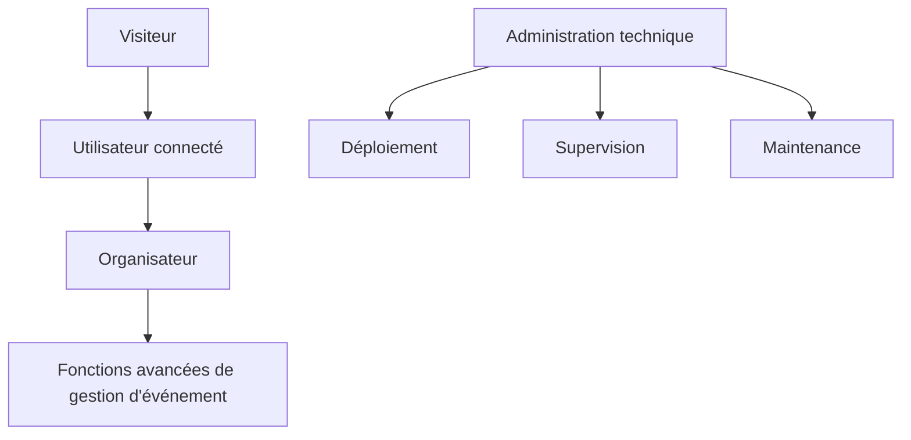

# Rôles et profils

## Objectif de cette section

Cette page décrit les principaux profils manipulés dans ONY ainsi que leur rôle fonctionnel dans l’application.

L’objectif n’est pas seulement d’identifier des types d’utilisateurs, mais aussi de clarifier :

- ce que chacun peut faire ;
- ce qui est déjà en place ;
- ce qui est prévu mais encore partiellement construit.

## Vue d’ensemble

Le modèle actuel d’ONY repose principalement sur trois niveaux de lecture :

- **visiteur / utilisateur non connecté**
- **utilisateur connecté**
- **organisateur**
- et, de manière plus implicite, un niveau de pilotage ou d’administration technique

À ce stade, le projet met surtout l’accent sur :

- l’utilisateur final ;
- la découverte d’événements ;
- le parcours organisateur en cours de structuration.

## 1. Visiteur / utilisateur non connecté

Le visiteur correspond à une personne qui consulte l’application sans être authentifiée.

### Attentes principales

- découvrir l’existence d’événements ;
- parcourir la carte ;
- consulter des listes et des fiches ;
- comprendre la valeur du service avant de créer un compte.

### Capacités attendues

Selon la configuration fonctionnelle en place, un visiteur peut généralement :

- parcourir les événements publics ;
- consulter certaines pages de listing ;
- accéder à une partie des détails ;
- visualiser la carte et la logique de découverte.

### Limites

Le visiteur ne peut pas accéder aux fonctions liées à l’identité personnelle, comme :

- les préférences utilisateur persistées ;
- les favoris ;
- les billets ;
- certaines actions de réservation ou de gestion.

## 2. Utilisateur connecté

L’utilisateur connecté constitue aujourd’hui le profil principal du produit.

Il représente la personne qui utilise ONY pour :

- découvrir des événements ;
- filtrer selon ses préférences ;
- consulter le détail d’un événement ;
- acheter ou récupérer un billet ;
- retrouver ses tickets ;
- gérer son profil.

### Capacités principales

L’utilisateur connecté peut, selon l’état actuel du projet :

- créer un compte ;
- se connecter ;
- gérer son profil ;
- définir ou exploiter des préférences ;
- parcourir la carte ;
- consulter des événements ;
- interagir avec des filtres ;
- accéder à ses billets ;
- utiliser les fonctions de scan ou de contrôle selon le rôle autorisé ;
- marquer ou consulter certains événements dans des parcours personnalisés.

### Données associées

Le profil utilisateur est lié à plusieurs informations métier :

- identité de base ;
- rôle ;
- groupe d’âge ;
- préférences de catégories ;
- distance maximale ;
- notifications activées ou non ;
- relation avec favoris, participations, vues et billets.

## 3. Organisateur

L’organisateur correspond à un utilisateur disposant d’un rôle élargi lui permettant de gérer des événements.

À ce stade du projet, cette brique existe déjà dans la structure de données et dans certaines routes applicatives, mais elle reste partiellement consolidée sur le plan métier et fonctionnel.

### Capacités visées

L’organisateur doit à terme pouvoir :

- créer un événement ;
- le modifier ;
- gérer sa publication ;
- piloter une partie des informations visibles ;
- suivre la logique de billetterie liée à ses événements ;
- scanner ou faire scanner les billets lors de l’accès à l’événement.

### Éléments déjà présents

Le projet contient déjà :

- une notion de rôle dans le profil ;
- une vérification organisateur ;
- une table de demandes organisateur ;
- des routes et des écrans liés à l’organisation ;
- une base pour la création / gestion d’événements.

### Éléments encore à consolider

Le parcours organisateur reste l’une des zones à renforcer :

- clarification des droits exacts ;
- meilleure séparation entre utilisateur standard et organisateur ;
- structuration plus propre du back métier ;
- stabilisation documentaire et fonctionnelle.

## 4. Administration technique

Le projet ne contient pas nécessairement à ce stade un back-office administrateur complet côté interface, mais il existe une réalité d’administration technique du produit.

Cette couche couvre :

- le déploiement ;
- la supervision ;
- la maintenance ;
- le monitoring ;
- la vérification de l’état applicatif ;
- la lecture des logs ;
- le rollback si nécessaire.

Ce rôle n’est pas forcément exposé comme un rôle métier dans l’application, mais il doit être documenté dans la dimension exploitation du projet.

## Représentation simplifiée

