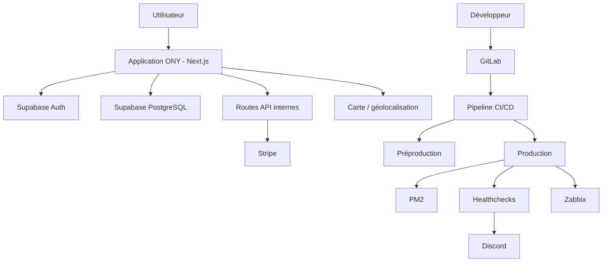
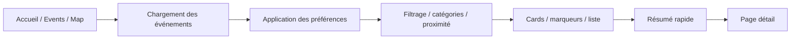
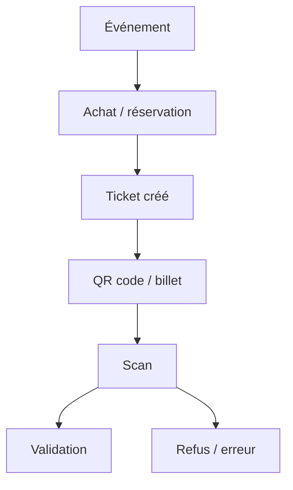
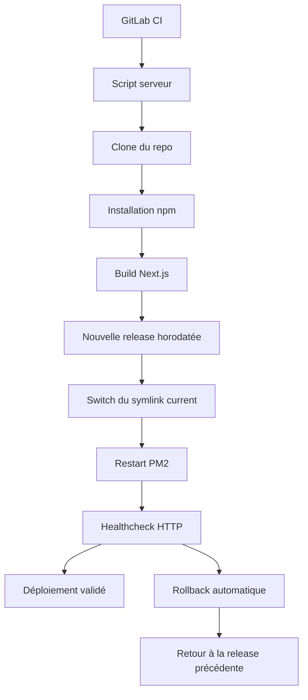
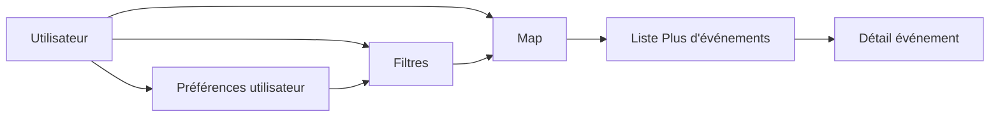
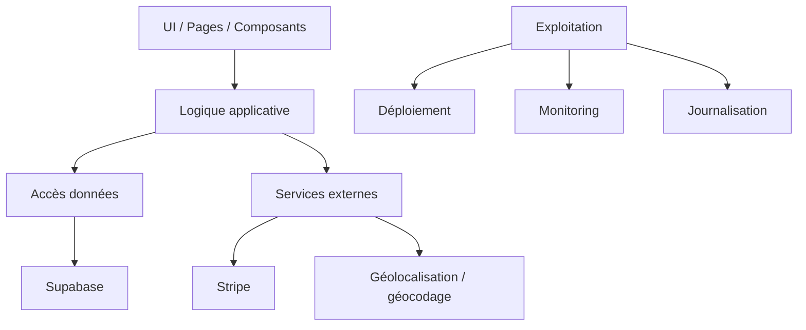

---
## `docs/03-architecture-globale/schemas.md`

---

# Schémas

## Objectif de cette section

Cette page regroupe les schémas globaux du projet ONY.Ils permettent de visualiser rapidement :

- les blocs du système ;
- les flux principaux ;
- la chaîne de déploiement ;
- le cycle événement → billet → scan.

Ces schémas ne remplacent pas les descriptions détaillées des sections suivantes, mais servent de support de compréhension transversale.

---

## 1. Schéma macro du système

### Lecture

Ce schéma montre les blocs structurants :

* interface applicative ;
* auth et données via Supabase ;
* services externes ;
* pipeline de déploiement ;
* supervision.

---

## 2. Schéma fonctionnel de découverte d’événements

### Lecture

La découverte d’événements est progressive :

* affichage initial ;
* personnalisation ;
* résumé ;
* détail.

Cette hiérarchie guide directement l’UX actuelle du produit.

---

## 3. Schéma billet / scan

Ce schéma résume le cycle de vie simplifié d’un billet dans ONY.

---

## 4. Schéma de déploiement atomique

Ce schéma représente la logique actuelle de déploiement :

* release versionnée ;
* bascule atomique ;
* healthcheck ;
* rollback en cas d’échec.

---

## 5. Schéma carte / filtres / liste

La map n’est pas indépendante du reste :

* les filtres modifient la carte ;
* la carte influence la liste ;
* les préférences alimentent les filtres ;
* la navigation mène au détail.

---

## 6. Schéma des couches techniques

### Lecture

Ce schéma met en évidence les grandes couches :

* présentation ;
* logique ;
* données ;
* intégration ;
* exploitation.

---

## Bonnes pratiques pour la suite

Cette page a vocation à être enrichie au fur et à mesure de l’évolution du projet.

Les futurs schémas utiles à ajouter pourront inclure :

* schéma détaillé du parcours organisateur ;
* schéma ER complet de la base ;
* schéma des flux Stripe ;
* schéma de supervision prod / préprod ;
* schéma du cycle de test.

## Conclusion

Ces schémas servent de support de lecture rapide du projet.

Ils doivent rester :

* synthétiques ;
* lisibles ;
* cohérents avec l’état réel du système.

Les détails de chaque bloc sont ensuite documentés dans les sections suivantes.
