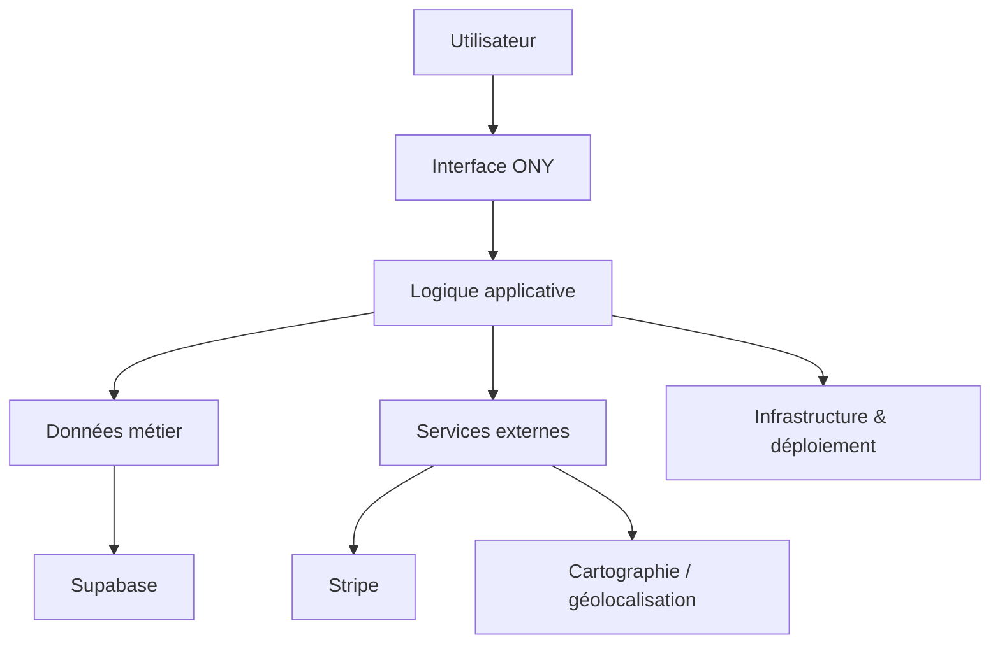

# Vue d’ensemble

## Objectif de cette section

Cette page présente la vue d’ensemble de l’architecture globale de **ONY**.

L’objectif est de donner une lecture transversale du projet, en reliant :

- l’expérience utilisateur ;
- les modules applicatifs ;
- les flux de données ;
- les briques techniques principales ;
- les services externes ;
- les environnements d’exécution.

Cette section sert d’introduction à l’architecture avant d’entrer dans le détail des flux applicatifs et des schémas.

## Positionnement global

ONY est une application orientée découverte d’événements, exploration cartographique, billetterie et usages organisateur.

L’architecture du projet a été pensée pour articuler plusieurs dimensions :

- une interface moderne centrée sur la navigation utilisateur ;
- une logique d’accès aux données structurée autour de Supabase ;
- des parcours applicatifs cohérents entre découverte, détail, achat et ticketing ;
- une exécution encadrée par une infrastructure distincte entre préproduction et production.

Le projet ne repose donc pas sur une seule page ou une seule fonctionnalité, mais sur un ensemble cohérent de modules reliés entre eux.

## Grandes briques de l’architecture

### Interface applicative

La première couche est celle de l’interface utilisateur.

Elle regroupe notamment :

- l’accueil ;
- la page événements ;
- la carte ;
- le détail d’un événement ;
- l’espace billets ;
- le profil ;
- les espaces organisateur ;
- les composants partagés de navigation et d’exploration.

Cette couche porte l’expérience visible du produit.

### Logique applicative

La seconde couche concerne la logique applicative.

Elle comprend notamment :

- le routing ;
- les composants métier ;
- les stores ;
- les librairies utilitaires ;
- les transformations de données pour l’interface ;
- les règles d’affichage ou de filtrage.

Cette couche fait le lien entre les données brutes, les parcours utilisateur et le rendu final.

### Données et authentification

Le projet repose sur une couche de données structurée, appuyée sur Supabase.

Cette couche couvre notamment :

- l’authentification ;
- les utilisateurs ;
- les événements ;
- les catégories ;
- les lieux ;
- les billets ;
- les préférences ;
- les scans ;
- les demandes organisateur.

Elle constitue le socle métier du projet.

### Services externes

Certaines briques externes complètent le fonctionnement global.

On retrouve notamment :

- **Supabase** pour la donnée et l’authentification ;
- **Stripe** pour la logique de paiement ou de ticketing simulé / préparé ;
- les services de cartographie et de géolocalisation ;
- l’infrastructure de publication et de déploiement.

## Logique générale de circulation

Le fonctionnement d’ensemble peut se résumer ainsi :

1. l’utilisateur interagit avec l’interface ;
2. l’application charge ou transforme les données utiles ;
3. les données sont lues ou enrichies depuis les sources prévues ;
4. les composants affichent les informations pertinentes ;
5. certaines actions produisent un effet métier : authentification, achat, génération de billet, scan, création d’événement, etc.

Cette lecture permet de comprendre que l’architecture n’est pas seulement technique : elle est organisée autour des usages du produit.

## Articulation entre les grandes zones fonctionnelles

Plusieurs zones du produit sont fortement liées entre elles :

### Découverte et exploration

Cette zone regroupe :

- l’accueil ;
- la carte ;
- la page événements ;
- les catégories ;
- les filtres ;
- les préférences.

Elle constitue le cœur de l’expérience utilisateur côté exploration.

### Consultation et décision

Cette zone regroupe :

- les résumés d’événements ;
- la page détail ;
- les informations de lieu, date, prix et description ;
- les actions principales disponibles pour l’utilisateur.

Elle sert à transformer une découverte en décision.

### Ticketing et contrôle

Cette zone regroupe :

- l’achat ou la réservation ;
- la génération de billet ;
- l’espace billets ;
- le scan ;
- la validation d’accès.

Elle prolonge le parcours utilisateur jusqu’à l’usage réel du ticket.

### Gestion utilisateur et organisateur

Cette zone regroupe :

- le profil ;
- les préférences ;
- les rôles ;
- les demandes organisateur ;
- la création ou gestion d’événements.

Elle porte la logique plus avancée d’usage et d’administration métier.

## Vision technique simplifiée

Du point de vue technique, ONY articule plusieurs niveaux :

- **frontend** : rendu de l’interface, navigation, composants, interactions ;
- **logique applicative** : stores, helpers, transformation et structuration des données ;
- **backend / données** : authentification, base de données, accès métier ;
- **services externes** : paiement, cartographie, publication ;
- **infrastructure** : environnements, exécution, déploiement, supervision.

Cette stratification permet de séparer les responsabilités sans perdre la cohérence globale.

## Intérêt de cette architecture

Cette organisation apporte plusieurs bénéfices :

- meilleure lisibilité du projet ;
- séparation claire des responsabilités ;
- capacité à faire évoluer une zone sans remettre en cause tout le système ;
- documentation plus structurée ;
- compréhension plus simple des liens entre usage, données et exécution.

Elle est particulièrement utile dans un projet qui mélange produit, UX, données, cartographie, ticketing et exploitation.

## Point d’attention

Le projet s’appelle désormais **ONY**, mais conserve encore certains héritages techniques liés à son ancien nom **Uvents**.

Cela peut se retrouver dans :

- certains dépôts ;
- certaines URLs ;
- certains chemins ;
- certains scripts historiques.

Cette situation ne change pas l’architecture de fond, mais doit être connue pour bien lire l’ensemble du projet.

## Schéma simplifié

