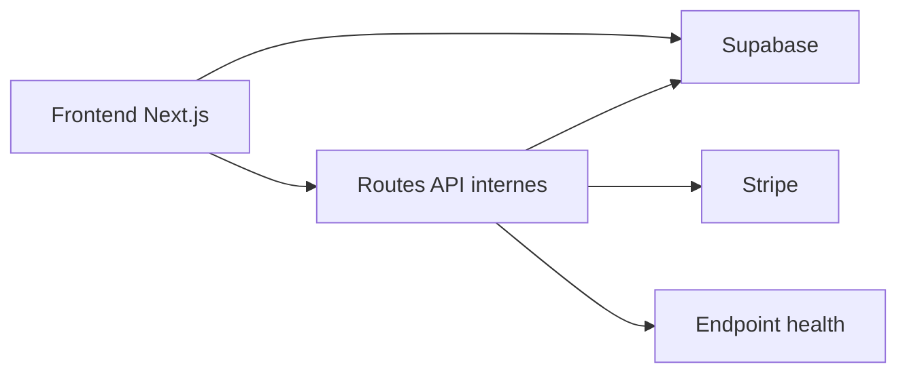

---
## `docs/04-stack-technique/backend-logique.md`

---

# Backend logique

## Objectif de cette section

Cette page décrit le backend logique d’ONY, c’est-à-dire la manière dont le projet gère ses traitements serveur sans s’appuyer sur un backend séparé de type API indépendante.

Le projet repose sur une architecture où la logique serveur est largement intégrée au framework applicatif.

## Principe général

ONY n’est pas construit autour d’un backend autonome distinct du frontend.
Le projet s’appuie plutôt sur une logique de **backend intégré** au sein de l’application Next.js.

Cette approche permet :

- de limiter la complexité structurelle ;
- de garder un périmètre MVP cohérent ;
- de centraliser une partie des traitements côté app ;
- d’intégrer plus facilement la logique serveur, les appels de données et les routes API.

## Ce que couvre le backend logique

Le backend logique d’ONY couvre principalement :

- les routes API internes ;
- l’orchestration des appels à Supabase ;
- les intégrations Stripe ;
- les healthchecks applicatifs ;
- certaines logiques de sécurisation ou de transformation de données.

## Routes API internes

Le projet dispose d’un ensemble de routes API embarquées dans l’application, notamment pour :

- la santé applicative ;
- la géolocalisation / géocodage ;
- le checkout Stripe ;
- le webhook Stripe.

Ces routes servent d’interface contrôlée entre :

- le frontend ;
- les services externes ;
- la couche de données ;
- les logiques sensibles qui ne doivent pas être exposées côté client.

## Intégration avec Supabase

Une partie importante du backend logique consiste à :

- interroger les tables Supabase ;
- orchestrer les relations métier ;
- croiser événements, catégories, lieux, profils, billets et préférences ;
- appliquer certaines règles de contexte applicatif.

Le backend logique ne remplace pas les règles de sécurité Supabase, mais il joue un rôle d’orchestration et d’agrégation.

## Intégration avec Stripe

Le projet embarque aussi une logique Stripe via :

- une route de checkout ;
- une route de webhook ;
- des variables d’environnement dédiées ;
- une orchestration de la billetterie côté application.

Cela permet de gérer :

- l’initialisation d’un paiement ou d’un achat simulé ;
- les retours de service ;
- la liaison avec le système de tickets.

## Endpoint de santé

Le projet expose un endpoint de santé, utilisé par les scripts de supervision.

Ce point est important car il sert de base à :

- certains healthchecks ;
- le heartbeat ;
- l’observation de l’état applicatif ;
- la validation post-déploiement.

Il permet aussi de vérifier, au moins partiellement, l’état de plusieurs services intégrés.

## Pourquoi ce choix d’architecture

Ce choix de backend logique intégré présente plusieurs avantages dans le contexte du projet :

### 1. Simplicité

Pas besoin de maintenir un backend autonome séparé.

### 2. Vitesse de développement

Le frontend et la logique serveur proche du produit restent dans un environnement cohérent.

### 3. Cohérence du MVP

Pour un produit encore en consolidation, cette approche est plus légère à maintenir.

### 4. Documentation plus lisible

Les flux sont plus faciles à suivre tant que l’application reste de taille raisonnable.

## Limites de cette approche

Cette architecture implique aussi quelques points de vigilance :

- éviter de disperser trop de logique serveur dans de nombreux endroits ;
- garder des responsabilités claires entre client, serveur et base ;
- éviter la duplication de logique métier ;
- bien documenter ce qui relève d’une route API et ce qui relève directement de Supabase.

## Place du backend dans l’architecture

Le backend logique d’ONY se situe entre :

- le frontend ;
- Supabase ;
- Stripe ;
- les scripts d’exploitation.

Il assure surtout :

- l’orchestration ;
- l’intégration ;
- la sécurisation de certains flux ;
- l’exposition de points techniques utiles à l’exploitation.

## Schéma simplifié

