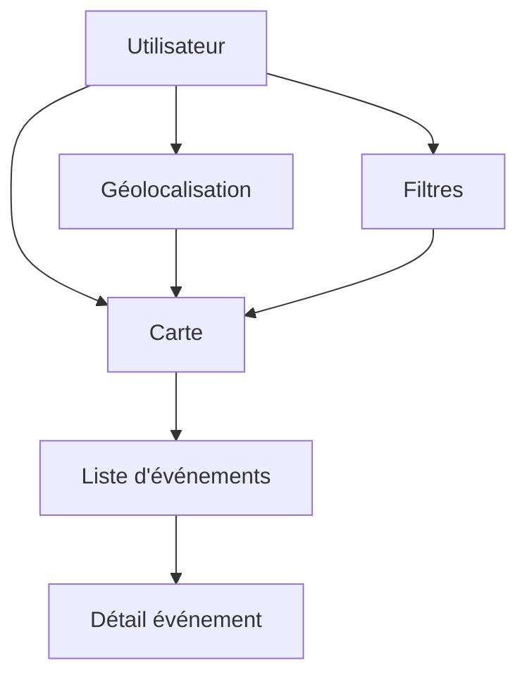

# Cartographie et géolocalisation

## Objectif de cette section

Cette page décrit la couche de cartographie et de géolocalisation utilisée dans ONY.

Cette brique est centrale dans le projet, car la carte constitue le point d’entrée principal de découverte des événements.

## Rôle de la carte dans ONY

La carte n’est pas un simple module complémentaire.Elle structure l’expérience utilisateur et influence directement :

- la navigation ;
- les filtres ;
- la logique de proximité ;
- la hiérarchie des écrans ;
- le positionnement produit.

ONY se distingue par une approche **map-first**, dans laquelle l’utilisateur peut découvrir des événements à partir de leur localisation plutôt qu’à partir d’une simple liste textuelle.

## Technologies utilisées

La cartographie repose sur :

- **Leaflet**
- **React-Leaflet**

Cette combinaison permet :

- l’intégration d’une carte interactive dans l’interface React ;
- l’affichage de marqueurs personnalisés ;
- la navigation par déplacement et zoom ;
- une bonne souplesse dans la gestion de l’UI embarquée autour de la carte.

## Données utilisées

La carte s’appuie principalement sur :

- les événements ;
- les lieux ;
- les coordonnées latitude / longitude des places ;
- les catégories associées ;
- les préférences utilisateur ;
- la position utilisateur ou un centre de carte.

Les coordonnées sont stockées dans la table `places`, puis reliées aux événements via `place_id`.

## Fonctionnalités principales couvertes

À ce stade, la carte prend déjà en charge :

- affichage des événements sur une carte ;
- marqueurs d’événements ;
- recentrage selon le contexte ;
- interaction avec les filtres ;
- catégories issues de la page d’accueil ;
- tri par proximité ;
- synchronisation avec la liste “Plus d’événements” ;
- chargement progressif des résultats ;
- logique de drawer rétractable.

## Géolocalisation utilisateur

Le projet prend en compte la position de l’utilisateur pour :

- orienter l’affichage ;
- proposer des événements proches ;
- améliorer le tri ;
- rendre le parcours plus contextuel.

Cette logique peut s’appuyer :

- soit sur la position réelle utilisateur ;
- soit sur un centre de carte ;
- soit sur les préférences ou filtres en cours.

## Différence entre localisation et préférence

Il est important de distinguer :

### Localisation

Elle correspond à la position ou au centre géographique utilisé pour calculer la proximité.

### Préférences

Elles correspondent aux goûts et paramètres utilisateur :

- catégories ;
- distance maximale ;
- suivi de localisation ;
- autres paramètres contextuels.

La carte croise ces deux dimensions pour proposer une expérience plus pertinente.

## Logique de proximité

Le projet utilise une logique de tri “du plus proche au plus éloigné” dans certains contextes, notamment :

- dans la liste liée à la map ;
- dans les parcours de découverte locale ;
- dans les sections contextuelles comme “Autour de toi”.

Cette logique renforce la promesse locale du produit.

## Recherche et filtres

La carte est associée à une interface de recherche et de filtres qui permet :

- de modifier les résultats affichés ;
- de voir les filtres actifs ;
- de les vider ;
- de réappliquer les préférences utilisateur ;
- d’explorer différents types d’événements sans réécrire les préférences persistées.

Cette séparation entre exploration temporaire et préférences de fond est un point important du produit.

## Synchronisation carte / liste

La carte n’est pas isolée.
Elle est couplée à une liste contextuelle de type “Plus d’événements”.

Cette liste :

- reflète les résultats actuellement visibles ou filtrés ;
- est triée par proximité ;
- est chargée progressivement ;
- permet une lecture complémentaire à la vue cartographique.

## Contraintes UX

La carte impose plusieurs contraintes d’interface :

- éviter que les overlays masquent trop l’espace utile ;
- garder une bonne lisibilité mobile ;
- permettre la rétraction des éléments secondaires ;
- maintenir la carte comme élément visuel principal ;
- limiter les collisions entre top bar, filtres, drawer et bottom bar.

Une partie importante du travail de refonte récent a consisté à mieux équilibrer ces éléments.

## Schéma simplifié

