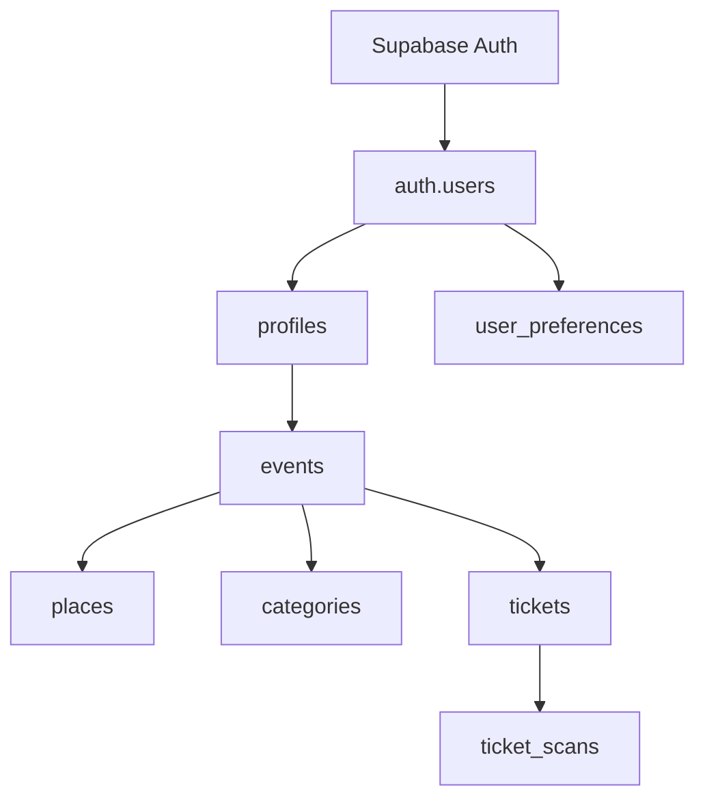

---
## `docs/04-stack-technique/donnees-et-auth.md`

---

# Données et authentification

## Objectif de cette section

Cette page présente les briques utilisées pour la gestion des données et de l’authentification dans ONY.

Le projet s’appuie principalement sur **Supabase** pour :

- l’authentification ;
- la base de données PostgreSQL ;
- la relation entre profils, événements, billets et préférences.

## Supabase comme socle principal

Supabase constitue aujourd’hui la couche centrale de persistance et d’identité du projet.

Cette solution permet de regrouper dans un même écosystème :

- l’authentification ;
- les utilisateurs ;
- les profils ;
- les données métier ;
- la logique de sécurité au niveau base ;
- les accès client et serveur.

## Authentification

L’authentification repose sur **Supabase Auth**.

### Capacités prises en charge

- création de compte ;
- connexion ;
- gestion de session ;
- OAuth, notamment Google ;
- rattachement à un profil applicatif.

### Intérêt

Ce choix permet :

- de ne pas reconstruire un système d’auth complet ;
- de bénéficier d’un socle robuste ;
- de garder une intégration simple avec les données PostgreSQL.

## Modèle de profil

Le projet distingue :

- l’utilisateur d’authentification (`auth.users`)
- le profil applicatif (`profiles`)

Cette séparation permet d’associer aux comptes des données métiers supplémentaires comme :

- nom ;
- username ;
- avatar ;
- rôle ;
- bio ;
- téléphone ;
- statut organisateur ;
- groupe d’âge.

## Préférences utilisateur

Les préférences sont stockées dans une table dédiée `user_preferences`.

Elles incluent notamment :

- catégories préférées ;
- distance maximale ;
- activation des notifications ;
- suivi de localisation.

Cette brique est importante car elle influence :

- les filtres ;
- les résultats proposés ;
- la logique de personnalisation.

## Données métier principales

La couche données couvre déjà plusieurs objets structurants :

### Événements

- titre
- description
- date de début / fin
- lieu
- visibilité
- capacité
- image
- prix
- organisateur éventuel

### Lieux

- nom
- adresse
- ville
- code postal
- latitude / longitude

### Catégories

- table `categories`
- table de liaison `event_categories`

### Billets

- tickets
- scans
- lien utilisateur / événement

### Interactions

- favoris
- participants
- vues
- notifications

### Parcours organisateur

- demandes organisateur
- rôle et statut vérifié

## Avantages de cette structure

Cette organisation permet :

- une séparation claire des responsabilités ;
- une bonne modélisation métier du MVP ;
- des relations explicites entre entités ;
- une base suffisante pour documenter les flux et les évolutions futures.

## Sécurité des données

La sécurité ne repose pas uniquement sur le frontend.

Elle s’appuie aussi sur :

- l’auth Supabase ;
- la séparation entre client et serveur ;
- la distinction entre clés publiques et clés serveur ;
- les règles de sécurité en base, notamment via RLS.

## Différence entre accès client et accès serveur

Le projet distingue :

- les opérations réalisables côté client avec la clé publique ;
- les opérations serveur ou sensibles nécessitant des variables protégées.

Cette distinction est particulièrement importante pour :

- les routes Stripe ;
- les traitements sensibles ;
- les opérations d’administration ou de service.

## Schéma simplifié

