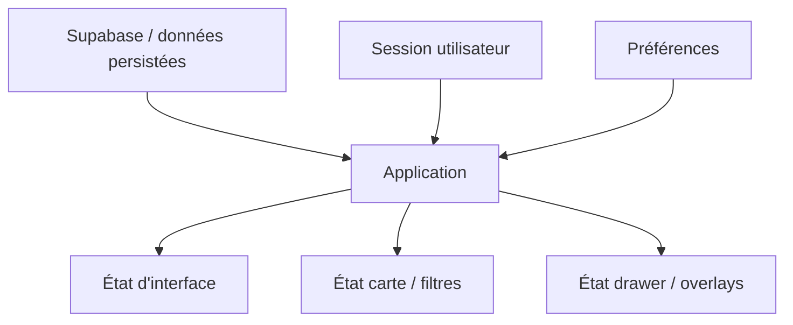

---
## `docs/04-stack-technique/etat-applicatif.md`

---

# État applicatif

## Objectif de cette section

Cette page décrit la gestion de l’état applicatif dans ONY, c’est-à-dire la manière dont l’application conserve, partage ou dérive certaines informations nécessaires à l’expérience utilisateur.

Dans une application comme ONY, l’état n’est pas limité à un simple affichage visuel.Il intervient dans :

- les sessions utilisateur ;
- les filtres ;
- la carte ;
- la navigation ;
- les drawers ;
- les tickets ;
- les préférences ;
- certains comportements contextuels.

## Deux niveaux d’état

Le projet manipule globalement deux grandes familles d’état :

### 1. État persistant

Il correspond à ce qui est stocké ou récupéré depuis une source externe, notamment :

- profil utilisateur ;
- préférences ;
- événements ;
- billets ;
- données de session ;
- données liées à Supabase.

### 2. État local ou transitoire

Il correspond à ce qui vit dans l’interface pendant l’usage :

- ouverture d’un drawer ;
- filtre temporaire actif ;
- état d’un panneau ;
- position de certains overlays ;
- étape d’un parcours ;
- recherche en cours ;
- état de chargement.

## Zustand

Le projet utilise **Zustand** comme solution de gestion d’état pour certains besoins partagés.

Zustand permet :

- une mise en place légère ;
- une intégration simple avec React ;
- un bon compromis entre centralisation et lisibilité ;
- une utilisation ciblée sans lourdeur excessive.

## Rôle de l’état dans ONY

L’état applicatif intervient notamment dans :

### Navigation et UI

- bottom bar ;
- overlays ;
- drawers ;
- états ouverts / fermés ;
- transitions de certains composants.

### Carte

- filtres actifs ;
- état de rétraction du drawer ;
- interaction entre la carte et la liste ;
- recentrage et contexte de visualisation.

### Utilisateur

- session ;
- profil ;
- préférences ;
- catégories ;
- paramètres personnels.

### Événements

- résumé sélectionné ;
- détail courant ;
- parcours d’exploration ;
- liste courante filtrée.

## Importance de la distinction entre état métier et état d’interface

Il est important de distinguer :

### État métier

Exemples :

- utilisateur connecté ;
- catégories préférées ;
- billets associés ;
- données événement récupérées.

### État d’interface

Exemples :

- drawer ouvert ou réduit ;
- panneau filtre affiché ;
- zone actuellement focalisée ;
- résultat de recherche en cours d’affichage.

Cette distinction évite :

- de confondre persistance et simple interaction ;
- de propager inutilement des états temporaires ;
- de complexifier le produit.

## Bonnes pratiques retenues

Dans l’état actuel du projet, l’approche la plus saine consiste à :

- laisser les données structurantes dans Supabase ou dans la logique de récupération ;
- garder l’état temporaire dans des composants ou stores ciblés ;
- utiliser Zustand de manière sélective ;
- éviter de centraliser artificiellement tout l’état de l’application.

## Points d’attention

Une application orientée carte, filtres et overlays peut rapidement accumuler des états difficiles à suivre si la logique n’est pas documentée.

Les points à surveiller sont notamment :

- la multiplication de filtres temporaires ;
- les dépendances entre préférences persistées et filtres actifs ;
- la duplication de logique entre composants ;
- les comportements UI qui se croisent autour de la map.

## État actuel du projet

À ce stade, l’état applicatif remplit correctement son rôle pour :

- la navigation principale ;
- les interactions UI récentes ;
- la map ;
- les parcours de découverte ;
- certaines briques utilisateur.

La documentation détaillée des stores et utilitaires sera reprise plus loin dans la partie Application.

## Schéma simplifié

