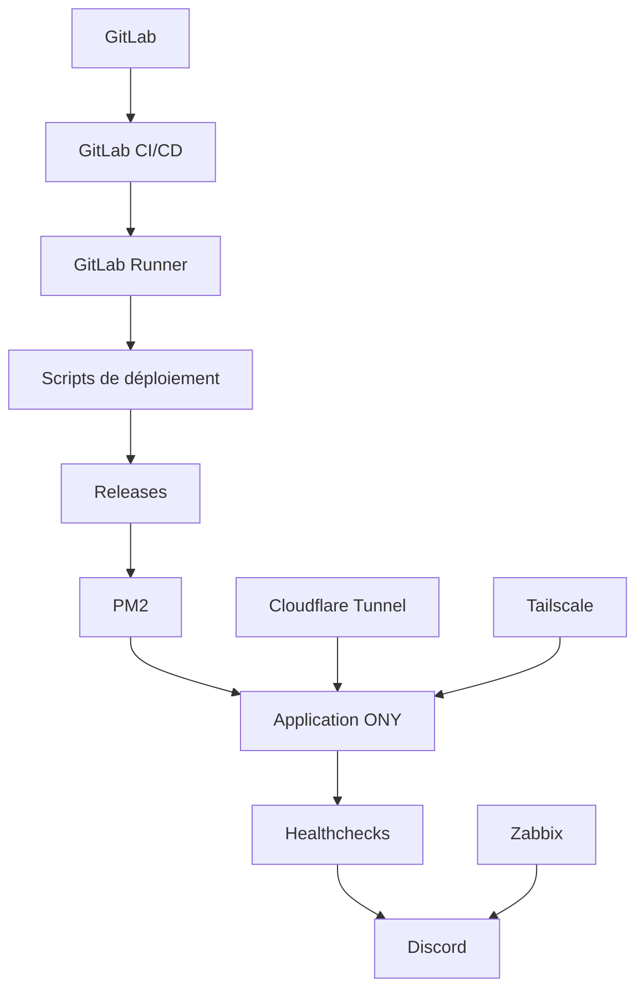

---
## `docs/04-stack-technique/outils-run-et-deploiement.md`

---

# Outils de run et de déploiement

## Objectif de cette section

Cette page présente les outils techniques utilisés pour exécuter, déployer et maintenir ONY dans ses environnements.

Il ne s’agit pas encore ici de détailler toute la procédure opérationnelle, mais de poser les briques qui rendent possible :

- l’exécution de l’application ;
- la livraison vers les environnements ;
- la supervision de base ;
- la continuité de service.

## Vue d’ensemble

Les principaux outils de run et de déploiement utilisés dans ONY sont :

- **PM2**
- **GitLab CI/CD**
- **GitLab Runner**
- **scripts Bash de déploiement**
- **Cloudflare Tunnel**
- **Tailscale**
- **Discord** pour les alertes
- **healthchecks applicatifs**
- **Zabbix** pour la supervision

## PM2

PM2 est utilisé pour exécuter l’application Next.js en environnement de production.

### Rôle

- lancer l’application ;
- la maintenir en ligne ;
- la redémarrer si nécessaire ;
- conserver un état de processus stable ;
- faciliter certaines opérations de maintenance.

### Dans ONY

L’application est lancée via un `ecosystem.config.js`, avec :

- un nom applicatif ;
- un répertoire courant ;
- un script `next start` ;
- un port d’écoute.

## GitLab CI/CD

GitLab CI/CD est utilisé pour automatiser les déploiements.

### Rôle

- déclencher un déploiement selon la branche ;
- exécuter les scripts serveur ;
- séparer les environnements ;
- notifier les échecs.

### Logique actuelle

- `dev` déclenche le déploiement vers la préproduction ;
- `main` déclenche le déploiement vers la production.

## GitLab Runner

Le pipeline repose sur des runners taggés selon l’environnement.

### Rôle

- exécuter les jobs CI/CD ;
- cibler l’environnement approprié ;
- permettre une séparation propre des déploiements.

## Scripts de déploiement

Le déploiement réel est piloté par des scripts Bash présents sur le serveur.

### Fonctions assurées

- vérification des variables critiques ;
- création de release horodatée ;
- clonage du repo ;
- installation des dépendances ;
- build Next.js ;
- création du fichier `.env.production` ;
- bascule du symlink `current` ;
- redémarrage PM2 ;
- healthcheck ;
- rollback en cas d’échec ;
- notifications Discord.

## Déploiement atomique

Le projet utilise une logique de releases versionnées.

### Principe

Chaque déploiement produit :

- un nouveau dossier de release ;
- un build propre ;
- une bascule du lien `current` ;
- une validation par healthcheck.

### Intérêt

- rollback plus simple ;
- réduction du risque de casse pendant une mise à jour ;
- meilleure lisibilité de l’état du serveur.

## Healthchecks

Plusieurs scripts techniques permettent de contrôler la santé applicative.

### Rôle

- vérifier la disponibilité de l’application ;
- contrôler certains services externes ;
- alimenter les alertes ;
- valider un déploiement.

## Discord

Discord est utilisé comme canal d’alerte et de notification opérationnelle.

### Cas typiques

- déploiement démarré ;
- déploiement réussi ;
- déploiement échoué ;
- heartbeat applicatif ;
- problème détecté par healthcheck.

## Cloudflare Tunnel

Cloudflare Tunnel est utilisé pour exposer proprement l’application sans ouvrir directement certains services de manière classique.

### Intérêt

- accès public plus maîtrisé ;
- simplification de l’exposition ;
- cohérence avec une architecture auto-hébergée.

## Tailscale

Tailscale est utilisé pour les accès réseau privés et l’administration.

### Intérêt

- accès sécurisé à l’infrastructure ;
- maintenance distante ;
- segmentation simplifiée sans exposition excessive.

## Zabbix

Zabbix complète la supervision technique du projet.

### Rôle

- monitoring d’infrastructure ;
- suivi de disponibilité ;
- surveillance d’hôtes ou services ;
- amélioration de la visibilité d’exploitation.

## Schéma simplifié

