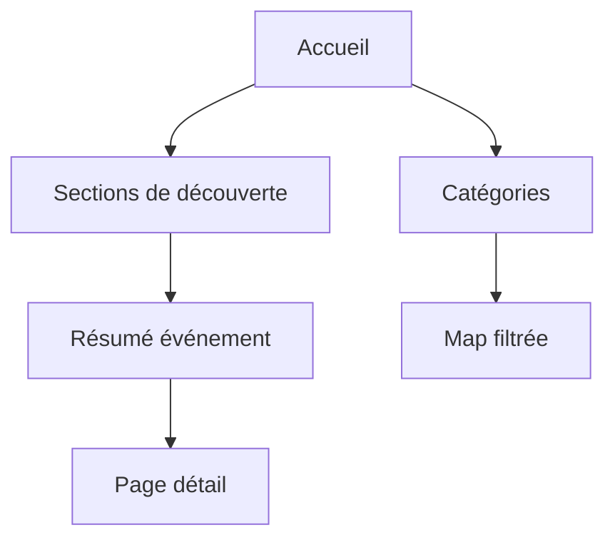

---
## `docs/05-application/accueil/accueil.md`

---

# Accueil

## Objectif de cette section

Cette page documente le rôle et la structure de la page d’accueil d’ONY.

L’accueil constitue l’un des principaux points d’entrée du produit.Il doit permettre à l’utilisateur de :

- comprendre rapidement la proposition de valeur ;
- découvrir des événements ;
- explorer des catégories ;
- accéder à la map et aux autres parcours clés.

## Rôle de la page d’accueil

La page d’accueil n’est pas conçue comme une vitrine statique.
Elle agit comme une interface de découverte rapide orientée vers l’action.

Ses objectifs principaux sont :

- exposer des événements pertinents ;
- donner envie d’explorer plus loin ;
- servir de point de rebond vers la carte, les catégories et les détails.

## Place dans le parcours produit

L’accueil intervient en amont de plusieurs parcours :

- découverte d’événements ;
- navigation par catégories ;
- accès au détail ;
- bascule vers la carte ;
- exploration contextuelle.

Elle constitue un niveau intermédiaire entre :

- la promesse globale du produit ;
- et l’exploration détaillée via `/events` ou `/map`.

## Structure générale

La page d’accueil repose sur plusieurs blocs fonctionnels, qui ont été conservés dans leur logique métier mais réharmonisés visuellement.

On y retrouve notamment :

- des mises en avant personnalisées ou contextuelles ;
- des cartes d’événements ;
- une section catégories ;
- des accès rapides à des événements proches ou recommandés ;
- des liens vers des parcours plus complets.

## Cartes événement

Les événements présents sur l’accueil sont affichés sous forme de cartes ou de visuels interactifs.

Ces cartes ont été renforcées récemment pour :

- afficher de vraies données issues de la base ;
- proposer un résumé rapide ;
- ouvrir un overlay informatif ;
- rediriger proprement vers la vraie page détail via “En savoir plus”.

## Catégories

La section catégories joue un rôle important dans la découverte guidée.

Elle permet à l’utilisateur de :

- explorer l’offre par thématique ;
- rebondir vers la carte avec un filtre unique ;
- découvrir une famille d’événements sans passer par une recherche complexe.

Les catégories ont été reconnectées aux données réelles et ne sont plus de simples éléments décoratifs.

## Cohérence avec la map

L’accueil ne fonctionne pas isolément.
Il est pensé comme une porte d’entrée vers l’expérience map-first d’ONY.

En particulier :

- certaines catégories redirigent vers la map ;
- certaines sections mènent vers une exploration de proximité ;
- les événements affichés suivent progressivement une logique cohérente avec la carte et les filtres utilisateur.

## Travail récent effectué

La page d’accueil a fait l’objet d’une harmonisation UI importante :

- conservation de l’esprit initial ;
- amélioration des paddings et espacements ;
- cohérence accrue des cartes, overlays et CTA ;
- suppression du bouton “Créer un événement” de l’accueil ;
- meilleure continuité visuelle avec auth, map, page events et détail événement.

L’objectif n’était pas de changer radicalement la page, mais de la faire monter en qualité perçue.

## Place des overlays résumés

Le travail récent a introduit une logique de résumé d’événement directement depuis les cartes de l’accueil.

Cette logique permet :

- d’éviter un passage immédiat au détail complet ;
- de présenter les informations utiles sans surcharge ;
- d’aider l’utilisateur à décider s’il veut approfondir.

C’est un point clé de la cohérence UX actuelle du projet.

## Contraintes UX

L’accueil doit respecter plusieurs contraintes :

- rester lisible sur mobile ;
- ne pas devenir trop dense ;
- présenter l’information utile rapidement ;
- éviter les faux contenus statiques ;
- garder une hiérarchie claire entre sections.

## Schéma simplifié

