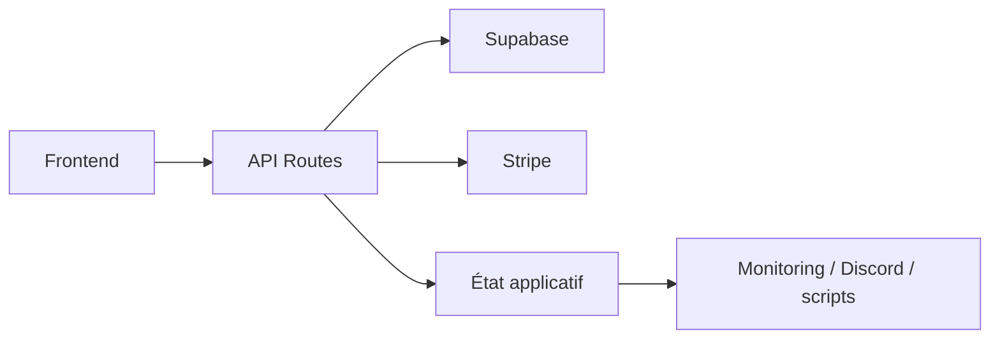

---
## `docs/05-application/api/api-routes.md`

---

# API Routes

## Objectif de cette section

Cette page documente les routes API internes de l’application ONY.

Ces routes ne constituent pas un backend séparé indépendant, mais une couche logique intégrée à l’application Next.js.
Elles permettent de traiter des flux techniques ou sensibles qui ne doivent pas être exécutés directement côté client.

## Rôle des API Routes dans ONY

Les routes API jouent plusieurs rôles dans le projet :

- exposer certains endpoints techniques ;
- protéger des appels sensibles ;
- intégrer des services externes ;
- centraliser des traitements serveur ;
- servir de point de contrôle pour l’exploitation.

Elles s’insèrent donc entre :

- le frontend ;
- Supabase ;
- Stripe ;
- certains besoins de supervision.

## Architecture générale

Les API Routes sont définies dans le dossier `app/api`.

Elles s’intègrent naturellement au framework Next.js et permettent d’utiliser :

- des handlers serveur ;
- des variables d’environnement protégées ;
- des traitements non exposés au navigateur.

## Routes principales identifiées

À ce stade, les routes API importantes du projet sont notamment :

### 1. `/api/health`

Cette route fournit un état de santé applicatif.

#### Rôle

- vérification de la disponibilité de l’application ;
- contrôle de certains services comme Supabase ou Stripe ;
- base pour les scripts heartbeat et healthcheck ;
- appui au déploiement et au monitoring.

Cette route est particulièrement importante pour l’exploitation.

### 2. `/api/geocode`

Cette route sert à une logique liée à la géolocalisation ou au géocodage.

#### Rôle

- transformer ou interroger des données de localisation ;
- soutenir la logique map-first du produit ;
- centraliser une intégration qui ne doit pas être dupliquée côté client.

### 3. `/api/stripe/checkout`

Cette route intervient dans le parcours d’achat ou de réservation.

#### Rôle

- déclencher ou préparer une session Stripe ;
- encapsuler la logique sensible côté serveur ;
- éviter d’exposer des traitements ou secrets côté client.

### 4. `/api/stripe/webhook`

Cette route reçoit les événements Stripe.

#### Rôle

- traiter les retours Stripe ;
- valider ou synchroniser un état métier ;
- s’inscrire dans la logique de billetterie ou de confirmation.

## Importance de la séparation client / serveur

Les API Routes jouent un rôle important dans la séparation entre :

- logique frontend pure ;
- logique serveur sensible ;
- intégration avec services tiers ;
- usage des secrets.

Cette séparation est particulièrement critique pour :

- Stripe ;
- les opérations sensibles ;
- certaines vérifications de santé.

## Intégration avec les variables d’environnement

Les routes API utilisent ou peuvent utiliser des variables d’environnement serveur, notamment :

- clés Stripe ;
- clés Supabase de niveau serveur ;
- URL ou secrets nécessaires à certains traitements.

Cette logique impose une documentation claire des variables et de leur usage.

## Lien avec l’exploitation

Certaines API Routes, notamment `/api/health`, dépassent le simple usage applicatif.

Elles servent aussi :

- au monitoring ;
- aux scripts de heartbeat ;
- aux healthchecks post-déploiement ;
- à la lecture de l’état système côté application.

Cela fait des API Routes un point de jonction entre application et exploitation.

## Lien avec les modules fonctionnels

Les API Routes sont mobilisées dans plusieurs zones du produit :

- carte et géolocalisation ;
- billetterie ;
- santé applicative ;
- potentiellement d’autres traitements sécurisés à venir.

Elles complètent donc les modules métiers sans constituer une couche autonome totalement séparée.

## Schéma simplifié

