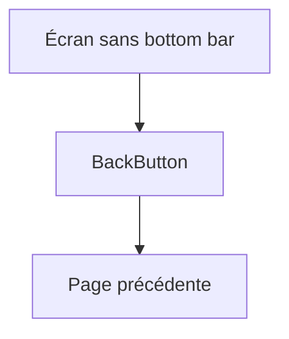

---
## `docs/05-application/composants-partages/back-button.md`

---

# Back button

## Objectif de cette section

Cette page documente le composant de **bouton retour** utilisé dans ONY.

Même s’il s’agit d’un composant simple en apparence, il joue un rôle important dans la cohérence de navigation, en particulier sur les écrans où la bottom bar n’est pas présente.

## Rôle dans l’application

Le bouton retour sert à permettre à l’utilisateur de revenir à l’écran précédent sans dépendre systématiquement :

- d’une bottom navigation ;
- du navigateur ;
- d’une logique de parcours implicite.

Il agit donc comme un composant de navigation secondaire.

## Contextes d’usage

Le bouton retour est particulièrement utile sur :

- les écrans de détail ;
- certains parcours centrés sur une tâche ;
- les écrans de scan ;
- les zones où la bottom bar est absente ;
- les écrans où l’utilisateur doit revenir à un contexte précédent précis.

## Pourquoi il est important

Dans une application mobile-first, la navigation ne doit pas reposer uniquement sur :

- le navigateur ;
- ou une bottom bar toujours visible.

Certains écrans nécessitent un repère explicite de retour pour :

- réduire la confusion ;
- fluidifier le parcours ;
- garder un cadre de navigation clair.

## Relation avec la bottom bar

Le bouton retour ne remplace pas la bottom bar.

Les deux composants répondent à des besoins différents :

### Bottom bar

Navigation principale et persistante sur les écrans larges de découverte.

### Back button

Navigation contextuelle, ponctuelle, adaptée aux écrans focalisés ou utilitaires.

Cette complémentarité est importante dans la hiérarchie globale du produit.

## Travail récent

Un travail récent a porté sur :

- la vérification des écrans où la bottom bar n’était pas pertinente ;
- l’ajout de boutons retour sur certains écrans où cela avait du sens ;
- l’harmonisation visuelle de ces boutons avec l’identité ONY.

L’objectif était d’éviter les écrans “isolés” du reste de l’application.

## Contraintes UX

Le bouton retour doit :

- être immédiatement identifiable ;
- ne pas être confondu avec une action métier ;
- être bien placé ;
- rester lisible sur mobile ;
- s’intégrer à la hiérarchie de l’écran sans dominer inutilement.

## Positionnement

Le positionnement du bouton retour dépend du contexte :

- haut de l’écran ;
- dans un header ;
- dans une zone claire de navigation.

Le placement doit éviter les collisions avec :

- titres ;
- filtres ;
- éléments sticky ;
- top bars.

## Schéma simplifié

