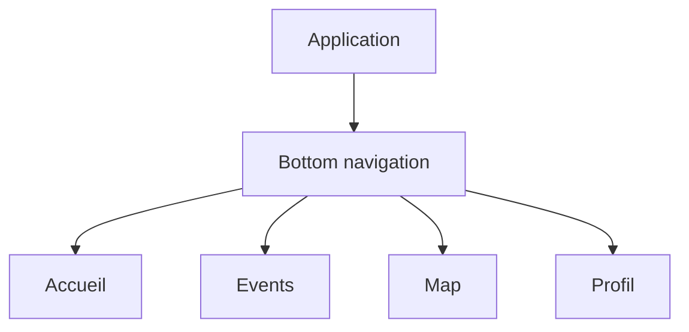

# Bottom navigation

## Objectif de cette section

Cette page documente la **bottom navigation** d’ONY, c’est-à-dire la barre de navigation basse utilisée sur les écrans où elle est pertinente.

La bottom bar constitue un élément structurant de l’expérience mobile-first du projet.
Elle permet d’accéder rapidement aux zones principales de l’application sans recharger la lecture visuelle de l’écran.

## Rôle dans l’application

La bottom navigation sert à :

- faciliter la navigation principale ;
- proposer des raccourcis constants vers les zones clés ;
- réduire la friction sur mobile ;
- maintenir une cohérence d’usage entre les écrans principaux.

Elle est pensée comme une navigation utilitaire et persistante, en particulier sur :

- l’accueil ;
- la page events ;
- la map ;
- le profil ;
- certaines zones de tickets ou parcours similaires selon le contexte.

## Principe mobile-first

La bottom bar est directement liée au choix mobile-first du projet.

Sur un usage mobile, elle présente plusieurs avantages :

- accès rapide au pouce ;
- repérage simple des entrées principales ;
- réduction du besoin de remonter dans l’interface ;
- maintien d’une orientation claire dans l’application.

Elle joue donc un rôle important dans la fluidité perçue.

## Fonctionnement attendu

La bottom navigation doit :

- afficher clairement les sections principales ;
- mettre en évidence l’état actif ;
- rester lisible même sur de petits écrans ;
- s’intégrer sans écraser le contenu ;
- disparaître sur les écrans où elle n’est pas pertinente.

## Travail récent de refonte

La bottom bar a récemment été retravaillée sur le plan UI, sans changement de logique fonctionnelle.

Les objectifs de cette refonte étaient :

- améliorer la lisibilité ;
- mieux intégrer la bottom bar au langage visuel ONY ;
- harmoniser les états actifs et inactifs ;
- améliorer la qualité perçue globale ;
- réduire l’impression de composant “ajouté après coup”.

## Présence / absence selon les écrans

La bottom bar n’a pas vocation à être visible partout.

Elle est pertinente sur les écrans de navigation courante, mais peut être masquée dans des cas comme :

- authentification ;
- reset de mot de passe ;
- scan billet ;
- certains écrans utilitaires ou très focalisés.

Dans ces cas, la navigation doit être compensée par :

- un bouton retour ;
- ou une logique plus adaptée au contexte.

## Intégration avec les autres composants

La bottom navigation cohabite avec :

- les drawers ;
- la map ;
- les overlays ;
- les récapitulatifs ;
- les panneaux filtres.

Elle doit donc être prise en compte dans la hiérarchie visuelle pour éviter :

- les collisions ;
- les superpositions gênantes ;
- la perte de lisibilité.

## Contraintes UX

La bottom bar doit respecter plusieurs contraintes :

- rester compacte ;
- ne pas surcharger visuellement l’écran ;
- être immédiatement compréhensible ;
- conserver une bonne accessibilité ;
- respecter la palette et les contrastes ONY.

## États visuels

Les états principaux à gérer sont :

- **actif**
- **inactif**
- **masqué**

La clarté de l’état actif est particulièrement importante pour éviter toute ambiguïté sur la position actuelle dans l’application.

## Schéma simplifié

