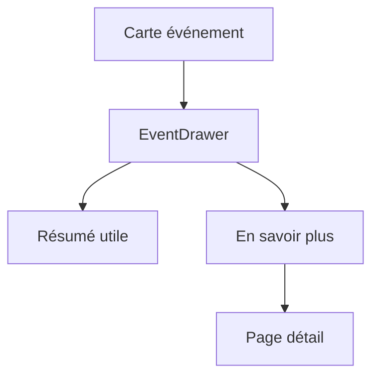

---
## `docs/05-application/composants-partages/event-drawer.md`

---

# Event drawer

## Objectif de cette section

Cette page documente le composant **EventDrawer**, utilisé dans ONY pour afficher un résumé riche d’un événement sans basculer immédiatement vers la page détail.

Ce composant joue un rôle important dans la logique de découverte progressive du produit.

## Rôle du composant

L’EventDrawer sert à présenter un **aperçu interactif** d’un événement depuis :

- une carte sur l’accueil ;
- une carte sur `/events` ;
- la liste liée à la map ;
- d’autres zones de découverte.

Il permet à l’utilisateur de :

- obtenir rapidement les informations utiles ;
- rester dans son contexte de navigation ;
- décider ensuite d’ouvrir la vraie page détail.

## Place dans l’UX ONY

Le produit suit une logique de lecture progressive :

1. aperçu rapide ;
2. résumé structuré ;
3. détail complet ;
4. action.

L’EventDrawer occupe donc la deuxième étape.
Il évite de transformer chaque interaction en changement de page, tout en donnant suffisamment d’informations pour décider.

## Données affichées

Le drawer s’appuie sur les vraies données issues du modèle événement.

Les informations généralement affichées sont :

- titre ;
- lieu ;
- date ;
- horaire ;
- catégorie ;
- prix ;
- description courte ;
- CTA “En savoir plus”.

Le bouton “En savoir plus” redirige vers la vraie page détail de l’événement.

## Travail récent

Le composant a récemment été retravaillé pour :

- remplacer le faux contenu statique ;
- afficher les vraies données BDD ;
- uniformiser son rendu avec le reste de l’application ;
- introduire un voile et une animation plus cohérente avec ONY ;
- proposer un contenu en slide-up depuis le bas ;
- améliorer l’intégration mobile-first.

## Logique d’ouverture

L’ouverture du drawer est déclenchée par clic sur certaines cartes ou zones visuelles.Le but est de :

- garder une interaction simple ;
- éviter un hover-only peu adapté au mobile ;
- maintenir une logique homogène entre écrans.

## Animation et hiérarchie visuelle

Le composant repose sur :

- un voile sombre ;
- un effet de transition ;
- un contenu qui se déploie depuis le bas ;
- une logique proche d’un overlay contextuel.

Cette hiérarchie permet :

- de renforcer la lisibilité ;
- de ne pas casser brutalement le parcours ;
- de garder l’utilisateur dans son contexte.

## Lien avec le détail événement

L’EventDrawer ne remplace pas la page détail.
Il prépare simplement l’accès au détail complet.

Cela permet de distinguer :

- l’information utile immédiate ;
- l’information exhaustive ;
- l’action éventuelle.

## Contextes d’usage

Le composant est pertinent dans plusieurs zones :

- cartes événement de l’accueil ;
- listings d’événements ;
- liste map ;
- autres composants de découverte similaires.

Il agit comme composant partagé de résumé événement.

## Contraintes UX

Le drawer doit :

- rester lisible sur mobile ;
- ne pas masquer inutilement l’écran ;
- rester cohérent avec l’identité ONY ;
- afficher assez d’informations sans surcharger ;
- offrir une fermeture claire et fluide.

## Schéma simplifié

