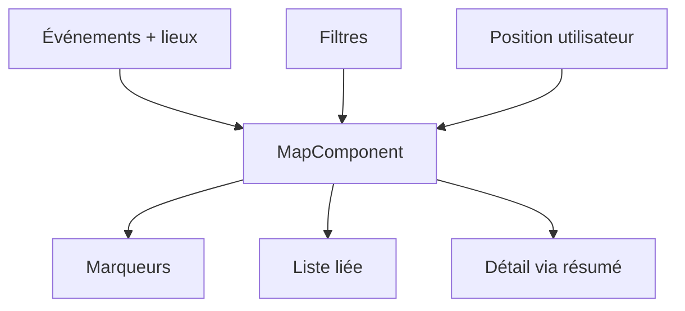

---
## `docs/05-application/composants-partages/map-component.md`

---

# Map component

## Objectif de cette section

Cette page documente le composant central de carte utilisé dans ONY.

Ce composant est l’une des briques les plus importantes du frontend, car il matérialise la promesse map-first du produit.

## Rôle du composant

Le composant carte sert à :

- afficher les événements géolocalisés ;
- proposer une navigation spatiale ;
- coordonner les interactions avec les filtres ;
- servir de base à la découverte locale.

Il est au cœur de la page `/map`, mais son rôle dépasse le simple affichage de tuiles cartographiques.

## Responsabilités principales

Le composant de carte prend en charge ou coordonne :

- le rendu cartographique ;
- l’affichage de marqueurs ;
- la navigation dans la carte ;
- le recentrage ;
- la réaction aux filtres ;
- la relation avec la liste d’événements ;
- certaines interactions UI liées à la priorité visuelle de la carte.

## Lien avec les données

La carte se nourrit principalement de :

- `events`
- `places`
- `event_categories`
- `user_preferences`
- position utilisateur ou centre courant

Le composant ne se contente donc pas d’un rendu graphique.
Il met en forme un résultat métier contextuel.

## Marqueurs

Les marqueurs représentent les événements visibles sur la carte.

Ils doivent :

- être lisibles ;
- refléter l’identité visuelle ONY ;
- être assez distinctifs ;
- permettre une interaction claire.

Un travail récent a déjà amélioré leur cohérence avec la DA du projet.

## Relation avec les filtres

Le composant carte réagit aux filtres actifs, notamment :

- catégories ;
- préférences utilisateur ;
- contexte de navigation ;
- recherche.

Il constitue donc un point de convergence entre :

- données géographiques ;
- personnalisation ;
- UX d’exploration.

## Relation avec le drawer

Le composant carte n’est pas isolé.
Il cohabite avec un drawer “Plus d’événements”.

Cette cohabitation impose :

- une bonne gestion des états visuels ;
- un équilibre entre carte et liste ;
- des règles de rétraction ;
- une attention particulière aux superpositions.

Une partie du travail récent a justement consisté à mieux hiérarchiser la carte face aux autres éléments.

## Géolocalisation et recentrage

Le composant prend en compte :

- la position utilisateur si disponible ;
- un centre de carte ;
- des actions de recentrage via un bouton de localisation.

Cela sert à renforcer la logique de proximité qui structure ONY.

## Comportement interactif

La carte doit rester fluide et prioritaire :

- lors du drag ;
- lors du zoom ;
- lors de l’ouverture d’un panneau filtre ;
- lors de la rétraction ou ouverture du drawer.

Les récents ajustements ont visé à réduire les collisions et superpositions gênantes autour de cette zone.

## Contraintes UX

Le MapComponent doit répondre à plusieurs contraintes :

- laisser un maximum de place utile à la carte ;
- rester lisible sur mobile ;
- ne pas être masqué par des panneaux trop envahissants ;
- s’intégrer à la hiérarchie générale de l’écran map.

## Schéma simplifié

