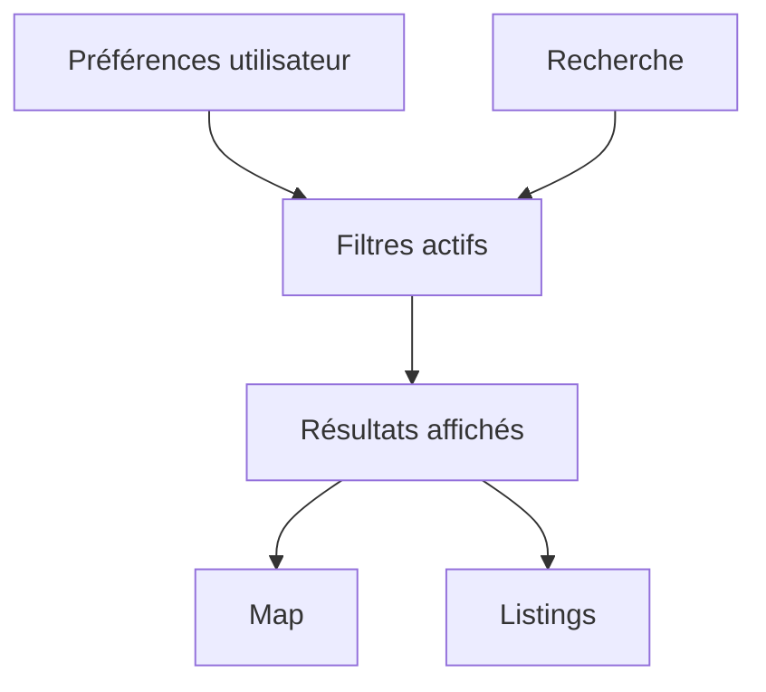

---
## `docs/05-application/composants-partages/search-et-filtres.md`

---

# Search et filtres

## Objectif de cette section

Cette page documente les composants et logiques de recherche et de filtres partagés dans ONY.

Ces briques sont essentielles pour transformer une simple liste d’événements en expérience contextualisée et personnalisée.

## Rôle dans l’application

Les composants de recherche et de filtres permettent à l’utilisateur :

- de retrouver plus rapidement un type d’événement ;
- d’adapter les résultats à ses besoins ;
- d’explorer sans modifier nécessairement ses préférences persistées ;
- d’utiliser la map et les listings de manière plus intelligente.

## Contextes d’usage

Ces composants sont particulièrement importants sur :

- la page map ;
- la page `/events` ;
- certaines sections d’accueil ;
- les parcours liés aux catégories.

## Recherche

La recherche sert à filtrer ou orienter l’exploration des événements à partir d’une saisie utilisateur.

Elle peut être utilisée pour :

- chercher un type d’événement ;
- orienter l’affichage ;
- réduire un ensemble de résultats ;
- renforcer la vitesse d’accès à l’information utile.

## Filtres

Les filtres permettent d’affiner l’affichage selon plusieurs critères, notamment :

- catégories ;
- préférences utilisateur ;
- contexte de proximité ;
- logique d’exploration temporaire.

### Distinction essentielle

Le projet distingue clairement :

- les **préférences persistées** de l’utilisateur ;
- les **filtres temporaires** utilisés pendant une session d’exploration.

Cette distinction est importante pour éviter que toute navigation contextuelle ne modifie durablement le profil utilisateur.

## Évolution récente

Une partie importante du travail récent a consisté à :

- clarifier la zone de filtres sur la map ;
- fusionner recherche et pilotage des filtres dans une barre plus cohérente ;
- permettre de voir les filtres actifs ;
- ajouter des actions explicites :
  - vider les filtres ;
  - réappliquer les préférences utilisateur.

Cette évolution a permis de rendre l’UI plus compréhensible et plus cohérente avec le reste du produit.

## Catégories

Les catégories participent à la logique de filtrage, mais elles peuvent aussi servir de point d’entrée de navigation.

Exemple :

- clic sur une catégorie depuis l’accueil ;
- redirection vers la map ;
- application d’un filtre unique ;
- nettoyage des autres filtres.

Les composants de filtrage doivent donc être capables de prendre en charge un contexte de navigation externe.

## Lien avec la map

La recherche et les filtres sont particulièrement critiques sur la map, car ils influencent :

- les marqueurs visibles ;
- la liste liée au drawer ;
- la logique de proximité ;
- la lisibilité du parcours.

Leur UI doit donc rester :

- compacte ;
- claire ;
- non intrusive ;
- cohérente avec un écran déjà dense.

## Lien avec les préférences utilisateur

Les composants de filtres doivent pouvoir :

- lire les préférences ;
- les réappliquer ;
- permettre de s’en écarter temporairement ;
- revenir à un état de base propre.

Cette articulation est importante pour la promesse de personnalisation d’ONY.

## Contraintes UX

Les composants de recherche et de filtres doivent :

- être compréhensibles ;
- ne pas surcharger l’écran ;
- rester utilisables sur mobile ;
- montrer les filtres actifs ;
- offrir des actions de reset simples.

## Schéma simplifié

