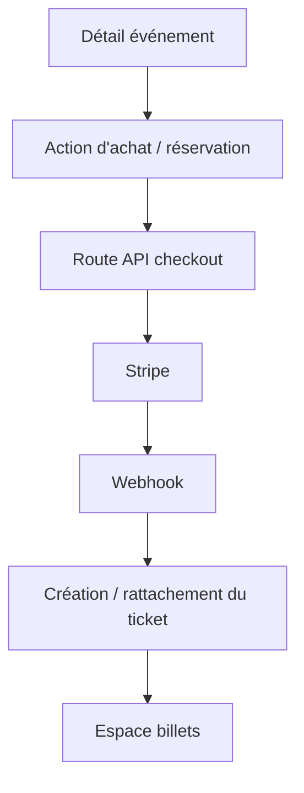

---
## `docs/05-application/events/achat-et-paiement.md`

---

# Achat et paiement

## Objectif de cette section

Cette page décrit la logique d’achat, de réservation et de paiement dans ONY, ainsi que son lien avec la génération de billets.

L’objectif est de documenter le parcours actuel dans sa réalité :

- partie déjà implémentée ;
- intégration Stripe ;
- rôle du frontend ;
- production d’un billet ou d’un ticket associé à l’événement.

## Rôle dans le produit

Le parcours achat/paiement constitue l’une des briques de transformation du produit.

Il permet de passer :

- de la découverte d’un événement ;
- à un engagement utilisateur plus concret ;
- puis à la possession d’un billet.

Il relie donc directement :

- le détail événement ;
- la logique de paiement ou réservation ;
- l’espace billets ;
- le futur contrôle d’accès via scan.

## État actuel

Le projet dispose déjà d’un socle cohérent pour cette partie :

- intégration Stripe dans le code ;
- routes API de checkout et webhook ;
- variables d’environnement dédiées ;
- billets présents dans le modèle de données ;
- affichage de tickets retravaillé dans le frontend.

Selon les zones du projet, le paiement peut être encore simulé ou partiellement industrialisé, mais l’architecture cible est déjà largement identifiable.

## Briques techniques impliquées

Le parcours achat/paiement s’appuie principalement sur :

- la page détail d’un événement ;
- une logique d’action côté frontend ;
- des routes API internes Next.js ;
- Stripe ;
- les tables `events` et `tickets` ;
- éventuellement des traitements liés au retour de paiement.

## Intégration Stripe

Le projet intègre Stripe via :

- une clé secrète côté serveur ;
- une clé publique côté client ;
- un webhook ;
- une route de checkout.

Cela permet de préparer une logique robuste autour de :

- l’initialisation d’un paiement ;
- la réception d’événements Stripe ;
- la sécurisation des échanges ;
- la liaison avec la logique ticketing.

## Parcours fonctionnel simplifié

Le scénario type est le suivant :

1. l’utilisateur consulte un événement ;
2. il choisit d’acheter ou réserver ;
3. l’application déclenche la logique appropriée ;
4. la transaction ou le flux simulé aboutit ;
5. un billet est généré ou rattaché à l’utilisateur ;
6. le billet devient consultable dans l’espace tickets.

## Données concernées

Les données principales de ce parcours sont :

- `events`
- `tickets`
- `profiles` / `auth.users`
- `ticket_scans` ensuite dans le cycle de vie
- éventuellement des métadonnées de paiement ou d’intégration Stripe

## Lien avec les billets

L’achat n’est pas un simple point de sortie du parcours.
Il débouche sur la création d’un objet métier concret : le billet.

Ce billet contient notamment :

- un identifiant ;
- un lien avec l’utilisateur ;
- un lien avec l’événement ;
- une date ;
- un visuel éventuel ;
- un QR code si nécessaire.

## Enjeux de sécurité

Le paiement constitue une zone sensible du projet.

Les principes à respecter sont notamment :

- ne jamais exposer les secrets Stripe côté client ;
- traiter les échanges sensibles via des routes serveur ;
- sécuriser les retours de webhook ;
- maintenir une séparation claire entre logique client et logique serveur.

## Enjeux UX

Le parcours achat/paiement doit rester :

- lisible ;
- rassurant ;
- cohérent avec le reste du produit ;
- compatible avec une expérience mobile.

Il ne doit pas introduire une rupture trop brutale entre l’univers de découverte et l’univers transactionnel.

## Schéma simplifié

