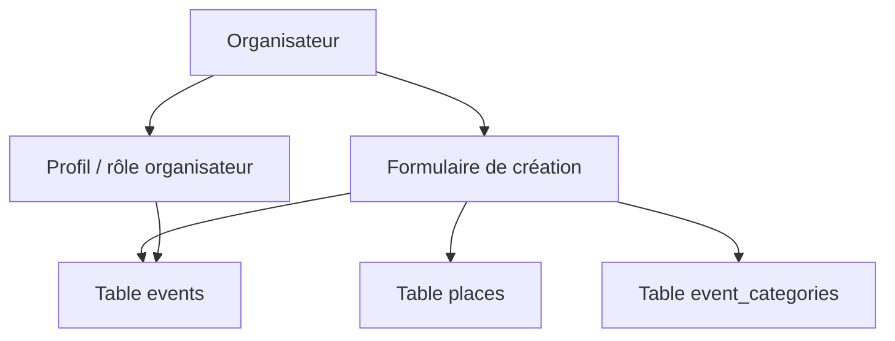

# Création d’un événement

## Objectif de cette section

Cette page documente la logique actuelle de création d’événement dans ONY, ainsi que sa place dans le parcours organisateur.

La création d’événement constitue l’un des piliers du versant “offre” du produit.
Elle permet d’alimenter l’application avec des événements publiables, rattachés à des lieux, à des catégories et potentiellement à un organisateur identifié.

## Place dans le produit

Le module de création d’événement se situe dans la continuité du parcours organisateur.Il représente une brique essentielle pour faire évoluer ONY d’un outil de découverte vers une plateforme capable de porter un cycle complet :

- création ;
- mise en forme ;
- publication ;
- consultation ;
- billetterie ;
- contrôle d’accès.

## État actuel

Le projet contient déjà :

- une route et un espace liés à l’organisation ;
- une modélisation de l’événement en base ;
- une notion d’organisateur dans `profiles` ;
- une table `organizer_requests` ;
- un lien `organizer_id` possible sur `events`.

Cela signifie que le socle existe déjà, mais que le parcours organisateur reste l’un des chantiers les moins stabilisés du projet.

## Données concernées

Créer un événement revient à produire ou renseigner plusieurs informations structurantes :

- titre
- description
- date de début
- date de fin
- lieu
- visibilité
- capacité
- image
- prix
- organisateur
- catégories associées

Certaines de ces informations sont directement stockées dans `events`, tandis que d’autres dépendent :

- d’un lieu existant ou à créer ;
- d’une liaison avec `categories` via `event_categories`.

## Lien avec les lieux

Un événement ONY doit être rattaché à un lieu via `place_id`.

Cela implique que le parcours de création doit prendre en compte l’un des deux cas :

- sélection d’un lieu existant ;
- création d’un nouveau lieu avant rattachement.

Cette dépendance métier est importante, car la carte et la proximité géographique reposent directement sur la qualité des données de lieu.

## Lien avec les catégories

Un événement peut être associé à une ou plusieurs catégories via la table de liaison `event_categories`.

Le parcours de création doit donc intégrer une logique de catégorisation cohérente, afin de permettre ensuite :

- le filtrage ;
- les recommandations ;
- l’exploration par catégories ;
- la personnalisation.

## Rôle de l’organisateur

Le modèle actuel permet de lier un événement à un profil organisateur.

Cela suppose qu’un utilisateur puisse :

- être reconnu comme organisateur ;
- ou faire l’objet d’une validation / demande via `organizer_requests`.

Cette brique devra être clarifiée à mesure que le parcours organisateur gagnera en maturité.

## Contraintes fonctionnelles

Le module de création d’événement doit répondre à plusieurs besoins :

- rester lisible ;
- guider correctement l’organisateur ;
- éviter les erreurs de saisie ;
- produire des événements directement exploitables dans la map, les listings et la billetterie ;
- s’intégrer à la logique de publication du produit.

## Contraintes UX

La création d’événement ne doit pas devenir un formulaire massif et peu lisible.Elle doit s’inscrire dans l’identité ONY :

- mobile-first ;
- structurée ;
- claire ;
- progressive si nécessaire ;
- cohérente avec les autres écrans.

## Dépendances techniques

La création d’événement dépend de plusieurs briques :

- authentification ;
- profil / rôle organisateur ;
- données lieux ;
- données catégories ;
- logique événements ;
- règles d’écriture sécurisées.

Elle peut également être concernée plus tard par :

- l’upload d’images ;
- des validations métier plus strictes ;
- des règles de publication ;
- des contrôles de cohérence renforcés.

## Schéma simplifié

