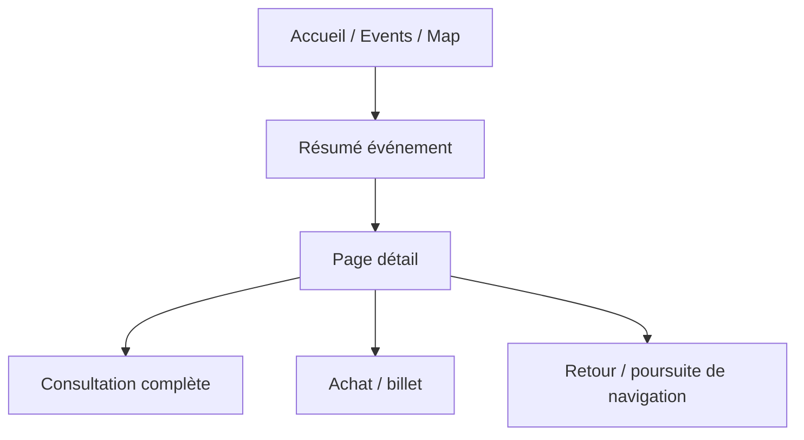

---
## `docs/05-application/events/detail-event.md`

---

# Détail d’un événement

## Objectif de cette section

Cette page documente la page de détail d’un événement dans ONY.

Le détail événement constitue l’écran où l’utilisateur passe d’une logique d’aperçu à une compréhension complète de l’événement.

## Rôle de la page détail

La page détail doit permettre à l’utilisateur de :

- confirmer son intérêt pour un événement ;
- consulter les informations essentielles ;
- prendre une décision d’action ;
- accéder à un parcours de billetterie ou de participation.

Elle occupe une place centrale entre :

- la découverte ;
- l’exploration ;
- et l’engagement utilisateur.

## Données affichées

Le détail d’un événement s’appuie sur les vraies données issues de la base.

Les principales informations affichées ou prévues sont :

- titre ;
- description ;
- date ;
- horaires ;
- lieu ;
- prix ;
- image ;
- catégories ;
- organisateur éventuel selon la logique métier ;
- actions associées.

## Lien avec les résumés d’événements

Une partie importante du travail récent a consisté à mieux articuler :

- les résumés rapides d’événements ;
- la vraie page détail.

Le principe retenu est le suivant :

- les cartes ouvrent un résumé léger ;
- le bouton “En savoir plus” redirige vers le vrai détail ;
- le détail constitue la vue complète et stable.

Cette hiérarchie améliore la lecture du produit.

## Structure de la page

La page détail est organisée autour de plusieurs blocs :

- visuel principal ;
- informations essentielles ;
- date / horaire ;
- lieu ;
- description ;
- actions ;
- bloc récapitulatif d’achat ou de participation.

## Travail récent de refonte

La page détail a fait l’objet d’un important travail de remise au propre.

Les objectifs étaient notamment :

- harmoniser l’UI avec le reste de l’app ;
- corriger les blocs trop grands ou mal positionnés ;
- améliorer la hiérarchie visuelle ;
- corriger les débordements mobiles ;
- rendre certains blocs plus rétractables ;
- laisser davantage de place aux détails lisibles.

## Bloc récapitulatif

Un point important de la page détail concerne le bloc récapitulatif lié à l’achat ou à l’action.

### État récent

Ce bloc a été retravaillé pour :

- être plus compact ;
- démarrer dans une version moins intrusive ;
- être rétractable ;
- masquer moins le contenu principal.

Cette évolution était nécessaire pour préserver la lisibilité mobile.

## Informations date / horaire

La zone date / horaire a aussi été retravaillée pour :

- éviter les débordements ;
- mieux s’adapter aux petits écrans ;
- passer en pile sur mobile si nécessaire ;
- ne plus imposer une grille trop rigide.

Cela améliore la robustesse de l’écran sur les cas réels.

## Place dans le parcours utilisateur

Le détail intervient après :

- une carte sur l’accueil ;
- une carte sur `/events` ;
- un marqueur ou une liste sur la map ;
- un résumé interactif.

Il précède généralement :

- une action d’achat ;
- une navigation retour ;
- ou la poursuite de l’exploration.

## Contraintes UX

Le détail doit respecter plusieurs contraintes :

- rester lisible sur mobile ;
- ne pas surcharger l’utilisateur ;
- présenter clairement l’information utile ;
- maintenir une hiérarchie simple ;
- conserver une cohérence avec les autres écrans du projet.

## Navigation

La page détail doit s’intégrer proprement dans le reste du parcours :

- redirection depuis plusieurs sources ;
- bouton retour ou logique de navigation cohérente ;
- transition claire entre résumé et détail complet.

## Schéma simplifié

