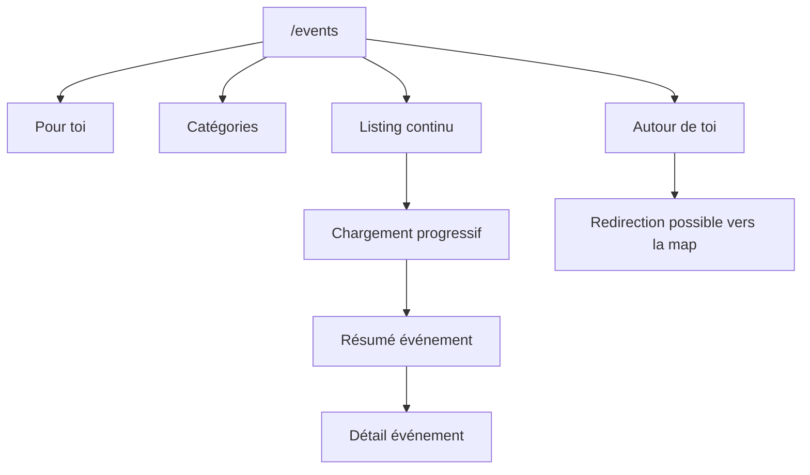

---
## `docs/05-application/events/listing-events.md`

---

# Listing des événements

## Objectif de cette section

Cette page décrit le rôle et le fonctionnement du listing d’événements dans ONY, notamment autour de la page `/events`.

Le listing d’événements constitue l’un des grands points d’entrée du produit, au même titre que l’accueil et la carte.

## Rôle de la page `/events`

La page `/events` sert à proposer une vue plus riche et plus continue de l’offre événementielle que l’accueil.

Elle permet :

- de consulter plusieurs événements dans une même logique de navigation ;
- de parcourir l’offre de manière plus dense ;
- d’organiser la découverte par blocs tout en préparant une logique de listing progressif.

## Positionnement dans les parcours

Cette page se situe entre :

- la découverte plus éditoriale de l’accueil ;
- l’exploration géographique de la carte.

Elle constitue une vue hybride :

- plus structurée qu’une simple homepage ;
- moins spatiale que la map ;
- plus adaptée à une navigation en continu.

## Blocs présents

La page conserve plusieurs sections distinctes, notamment :

- une section “Pour toi” ;
- une section catégories ;
- une section “Autour de toi” ;
- un listing d’événements plus continu.

L’objectif n’est pas d’écraser toute l’expérience dans une seule liste, mais d’organiser la découverte progressivement.

## Réorganisation récente

La page `/events` a récemment fait l’objet d’une réorganisation de structure et d’UI.

Les évolutions principales visées sont :

- repositionner les catégories entre “Pour toi” et “Autour de toi” ;
- conserver les blocs existants ;
- améliorer la logique de lecture ;
- transformer la page en véritable espace de découverte continue.

## Logique de listing continu

La page est pensée pour pouvoir afficher tous les événements de manière progressive.

### Principe attendu

- affichage initial d’un premier lot ;
- chargement progressif de nouveaux événements lors du scroll ;
- poursuite de l’affichage par incréments ;
- logique scalable sans tout charger d’un coup.

Cette approche répond à plusieurs besoins :

- fluidité d’usage ;
- meilleure montée en charge ;
- cohérence avec une future augmentation du volume d’événements.

## Ordonnancement des événements

Le tri des événements doit suivre une logique utile au produit.

Les critères principaux sont :

1. préférences ou filtres utilisateur ;
2. proximité par rapport à la localisation de l’utilisateur.

Cette hiérarchie permet d’aligner la page avec la promesse générale d’ONY :

- montrer d’abord ce qui est pertinent ;
- puis ce qui est proche ;
- permettre une exploration continue.

## Lien avec les préférences utilisateur

Le listing n’est pas purement neutre.Il peut être influencé par :

- les catégories préférées ;
- la logique de personnalisation ;
- la proximité géographique ;
- le contexte utilisateur.

Cela permet de rapprocher la page `/events` du comportement de la carte, sans en être une copie.

## Lien avec la carte

La page `/events` est aussi connectée à la logique map-first du produit.

Par exemple :

- certaines actions “Voir tout” redirigent vers la carte ;
- les événements proches doivent rester cohérents avec la proximité réelle ;
- la page peut servir de tremplin vers la map.

Elle doit donc rester cohérente avec les mêmes sources de vérité que la carte :

- événements ;
- lieux ;
- préférences ;
- proximité ;
- catégories.

## Cartes et résumé rapide

Comme l’accueil et d’autres vues du projet, la page `/events` réutilise des cartes événement capables d’ouvrir un résumé interactif.

Cette logique permet :

- de limiter le bruit visuel ;
- d’éviter de passer systématiquement sur une page détail ;
- de garder une découverte progressive ;
- de réutiliser des composants communs.

## Contraintes UX

La page doit respecter plusieurs contraintes :

- garder les blocs fonctionnels ;
- ne pas perdre la lisibilité mobile ;
- éviter la surcharge visuelle ;
- permettre un scroll naturel ;
- rester cohérente avec le reste de l’application.

## Schéma simplifié

