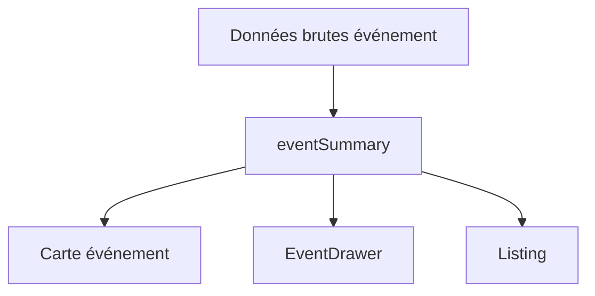

---
## `docs/05-application/lib-et-stores/event-summary.md`

---

# Event summary

## Objectif de cette section

Cette page documente la logique `eventSummary`, utilisée dans ONY pour normaliser et préparer les données d’un événement en vue de leur affichage dans des composants de résumé.

Cette brique a joué un rôle important dans la refonte récente de l’interface, car elle a permis de remplacer plusieurs contenus codés en dur par de vraies données issues de la base.

## Rôle du module

Le module `eventSummary` sert à transformer les données brutes d’un événement en un format exploitable par les composants de présentation.

Il permet notamment :

- de sélectionner les champs utiles ;
- de normaliser certaines valeurs ;
- de préparer des informations lisibles ;
- d’uniformiser l’affichage d’un événement dans plusieurs contextes.

## Pourquoi cette couche est utile

Dans une application comme ONY, un même événement peut apparaître dans plusieurs interfaces :

- accueil ;
- page events ;
- map ;
- liste liée à la map ;
- overlays de résumé ;
- cartes diverses.

Sans couche de normalisation, chaque composant risque de :

- reconstruire ses propres formats ;
- dupliquer la logique ;
- afficher des valeurs incohérentes.

## Responsabilités principales

Le module `eventSummary` peut notamment prendre en charge :

- la sélection des champs pertinents ;
- la normalisation de l’image ;
- l’extraction du lieu ;
- l’extraction ou la préparation des catégories ;
- le formatage de la date ;
- le formatage de l’heure ;
- le formatage du prix ;
- la préparation d’un résumé réutilisable.

## Lien avec les composants UI

Cette couche alimente directement des composants comme :

- `EventDrawer`
- certaines cartes événements
- des blocs de listing
- certaines vues map ou résumés contextuels

Elle contribue donc fortement à la cohérence de l’interface.

## Travail récent

Le module a été particulièrement utile lors du remplacement des faux contenus statiques dans les résumés d’événements.

Il a permis de :

- brancher les vraies données BDD ;
- harmoniser les informations affichées ;
- éviter une logique de mapping recopiée dans plusieurs composants ;
- rapprocher le produit d’un état plus crédible et maintenable.

## Nature de la logique portée

`eventSummary` ne constitue pas un composant visuel.C’est une couche intermédiaire entre :

- les données brutes ;
- l’interface.

Cette distinction est importante car elle aide à maintenir :

- la lisibilité du code ;
- la séparation entre présentation et transformation ;
- une meilleure réutilisabilité.

## Lien avec la cohérence produit

Cette couche renforce la cohérence du produit sur plusieurs dimensions :

- même titre affiché partout ;
- mêmes formats de date et d’heure ;
- même logique de prix ;
- même qualité d’image ou de fallback ;
- même niveau de détail selon le contexte.

## Points de vigilance

Il faudra veiller à :

- ne pas disperser des logiques de résumé concurrentes ailleurs ;
- garder cette couche simple et centrée sur la transformation ;
- ne pas la surcharger avec de la logique métier complexe.

## Schéma simplifié

