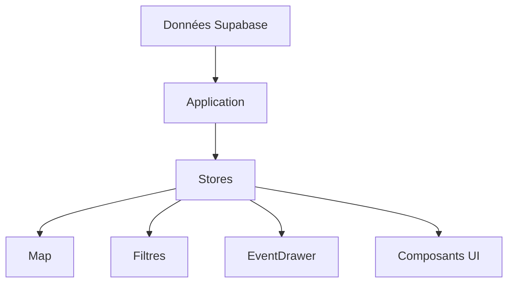

# Stores

## Objectif de cette section

Cette page documente les stores utilisés dans ONY pour porter l’état applicatif partagé.

Dans une application comme ONY, tous les états n’ont pas vocation à rester locaux à un composant.
Certaines informations doivent être partagées entre plusieurs écrans, plusieurs composants ou plusieurs parcours.

La logique de store répond à ce besoin.

## Rôle des stores dans ONY

Les stores servent à centraliser certains états transverses de l’application.

Ils permettent notamment :

- de conserver un état partagé ;
- d’éviter le passage excessif de props ;
- de synchroniser plusieurs zones de l’interface ;
- de rendre certains parcours plus fluides côté utilisateur.

Cette couche relève donc de la gestion d’état frontend.

## Place dans l’architecture

Les stores se situent entre :

- les données récupérées ou préparées par l’application ;
- les composants d’interface ;
- les parcours utilisateur.

Ils ne remplacent pas la base de données ni Supabase.
Ils servent à porter un état applicatif temporaire, local au frontend, mais utile à plusieurs composants en même temps.

## Différence entre store et donnée persistée

Il est important de distinguer :

- une donnée persistée en base ;
- un état frontend.

Par exemple :

- un événement existe en base dans `events` ;
- un filtre actif ou un événement actuellement sélectionné peut, lui, relever d’un store.

Les stores ne sont donc pas une source de vérité métier durable.
Ils servent surtout à améliorer la circulation de l’information dans l’interface.

## Pourquoi cette couche est utile

Dans ONY, plusieurs parcours nécessitent un partage d’état entre écrans ou composants :

- la navigation accueil → map ;
- la conservation de filtres ;
- la sélection d’une catégorie ;
- l’ouverture d’un résumé d’événement ;
- certains comportements liés au profil ou aux préférences ;
- certains états d’interface mobile.

Sans store, ces logiques risquent de provoquer :

- une duplication de code ;
- une circulation complexe de props ;
- des incohérences entre écrans ;
- une maintenance plus difficile.

## Types d’état concernés

Les stores peuvent notamment porter :

- l’état de filtres actifs ;
- une catégorie sélectionnée ;
- une position ou un contexte de carte ;
- un événement sélectionné ;
- certains états liés à l’ouverture d’un drawer, d’un overlay ou d’une vue mobile ;
- certains états de session ou de préférence déjà chargés côté frontend.

Tous les états n’ont pas besoin d’un store.
Cette couche doit rester réservée aux états réellement transverses.

## Lien avec les composants partagés

Les stores ont un lien direct avec plusieurs composants réutilisés dans le projet, notamment :

- la navigation basse ;
- les filtres ;
- la map ;
- les drawers ;
- certaines cartes événements.

Ils jouent donc un rôle d’orchestration discret mais important dans l’expérience utilisateur.

## Lien avec les modules `eventSummary` et `categoryPresentation`

Les stores ne remplissent pas le même rôle que `eventSummary` ou `categoryPresentation`.

- `eventSummary` prépare un format d’événement exploitable par l’UI ;
- `categoryPresentation` harmonise la représentation visuelle des catégories ;
- les stores, eux, portent l’état partagé nécessaire au fonctionnement de l’interface.

Ils sont donc complémentaires.

## Intérêt produit

Cette couche contribue à rendre l’application plus fluide :

- meilleure continuité entre les écrans ;
- comportements plus cohérents ;
- réduction des effets de rupture dans les parcours ;
- meilleure maintenabilité de l’interface.

Dans un projet mobile-first comme ONY, cette fluidité est particulièrement importante.

## Points de vigilance

Pour la suite, il faudra veiller à :

- ne pas transformer les stores en fourre-tout ;
- distinguer clairement état frontend et donnée métier persistée ;
- éviter de dupliquer dans les stores des données déjà disponibles ailleurs ;
- garder des responsabilités lisibles ;
- documenter les stores réellement structurants.

## Schéma simplifié

