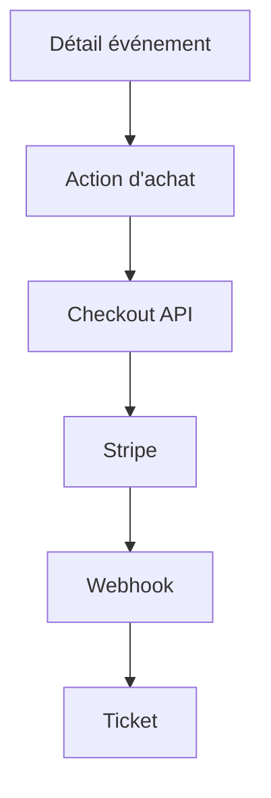

---
## `docs/05-application/lib-et-stores/stripe.md`
---

# Stripe

## Objectif de cette section

Cette page documente l’intégration Stripe dans ONY.

Stripe constitue la brique utilisée pour porter la logique de paiement ou de billetterie simulée/évolutive dans le projet.
Même si tous les flux ne sont pas encore au même niveau de maturité, l’intégration est déjà structurée dans l’architecture.

## Rôle de Stripe dans ONY

Stripe sert à accompagner le passage entre :

- la consultation d’un événement ;
- l’action d’achat ou de réservation ;
- la création d’un billet ;
- l’intégration d’un parcours transactionnel crédible.

L’objectif n’est pas uniquement technique : Stripe participe aussi à la crédibilité globale du produit.

## Place dans l’architecture

Stripe est intégré dans ONY via :

- des variables d’environnement dédiées ;
- une configuration applicative ;
- une route de checkout ;
- une route de webhook ;
- une logique de billetterie côté app.

Cette intégration se situe principalement dans la couche backend logique de l’application.

## Éléments principaux

L’intégration Stripe repose sur plusieurs briques :

### 1. Clé publique

Utilisée côté frontend pour initialiser certains flux autorisés.

### 2. Clé secrète

Utilisée uniquement côté serveur pour les opérations sensibles.

### 3. Route de checkout

Utilisée pour déclencher un parcours lié à l’achat ou à la réservation.

### 4. Webhook

Utilisé pour recevoir les événements Stripe et synchroniser les traitements nécessaires.

## Intérêt de cette intégration

L’usage de Stripe permet :

- de préparer un parcours plus réaliste que de simples simulations ;
- de séparer proprement frontend et logique sensible ;
- de s’appuyer sur un standard reconnu ;
- de rendre le projet plus crédible techniquement.

## Lien avec les tickets

Le rôle de Stripe ne s’arrête pas au paiement.Dans ONY, il s’inscrit dans une chaîne plus large :

- événement ;
- action d’achat ;
- traitement backend ;
- génération ou rattachement du billet ;
- consultation du ticket ;
- scan éventuel.

Stripe est donc une brique transactionnelle, mais aussi un déclencheur du cycle billet.

## Sécurité

L’intégration Stripe impose plusieurs règles de sécurité :

- ne jamais exposer la clé secrète côté client ;
- utiliser des routes serveur pour les traitements sensibles ;
- vérifier correctement les événements de webhook ;
- documenter clairement les variables utilisées ;
- garder une séparation stricte entre logique publique et logique protégée.

## Dépendances techniques

Stripe dépend notamment :

- des variables d’environnement ;
- des routes API Next.js ;
- de certains flux de création de tickets ;
- du frontend qui déclenche les actions d’achat.

## Limites actuelles

Le niveau d’industrialisation du paiement peut encore évoluer selon l’état exact des parcours.Les zones à renforcer dans la suite pourront inclure :

- les tests E2E du parcours Stripe ;
- la clarification des statuts métier après paiement ;
- la documentation détaillée des cas d’erreur ;
- la meilleure synchronisation avec la billetterie.

## Schéma simplifié

