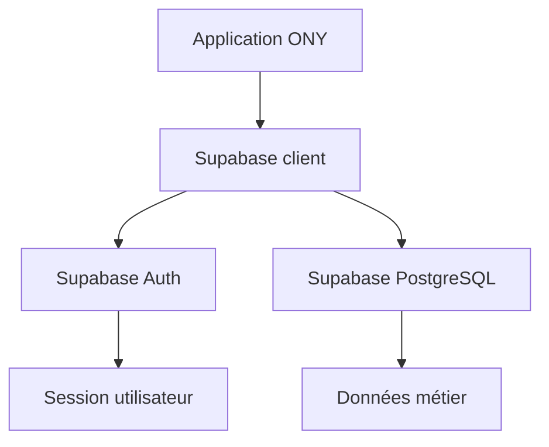

# Supabase client

## Objectif de cette section

Cette page documente le client Supabase utilisé dans ONY.

Le client Supabase constitue l’un des points d’entrée techniques les plus importants du projet, car il permet à l’application d’interagir avec :

- l’authentification ;
- la base de données ;
- les profils ;
- les préférences ;
- les événements ;
- les billets ;
- et plus généralement l’ensemble des données portées par Supabase.

## Rôle du client Supabase

Le client Supabase sert à encapsuler ou centraliser l’accès à l’instance Supabase du projet.

Il permet notamment :

- d’initialiser la connexion à Supabase ;
- de fournir un point de configuration unique ;
- d’éviter la duplication de logique d’instanciation ;
- d’uniformiser les appels côté application.

## Place dans l’architecture

Le client Supabase se situe au croisement entre :

- la couche application ;
- la couche données ;
- la couche authentification.

Il est utilisé par plusieurs zones du projet :

- authentification ;
- profil ;
- préférences ;
- événements ;
- billets ;
- scan ;
- routes API selon les besoins.

## Types d’usage

Le projet peut exploiter plusieurs modes d’utilisation de Supabase selon le contexte :

### 1. Côté client

Pour les opérations autorisées dans le navigateur, avec la clé publique.

### 2. Côté serveur

Pour des opérations protégées ou des traitements nécessitant des variables sensibles.

### 3. Dans les routes API

Pour certains flux intégrés, notamment quand il faut croiser :

- données ;
- sécurité ;
- logique Stripe ;
- ou traitements backend.

## Lien avec l’authentification

Le client Supabase est directement impliqué dans :

- la connexion ;
- l’inscription ;
- le maintien de session ;
- l’OAuth ;
- le chargement des données liées à l’utilisateur.

Il agit donc comme l’un des ponts techniques majeurs entre l’interface et le système d’identité.

## Lien avec les données métier

Le client Supabase permet aussi d’interroger les tables métier et leurs relations :

- `events`
- `places`
- `categories`
- `event_categories`
- `profiles`
- `user_preferences`
- `tickets`
- `ticket_scans`
- `notifications`
- `organizer_requests`

Il participe donc à l’orchestration de la majeure partie des flux applicatifs du projet.

## Intérêt d’une centralisation

Centraliser l’instanciation du client Supabase présente plusieurs avantages :

- éviter la redondance ;
- limiter les erreurs de configuration ;
- mieux documenter les usages ;
- clarifier la séparation client / serveur ;
- faciliter la maintenance.

## Relation avec les variables d’environnement

Le client Supabase dépend de variables d’environnement, notamment :

- l’URL Supabase ;
- la clé anonyme publique ;
- éventuellement la clé de service côté serveur.

La distinction entre ces variables est importante :

- les variables publiques peuvent être exposées au frontend ;
- les variables de service doivent rester côté serveur uniquement.

## Points de vigilance

Les principaux points à surveiller sont :

- ne pas utiliser une clé trop privilégiée côté client ;
- bien distinguer les usages frontend et backend ;
- garder une logique d’accès documentée ;
- éviter de dupliquer les helpers autour de Supabase sans raison.

## Schéma simplifié

