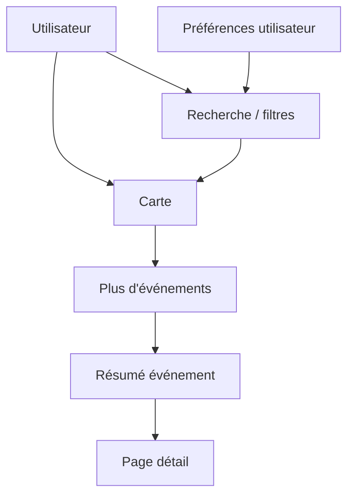

---
## `docs/05-application/map/map-interactive.md`

---

# Carte interactive

## Objectif de cette section

Cette page documente la carte interactive d’ONY comme module applicatif central.

Même si la cartographie a déjà été décrite dans la stack technique, cette page se concentre sur la **mise en œuvre côté application** :

- comportement utilisateur ;
- interface ;
- filtres ;
- drawer ;
- synchronisation avec les événements ;
- cohérence avec les autres parcours.

## Rôle de la page map

La page map représente l’un des écrans les plus importants du projet.
Elle traduit concrètement la promesse map-first d’ONY.

Elle permet à l’utilisateur de :

- repérer des événements autour de lui ;
- filtrer l’affichage ;
- cliquer sur un événement ;
- consulter un résumé ou un détail ;
- naviguer de manière géographique plutôt que purement textuelle.

## Structure générale de l’écran

La page map repose sur plusieurs éléments coordonnés :

- une carte centrale ;
- une barre haute de recherche et de filtres ;
- un bouton de localisation ;
- un drawer “Plus d’événements” ;
- des overlays ou résumés d’événements ;
- une navigation globale adaptée.

L’équilibre entre ces éléments est essentiel pour conserver la lisibilité de l’écran.

## Carte comme élément prioritaire

Une décision UX forte a été prise récemment : la carte doit rester l’élément principal de la page.

Cela implique notamment :

- de limiter les overlays trop envahissants ;
- de garder les panneaux secondaires compacts ;
- de réduire les superpositions inutiles ;
- de fermer ou réduire certains drawers par défaut.

## Filtres et recherche

La page map intègre une logique de recherche et de filtres.

Le fonctionnement attendu est le suivant :

- une barre principale en haut de la page ;
- un bouton filtres à droite ;
- un panneau compact permettant :
  - de voir les filtres actifs ;
  - de les modifier ;
  - de vider les filtres ;
  - de réappliquer les préférences utilisateur.

Un point important du produit est la distinction entre :

- **préférences utilisateur persistées**
- **filtres temporaires d’exploration**

## Catégories depuis l’accueil

La map peut aussi être atteinte avec un contexte, par exemple :

- clic sur une catégorie depuis l’accueil ;
- redirection vers `/map?category=...`

Dans ce cas :

- les anciens filtres sont nettoyés ;
- une catégorie unique est appliquée ;
- la carte et la liste associée se synchronisent sur cette logique.

## Drawer “Plus d’événements”

La map est complétée par un drawer listant les événements en lien avec le contexte courant.

Ce drawer :

- reflète les événements actuellement filtrés ;
- est trié du plus proche au plus éloigné ;
- n’affiche qu’un nombre limité de résultats au départ ;
- permet un chargement progressif ;
- peut être rétracté ;
- doit laisser la carte visible.

### Comportement actuel attendu

- état réduit ou fermé par défaut ;
- rétraction automatique lors de la manipulation de la carte ;
- réouverture maîtrisée ;
- cohérence mobile-first.

## Synchronisation carte / liste

Le drawer n’est pas un bloc décoratif.Il doit être synchronisé avec la carte :

- mêmes résultats ;
- même logique de filtre ;
- même logique de proximité ;
- continuité vers le détail.

Cette cohérence est essentielle à la qualité perçue du produit.

## Résumés d’événements

Comme sur d’autres pages du produit, la map peut ouvrir des résumés rapides d’événements.

Ces overlays permettent :

- de consulter les informations utiles ;
- d’éviter un changement de page immédiat ;
- de garder la carte comme contexte principal ;
- de rediriger ensuite vers le vrai détail via “En savoir plus”.

## Localisation utilisateur

La map prend en compte la position utilisateur ou un centre de carte afin de :

- mieux trier les événements ;
- améliorer la pertinence de l’affichage ;
- alimenter la logique “Autour de toi”.

Un bouton de localisation permet de réagir rapidement à ce contexte.

## Travail récent de refonte

La map a fait l’objet d’un travail important de consolidation :

- catégories réellement reliées à la BDD ;
- filtres remis au propre ;
- drawer plus cohérent ;
- tri par proximité ;
- chargement progressif ;
- meilleure gestion des superpositions ;
- recentrage de l’expérience sur la carte ;
- harmonisation visuelle avec le reste de l’application.

## Contraintes UX majeures

La carte impose plusieurs contraintes :

- préserver l’espace visible ;
- éviter les collisions entre composants ;
- garder une interface compréhensible sur mobile ;
- permettre une découverte rapide ;
- ne pas transformer la carte en écran surchargé.

## Schéma simplifié

