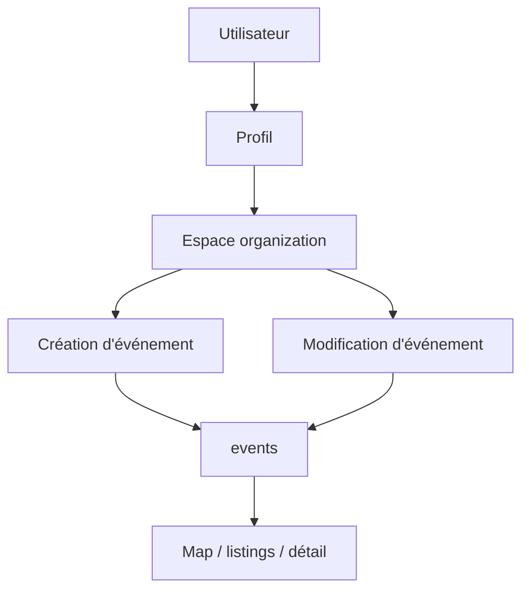

# Organisation

## Objectif de cette section

Cette page documente l’espace **organization** d’ONY, c’est-à-dire la zone de l’application pensée pour les parcours liés aux organisateurs et à la gestion d’événements.

Cette partie du projet existe déjà dans la structure applicative et dans le modèle de données, mais elle reste l’un des blocs les moins totalement stabilisés sur le plan métier.

## Rôle de l’espace organization

L’espace organization a vocation à devenir le point d’entrée principal pour les utilisateurs disposant d’un rôle organisateur ou cherchant à accéder à des fonctions avancées de gestion.

Il doit permettre, à terme ou selon l’état actuel des écrans :

- d’accéder à des fonctions de création d’événement ;
- de modifier des événements existants ;
- d’organiser la publication d’un événement ;
- de préparer des usages liés à la billetterie ou au scan ;
- de distinguer les usages “participant” des usages “organisateur”.

## Place dans l’application

L’espace organization est distinct :

- de la découverte publique via l’accueil, `/events` et `/map` ;
- du simple profil utilisateur ;
- des écrans orientés billetterie personnelle.

Il sert de pivot entre :

- le profil ;
- la création d’événement ;
- la gestion d’événement ;
- et, à terme, la logique métier organisateur plus avancée.

## Fondations déjà présentes

Le projet dispose déjà de plusieurs briques qui rendent cet espace pertinent :

- présence d’une route dédiée côté application ;
- existence d’une logique de rôle dans `profiles` ;
- présence d’un booléen `organizer_verified` ;
- table `organizer_requests` pour les demandes ou validations ;
- champ `organizer_id` sur les événements ;
- base de création / gestion d’événements dans l’application.

Cela montre que le module n’est pas théorique : il repose déjà sur de vraies briques applicatives et métier.

## Lien avec le rôle organisateur

Le module organization dépend directement du rôle et du statut du compte utilisateur.

Plusieurs cas peuvent être distingués :

- utilisateur standard sans rôle organisateur ;
- utilisateur ayant formulé une demande ;
- utilisateur vérifié comme organisateur ;
- utilisateur autorisé à gérer ses événements.

Cette distinction devra être strictement documentée et clarifiée à mesure que le module sera consolidé.

## Fonctions visées

L’espace organization doit porter ou préparer les fonctions suivantes :

### 1. Création d’événement

Créer un événement avec :

- titre ;
- description ;
- dates ;
- lieu ;
- catégories ;
- prix ;
- visuel ;
- capacité.

### 2. Modification

Permettre de corriger ou mettre à jour :

- les informations de base ;
- la visibilité ;
- les métadonnées associées ;
- le lien avec les catégories ou le lieu.

### 3. Gestion organisateur

Donner accès à une vue plus “pilotage” :

- événements publiés ;
- actions disponibles ;
- statut du compte organisateur ;
- éventuellement gestion future des billets ou scans.

## État actuel du module

Le module organization existe dans le code, mais il reste partiellement consolidé.

Les zones qui demandent encore de la structuration sont notamment :

- la clarté des rôles exacts ;
- le périmètre fonctionnel visible ;
- la cohérence entre front et logique métier ;
- la documentation des cas d’usage ;
- la séparation entre fonctions utilisateur et fonctions organisateur.

## Contraintes métier

Cette zone implique plusieurs enjeux :

- contrôler qui peut créer ou modifier ;
- éviter les événements mal structurés ;
- garantir la cohérence avec les lieux et catégories ;
- aligner la gestion d’événements avec la logique de découverte du produit.

Un événement créé dans l’espace organisateur doit être immédiatement exploitable dans :

- la map ;
- les listings ;
- les détails ;
- la billetterie.

## Contraintes UX

Le module organization ne doit pas dériver vers une interface lourde ou trop administrative.

Il doit rester cohérent avec ONY :

- mobile-first ;
- lisible ;
- guidé ;
- structuré ;
- compatible avec des usages rapides.

L’objectif n’est pas de construire un back-office industriel complet, mais une interface de gestion claire et pragmatique.

## Relation avec les autres modules

L’espace organization interagit directement avec :

- le profil ;
- les événements ;
- les lieux ;
- les catégories ;
- les billets ;
- le scan ;
- potentiellement les notifications.

Il constitue donc un nœud métier important pour les futures évolutions du projet.

## Schéma simplifié

