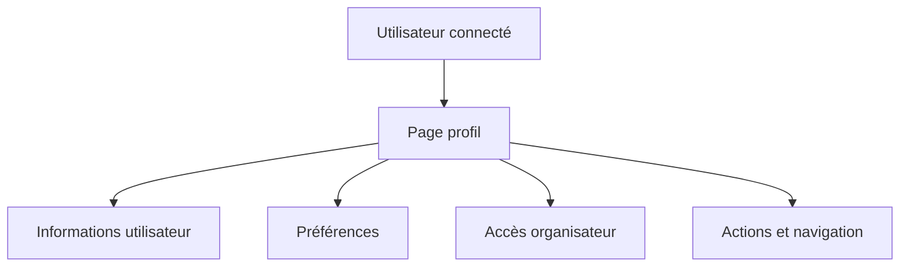

---
## `docs/05-application/profile/profile.md`

---

# Profil

## Objectif de cette section

Cette page documente la page profil d’ONY et son rôle dans l’expérience utilisateur.

La page profil sert de point d’accès aux informations personnelles, aux préférences et à certaines fonctions liées au compte utilisateur.

## Rôle du profil dans le produit

Le profil remplit plusieurs fonctions dans ONY :

- donner accès à l’identité utilisateur ;
- servir de point d’entrée vers certaines options personnelles ;
- centraliser des informations de compte ;
- permettre une personnalisation minimale du produit ;
- ouvrir vers des parcours plus spécifiques, notamment organisateur.

Il ne s’agit donc pas seulement d’une fiche utilisateur, mais d’un espace de gestion du contexte personnel dans l’application.

## Données concernées

Le profil s’appuie principalement sur :

- `auth.users` pour l’identité technique ;
- `profiles` pour les données applicatives enrichies ;
- `user_preferences` pour les préférences de découverte ;
- éventuellement d’autres tables liées à l’activité utilisateur.

Les informations manipulées peuvent inclure :

- nom ;
- username ;
- rôle ;
- bio ;
- téléphone ;
- avatar ;
- statut organisateur ;
- groupe d’âge ;
- préférences.

## Éléments présents sur la page

La page profil a vocation à regrouper ou exposer :

- les informations de compte ;
- le menu profil ;
- les préférences ;
- les accès vers des zones liées à l’utilisateur ;
- certaines actions liées à la session ou au rôle.

## Travail récent de refonte

La page profil a récemment été retravaillée sur le plan UI afin de :

- mieux l’aligner avec le reste de l’application ;
- clarifier la hiérarchie visuelle ;
- mieux organiser le menu ;
- améliorer les espacements et les regroupements ;
- réduire l’effet de patchwork entre sections.

Le but n’était pas de changer la logique métier en profondeur, mais de rendre la lecture plus fluide et plus cohérente.

## Menu profil

Le menu profil représente l’un des éléments les plus importants de cet écran.

Il doit permettre :

- d’identifier clairement les actions disponibles ;
- de regrouper les options de manière logique ;
- de guider l’utilisateur sans multiplier les niveaux de lecture.

La qualité de ce menu conditionne largement la perception de clarté du profil.

## Lien avec les préférences

Le profil agit aussi comme point d’accès naturel aux préférences utilisateur.

Ces préférences peuvent influencer :

- les catégories mises en avant ;
- la distance maximale ;
- certains comportements de découverte ;
- l’usage de la map.

La documentation distingue toutefois clairement :

- préférences persistées dans le profil ;
- filtres temporaires utilisés pendant l’exploration.

## Lien avec l’espace organisateur

Le profil peut aussi faire office de point d’accès vers des fonctionnalités plus avancées :

- demande de rôle organisateur ;
- statut d’organisateur ;
- entrée vers l’espace de gestion d’événements.

Cette articulation devra encore être consolidée à mesure que le module organisateur gagnera en maturité.

## Lien avec la navigation globale

La page profil s’intègre à la navigation générale du produit :

- bottom bar ;
- boutons retour sur écrans spécifiques ;
- accès secondaires à certaines fonctions liées au compte.

Elle constitue un écran de personnalisation, mais aussi un nœud de navigation important.

## Contraintes UX

Le profil doit respecter plusieurs contraintes :

- rester lisible sur mobile ;
- ne pas devenir une page fourre-tout ;
- éviter les menus trop confus ;
- rester cohérent avec la direction artistique ONY ;
- conserver des blocs simples à parcourir.

## Schéma simplifié

