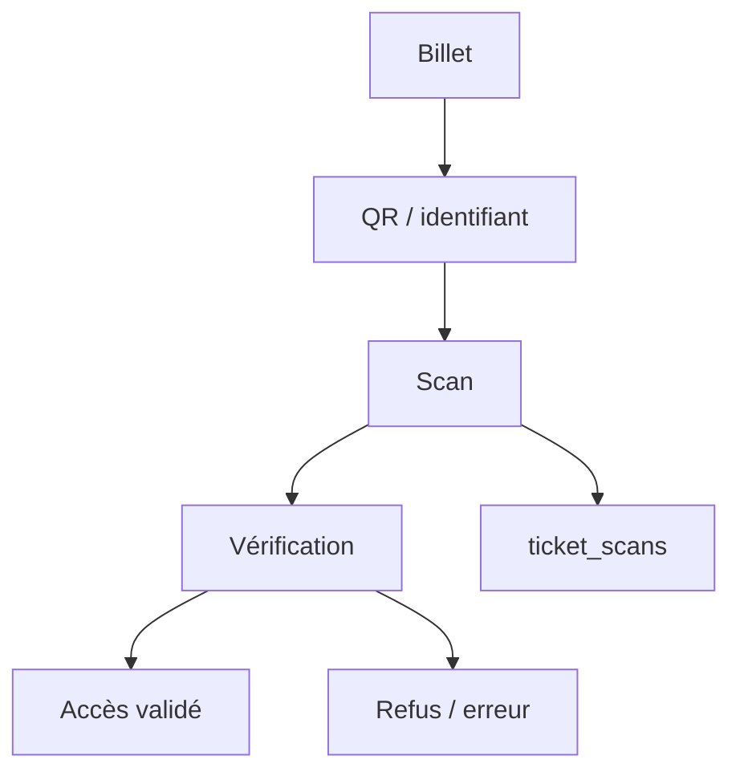

---
## `docs/05-application/scan/scan-billet.md`

---

# Scan de billet

## Objectif de cette section

Cette page documente le module de **scan de billet** dans ONY.

Le scan représente la dernière étape du cycle événementiel :

- découverte ;
- détail ;
- achat ou réservation ;
- billet ;
- contrôle d’accès.

Il s’agit donc d’une brique essentielle pour relier l’application à un usage terrain.

## Rôle du module scan

Le module scan permet de vérifier la validité d’un billet au moment de l’accès à un événement.

Il sert à :

- lire un billet ;
- vérifier qu’il existe ;
- contrôler son lien avec un événement ;
- produire une validation ou un refus ;
- enregistrer une trace de scan.

## Place dans le produit

Le scan n’est pas un parcours central pour tous les utilisateurs, mais il est stratégique dans l’écosystème du projet.

Il intervient principalement côté :

- organisateur ;
- staff ;
- contrôle d’accès ;
- gestion pratique d’événements.

Il donne une extension concrète à la billetterie.

## Données concernées

Le scan s’appuie principalement sur :

- `tickets`
- `ticket_scans`
- éventuellement `events`
- l’identité du compte ayant effectué le scan

La table `ticket_scans` permet notamment de conserver :

- l’identifiant du scan ;
- le ticket concerné ;
- l’événement éventuel ;
- l’utilisateur ayant scanné ;
- la date du scan.

## Fonctionnement attendu

Le parcours de scan suit une logique simple :

1. ouverture de l’écran de scan ;
2. lecture du QR code ou de l’identifiant ;
3. recherche du ticket correspondant ;
4. vérification de la cohérence ;
5. retour visuel :
   - valide
   - invalide
   - problème de lecture ou ticket non reconnu ;
6. enregistrement éventuel du scan.

## Lien avec les tickets

Le module scan dépend directement de la qualité du module tickets.

Un ticket doit être suffisamment structuré pour permettre :

- son identification ;
- sa lecture ;
- sa validation dans un contexte événementiel.

Le scan n’est donc pas un module isolé, mais l’extension du système de billetterie.

## Lien avec les rôles

Le scan est plutôt destiné à des comptes disposant d’un usage spécifique, par exemple :

- organisateur ;
- personnel lié à l’événement ;
- opérateur de contrôle.

Cette logique devra être mieux explicitée et sécurisée à mesure que le module organisateur sera consolidé.

## Interface utilisateur

L’écran de scan doit rester :

- simple ;
- lisible ;
- rapide à utiliser ;
- compatible avec un usage mobile sur le terrain.

À l’inverse de certains écrans de découverte, l’interface de scan doit privilégier :

- l’efficacité ;
- la clarté du résultat ;
- la vitesse de lecture.

## Navigation et UX

Le module scan ne nécessite pas toujours la présence de la bottom bar.
Sur les écrans où celle-ci n’est pas pertinente, une logique de bouton retour ou de navigation adaptée doit être prévue.

Cette attention est importante car le scan est un usage utilitaire plus qu’un usage de navigation générale.

## État actuel

Le projet possède déjà :

- une route dédiée au scan ;
- une modélisation de `ticket_scans` ;
- une logique liée aux billets ;
- une documentation et un parcours applicatif déjà amorcés.

La zone reste toutefois à consolider sur :

- les règles métier exactes ;
- les contrôles de droits ;
- les cas d’erreur ;
- l’intégration complète dans le parcours organisateur.

## Contraintes techniques

Le scan doit gérer plusieurs cas :

- ticket valide ;
- ticket invalide ;
- ticket introuvable ;
- mauvais contexte ;
- tentative de réutilisation ou doublon éventuel ;
- problème de lecture.

Ces cas devront être mieux formalisés dans la partie tests et dans la logique métier future.

## Schéma simplifié

