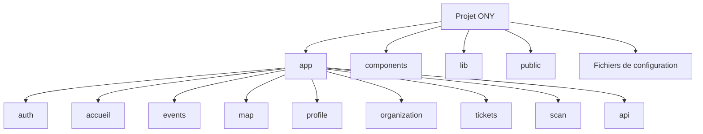

# Structure du projet

## Objectif de cette section

Cette page décrit l’organisation actuelle du code de l’application ONY.L’objectif est de fournir une lecture claire de l’arborescence du projet afin de faciliter :

- la compréhension globale du code ;
- la reprise du projet ;
- la maintenance ;
- l’identification rapide des zones fonctionnelles.

Cette documentation s’appuie sur l’arborescence réelle du dépôt dans son état actuel.

## Vue d’ensemble

L’application ONY repose sur une base **Next.js** avec **App Router**.L’organisation actuelle du projet suit une logique relativement claire, articulée autour de :

- `app/` pour les routes et les pages ;
- `components/` pour les composants partagés ou spécialisés ;
- `lib/` pour les utilitaires et intégrations ;
- `public/` pour les assets statiques ;
- `docs/` pour la documentation interne liée au code si présente ;
- fichiers de configuration à la racine du projet.

## Arborescence principale

Les dossiers les plus structurants du projet sont les suivants :

### `app/`

C’est le cœur de l’application côté interface et routing.

On y retrouve notamment :

- les groupes de routes d’authentification ;
- l’accueil ;
- la page `events` ;
- la carte `map` ;
- le profil ;
- l’organisation ;
- le scan ;
- les tickets ;
- les routes API ;
- les pages dynamiques comme le détail d’un événement.

### `components/`

Ce dossier regroupe les composants réutilisables ou mutualisés, notamment :

- composants UI ;
- composants liés aux événements ;
- composants liés à la map ;
- navigation ;
- éléments de layout ;
- blocs de résumé et d’action.

### `lib/`

Cette zone regroupe généralement :

- les clients d’intégration ;
- les utilitaires techniques ;
- les helpers ;
- les fonctions de transformation de données ;
- les couches de service côté app.

### `public/`

Ce dossier contient les assets statiques utilisés par l’application, par exemple :

- logos ;
- images ;
- icônes ;
- illustrations ;
- visuels de fallback.

### `docs/`

S’il est présent dans le dépôt applicatif, ce dossier peut contenir des éléments de documentation technique ou de support liés directement au projet.
La documentation de référence est toutefois désormais centralisée dans le dépôt Docusaurus dédié.

### Fichiers racine

À la racine du projet, on retrouve généralement les éléments suivants :

- `package.json`
- `tsconfig.json`
- `next.config.*`
- `middleware.*`
- configuration ESLint
- configuration PM2 éventuelle
- configuration de styles
- variables d’environnement et scripts associés

## Rôle central du dossier `app/`

Le dossier `app/` porte la plus grande partie de la structure fonctionnelle visible du projet.

La logique actuelle s’organise autour de plusieurs sous-domaines :

- authentification
- accueil
- événements
- carte
- profil
- billets
- scan
- organisation
- API internes

Cette organisation est cohérente avec la segmentation fonctionnelle réelle du produit.

## Logique de regroupement

L’application suit une logique de regroupement par domaine fonctionnel plutôt que par simple nature technique.

Par exemple :

- les pages événements sont regroupées ensemble ;
- les routes liées à la map sont isolées ;
- les écrans auth sont placés dans un groupe dédié ;
- les composants partagés sont documentés séparément.

Cette approche permet :

- une lecture plus intuitive ;
- une meilleure maintenabilité ;
- un découpage plus naturel entre zones du produit.

## Structure orientée App Router

Le choix de l’App Router influence directement la structure du projet :

- les routes vivent dans `app/`
- certaines pages utilisent des segments dynamiques
- les layouts et sous-arborescences permettent de spécialiser certaines zones
- des groupes de routes permettent d’isoler les écrans auth ou autres espaces logiques

Cela rend la structure plus expressive qu’un simple système de pages plates.

## Organisation UI / métier / intégration

À ce stade, on peut lire le projet selon trois grands axes :

### 1. Couche interface

Pages, composants visuels, navigation, cartes, drawers, billets, profil.

### 2. Couche logique applicative

Transformation de données, filtres, orchestration de parcours, gestion de certains états.

### 3. Couche intégration

Supabase, Stripe, géolocalisation, API internes, healthcheck.

Cette lecture est utile pour mieux documenter ensuite chaque partie sans tout mélanger.

## Exemples de zones structurantes

### Authentification

Le projet contient un espace dédié aux écrans login/register et aux parcours liés à la session.

### Événements

Le projet isole le listing, le détail, la création et les parcours associés.

### Carte

La carte constitue une brique à part entière avec ses propres composants, son interface de filtres et sa liste contextualisée.

### Profil

Le profil est traité comme un espace distinct, centré sur l’utilisateur connecté.

### Organisation

Le projet prévoit une zone dédiée aux fonctions orientées organisateur.

### Scan et billets

Ces deux briques structurent le prolongement du parcours événementiel après l’achat ou la réservation.

## Forces actuelles de la structure

La structure actuelle présente plusieurs avantages :

- elle suit globalement la logique produit ;
- elle reste lisible ;
- elle reflète les grandes zones fonctionnelles ;
- elle facilite la documentation modulaire ;
- elle est compatible avec une montée progressive du projet.

## Points de vigilance

Comme le projet a beaucoup évolué, certains points devront continuer à être surveillés :

- éviter la duplication de logique entre composants ;
- conserver une séparation claire entre zones fonctionnelles ;
- documenter les utilitaires et composants critiques ;
- stabiliser la zone organisateur ;
- maintenir la cohérence entre structure de code et structure documentaire.

## Schéma simplifié

