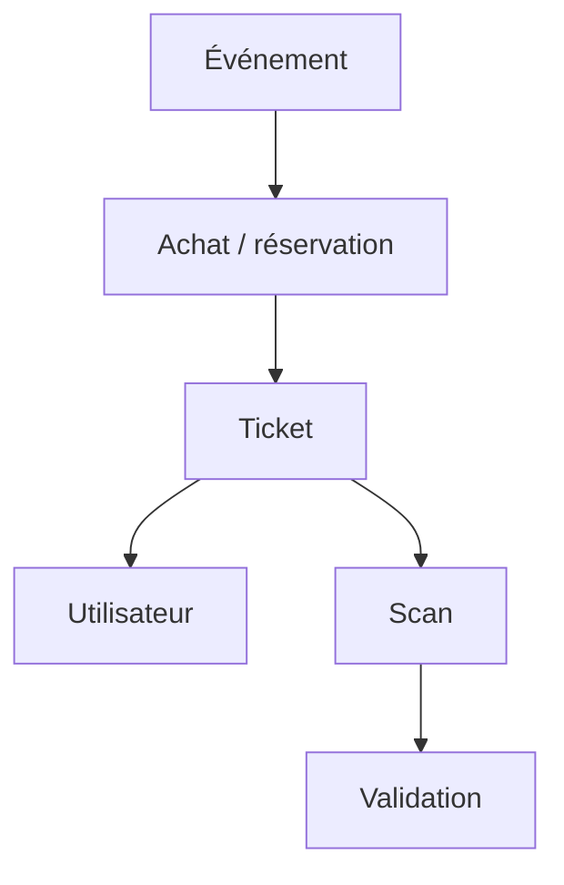

---
## `docs/05-application/tickets/tickets.md`

---

# Tickets

## Objectif de cette section

Cette page documente le module **tickets** d’ONY, c’est-à-dire la partie de l’application qui permet à l’utilisateur de consulter les billets associés à ses événements.

Le ticket représente la matérialisation du lien entre :

- un utilisateur ;
- un événement ;
- un droit d’accès potentiel ;
- et le futur parcours de scan / contrôle.

## Rôle du module tickets

Le module tickets permet de prolonger le parcours produit après la découverte et l’achat ou la réservation.

Il permet à l’utilisateur de :

- retrouver ses billets ;
- consulter les informations essentielles d’un événement réservé ;
- accéder à un QR code ou à un visuel de validation ;
- présenter son billet au moment d’un contrôle.

## Données concernées

Le module tickets s’appuie principalement sur la table `tickets`.

Les informations portées par un ticket incluent notamment :

- identifiant du ticket ;
- utilisateur associé ;
- nom de l’événement ;
- date de l’événement ;
- QR code ;
- date de création ;
- lien éventuel avec `events` ;
- image associée.

Le ticket constitue donc un objet métier autonome mais relié au parcours événementiel.

## Lien avec les événements

Le ticket n’existe pas isolément.
Il est lié à un événement via `event_id` quand cette donnée est disponible.

Cette relation permet :

- de rattacher le billet à un événement réel ;
- de cohérer avec les données affichées ailleurs ;
- de préparer la logique de scan et de contrôle.

## Lien avec l’utilisateur

Les tickets sont également liés à un utilisateur via `user_id`.

Cela permet :

- d’afficher les billets d’un compte donné ;
- de sécuriser l’accès aux tickets personnels ;
- d’inscrire la billetterie dans un parcours authentifié.

## Affichage des billets

Le rendu des billets a récemment été retravaillé pour atteindre un niveau visuel plus cohérent avec ONY.

Le travail réalisé visait notamment à :

- rendre le ticket plus identifiable ;
- améliorer la hiérarchie visuelle ;
- valoriser le visuel principal ;
- mieux intégrer les informations clés ;
- proposer une apparence plus “billet” et moins simple carte générique.

## Contenu d’un ticket affiché

Selon le niveau d’avancement du module, un ticket peut afficher :

- le nom de l’événement ;
- la date ;
- le visuel ;
- l’identifiant ;
- un QR code ;
- des éléments de contexte ou de validation.

L’objectif est que le billet soit immédiatement lisible et exploitable.

## Place dans le parcours utilisateur

Le module tickets intervient après :

- la consultation d’un événement ;
- l’action d’achat ou de réservation ;
- la création du billet.

Il peut ensuite déboucher sur :

- la simple consultation ;
- la présentation à l’entrée ;
- le scan par un opérateur.

## Place dans l’expérience ONY

Le ticket est une brique importante car il donne une dimension concrète au produit.Il fait passer ONY :

- d’une logique de découverte ;
- à une logique d’engagement réel.

Même si le système reste en partie simulé ou en consolidation selon les zones, cette brique contribue fortement à la crédibilité du projet.

## Contraintes UX

Les tickets doivent être :

- facilement lisibles sur mobile ;
- visuellement distincts des simples cartes événement ;
- exploitables rapidement au moment du contrôle ;
- cohérents avec la direction artistique ONY.

Ils ne doivent pas être noyés dans une interface trop administrative.

## Lien avec le scan

Le ticket prépare directement le parcours de scan.

Le fait d’avoir :

- un identifiant ;
- un QR code ;
- un lien vers l’événement ;
- un utilisateur associé
  permet ensuite de valider ou refuser l’accès lors d’un contrôle.

## Schéma simplifié

