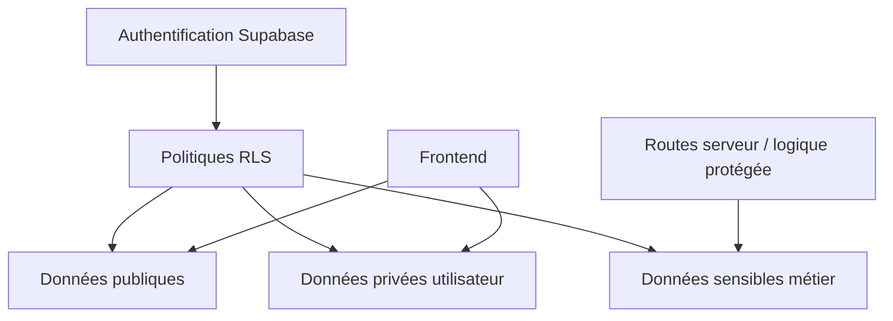

---
## `docs/06-base-de-donnees/regles-de-securite.md`

---

# Règles de sécurité

## Objectif de cette section

Cette page décrit les grands principes de sécurité appliqués à la base de données ONY.

L’objectif est de montrer comment les données sont protégées, à la fois par la structure du modèle et par les mécanismes fournis par Supabase.

## Principe général

La sécurité des données ne repose pas sur un seul mécanisme.

Dans ONY, elle s’appuie sur plusieurs couches complémentaires :

- authentification ;
- séparation des tables ;
- clés étrangères et contraintes ;
- distinction entre logique client et logique serveur ;
- politiques d’accès au niveau base.

## Rôle de Supabase dans la sécurité

Supabase apporte une partie importante du socle de sécurité.

La plateforme permet notamment :

- de s’appuyer sur `auth.users` comme source d’identité ;
- de centraliser l’accès à la base ;
- de mettre en œuvre des politiques RLS ;
- de contrôler les droits de lecture et d’écriture table par table.

Ce point est structurant dans l’architecture ONY.

## Authentification et identité

L’identité utilisateur repose sur le système d’authentification Supabase.

Les tables applicatives ne doivent donc pas gérer elles-mêmes l’authentification primaire.
Elles prolongent uniquement l’utilisateur authentifié.

Cette séparation réduit le risque de dérive sur la gestion des comptes.

## Intégrité référentielle

Les clés étrangères jouent un rôle de sécurité fonctionnelle important.

Elles permettent d’éviter par exemple :

- un ticket rattaché à un événement inexistant ;
- un favori pointant vers un événement supprimé ou invalide ;
- un scan associé à un billet inconnu ;
- un profil non relié à un utilisateur authentifié.

Cette couche n’est pas une sécurité d’accès à proprement parler, mais elle protège la cohérence de la donnée.

## Contraintes utiles

Certaines contraintes renforcent également la qualité et la sûreté du modèle :

- clé primaire sur chaque entité ;
- unicité sur certains champs comme `categories.name` ;
- relation primaire composite sur certaines tables de liaison ;
- contrainte de prix non négatif dans `events.price` ;
- contrôle de longueur minimale sur `profiles.username`.

Ces éléments réduisent les incohérences possibles.

## Row Level Security

Le mécanisme RLS constitue l’un des leviers de sécurité les plus importants dans une architecture Supabase.

Son rôle est de définir précisément :

- qui peut lire une ligne ;
- qui peut créer une ligne ;
- qui peut modifier une ligne ;
- qui peut supprimer une ligne.

Dans ONY, ce principe est particulièrement important pour les tables sensibles ou personnelles.

## Tables particulièrement sensibles

Certaines tables nécessitent une vigilance renforcée :

### `profiles`

Contient des données personnelles ou semi-personnelles.

### `user_preferences`

Contient des paramètres individualisés liés à l’usage.

### `tickets`

Contient des billets associés à un utilisateur.

### `ticket_scans`

Contient une traçabilité opérationnelle de contrôle.

### `organizer_requests`

Contient des demandes potentiellement sensibles liées au statut.

## Principes d’accès attendus

Même si les politiques détaillées peuvent évoluer, les principes attendus sont les suivants :

- un utilisateur ne doit accéder qu’à ses propres données personnelles lorsque cela est nécessaire ;
- les données publiques d’un événement doivent rester consultables selon la logique produit ;
- les opérations sensibles doivent rester contrôlées ;
- les actions à impact métier fort doivent être protégées par des règles explicites.

## Logique client / serveur

Toutes les opérations ne doivent pas être effectuées directement côté client.

Certaines logiques sensibles doivent rester dans des routes ou traitements côté serveur, notamment lorsqu’elles impliquent :

- des secrets ;
- des validations critiques ;
- des traitements liés au paiement ;
- des opérations d’écriture plus sensibles.

Cette séparation complète la sécurité base.

## Cas du paiement et des webhooks

Le paiement ne doit jamais reposer sur une confiance implicite côté client.

Les flux Stripe doivent conserver :

- des secrets uniquement côté serveur ;
- des webhooks vérifiés ;
- une synchronisation contrôlée avec la billetterie.

Cette logique a un impact direct sur la sûreté des écritures associées aux tickets.

## Cas de la géolocalisation

Les données de lieu et de position doivent être exploitées avec mesure.

Le projet utilise des lieux et des coordonnées pour l’expérience cartographique, mais cela ne signifie pas qu’il faille exposer ou conserver plus de données que nécessaire.

La minimisation des données reste une bonne pratique structurante.

## Vigilances pour la suite

Pour faire évoluer le projet correctement, il faudra continuer à :

- vérifier les politiques RLS table par table ;
- contrôler les opérations d’écriture critiques ;
- limiter l’exposition des données personnelles ;
- documenter précisément les accès autorisés ;
- garder une séparation claire entre public, privé et métier sensible.

## Schéma simplifié de principe

