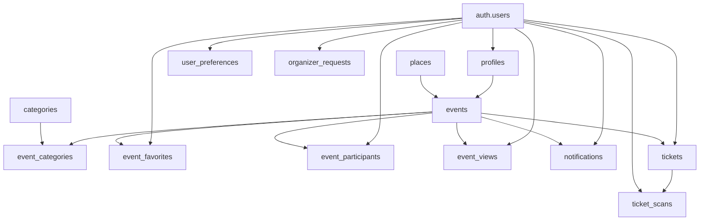

---
## `docs/06-base-de-donnees/relations-et-logique-metier.md`

---

# Relations et logique métier

## Objectif de cette section

Cette page décrit les principales relations entre les tables de la base ONY, ainsi que la logique métier qu’elles rendent possible.

L’enjeu n’est pas seulement de comprendre quelles tables sont liées, mais pourquoi ces liens existent dans le fonctionnement réel du produit.

## Principes relationnels utilisés

Le modèle repose principalement sur trois types de relations :

- un-à-un ;
- un-à-plusieurs ;
- plusieurs-à-plusieurs.

Cette structure permet d’éviter la duplication, de clarifier les responsabilités et de garder une base cohérente.

## Authentification et prolongement applicatif

La table `auth.users` sert de socle d’identité technique.

Elle est prolongée par plusieurs tables applicatives :

- `profiles`
- `user_preferences`
- `organizer_requests`
- `event_favorites`
- `event_participants`
- `event_views`
- `tickets`
- `notifications`
- `ticket_scans`

Cette organisation permet de séparer :

- l’utilisateur authentifié ;
- son profil métier ;
- ses préférences ;
- ses interactions avec le produit.

## Relation `auth.users` → `profiles`

Il s’agit d’une relation un-à-un.

Chaque utilisateur authentifié peut disposer d’un profil applicatif unique, contenant des informations supplémentaires nécessaires à l’expérience ONY.

Cette relation permet de ne pas surcharger la couche d’authentification brute avec des champs métier.

## Relation `auth.users` → `user_preferences`

Il s’agit également d’une relation un-à-un.

Chaque utilisateur peut avoir un ensemble de préférences personnalisées, notamment pour :

- les catégories ;
- la distance maximale ;
- la gestion des notifications ;
- le suivi de localisation.

Cette table soutient directement la personnalisation de l’expérience.

## Relation `auth.users` → `organizer_requests`

Il s’agit d’une relation un-à-plusieurs.

Un utilisateur peut effectuer plusieurs demandes liées à un rôle organisateur, selon l’évolution du produit ou les vérifications à effectuer.

Cette relation formalise le passage entre utilisateur standard et organisateur reconnu.

## Relation `profiles` → `events`

La relation entre `profiles` et `events` est un-à-plusieurs.

Un profil organisateur peut être rattaché à plusieurs événements via `organizer_id`.

Cette relation est fondamentale pour le parcours organisateur.

## Relation `places` → `events`

La relation entre `places` et `events` est un-à-plusieurs.

Un même lieu peut accueillir plusieurs événements.
Cette structure évite de dupliquer les données d’adresse et facilite la logique cartographique.

## Relation `events` ↔ `categories`

La relation entre `events` et `categories` est plusieurs-à-plusieurs.

Elle est portée par la table de liaison `event_categories`.

Cette modélisation est logique, car :

- un événement peut relever de plusieurs catégories ;
- une catégorie peut être utilisée par de nombreux événements.

Elle soutient directement :

- les filtres ;
- la navigation thématique ;
- la présentation visuelle ;
- la recherche.

## Relation `auth.users` ↔ `events` via les interactions

Plusieurs tables relient indirectement un utilisateur à un événement :

- `event_favorites`
- `event_participants`
- `event_views`
- `notifications`

Ces relations traduisent différents niveaux d’engagement :

- intérêt ;
- participation ;
- consultation ;
- communication ciblée.

Elles permettent de garder une table `events` propre, tout en traçant les usages.

## Relation `tickets` ↔ `events`

Chaque ticket peut être rattaché à un événement via `event_id`.

Cette relation est essentielle pour le parcours de billetterie, car elle permet de savoir à quel événement un billet correspond.

Elle relie directement :

- l’achat ou la génération du billet ;
- l’affichage du ticket ;
- le contrôle d’accès.

## Relation `tickets` ↔ `auth.users`

Chaque ticket peut également être rattaché à un utilisateur.

Cette relation permet de retrouver les billets d’un utilisateur connecté et de construire l’espace personnel de billetterie.

## Relation `ticket_scans` ↔ `tickets`

La relation entre `ticket_scans` et `tickets` est un-à-plusieurs.

Un billet peut faire l’objet d’un ou plusieurs enregistrements de scan selon la logique de contrôle retenue.

Cette traçabilité est importante pour :

- la validation d’accès ;
- l’historique de contrôle ;
- la détection d’anomalies éventuelles.

## Relation `ticket_scans` ↔ `auth.users`

Le champ `scanned_by` relie un scan à l’utilisateur ayant effectué le contrôle.

Cette relation permet d’identifier qui a réalisé l’action, ce qui apporte une dimension d’audit et de responsabilité.

## Relations et logique produit

Au-delà des clés étrangères, ces relations structurent les grands flux du produit :

### Découverte

- consultation d’événements ;
- lecture des catégories ;
- utilisation des lieux et de la carte ;
- personnalisation via préférences.

### Engagement

- favoris ;
- participation ;
- notifications ;
- historique de consultation.

### Organisation

- profil organisateur ;
- demande de rôle ;
- création d’événement ;
- rattachement à un lieu et à des catégories.

### Billetterie

- billet lié à un événement ;
- billet lié à un utilisateur ;
- scan lié au billet ;
- scan lié à l’agent de contrôle.

## Logique de séparation utile

Le modèle montre une séparation saine entre :

- identité ;
- contenu métier ;
- interactions ;
- billetterie ;
- contrôle.

Cette séparation contribue à la lisibilité du projet et à sa maintenabilité.

## Schéma relationnel simplifié

