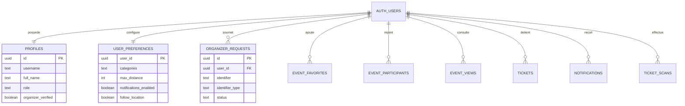
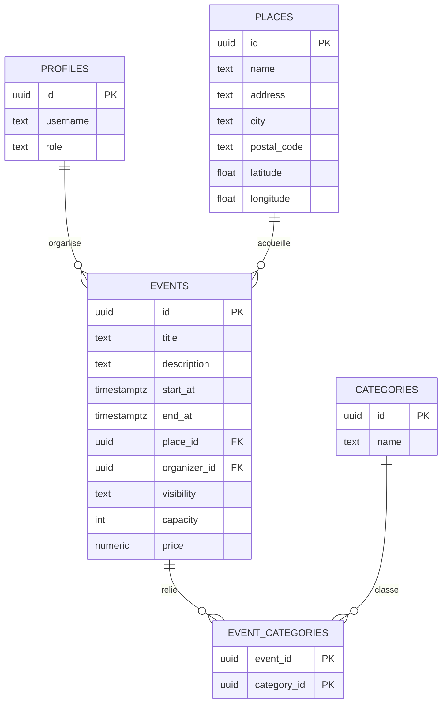
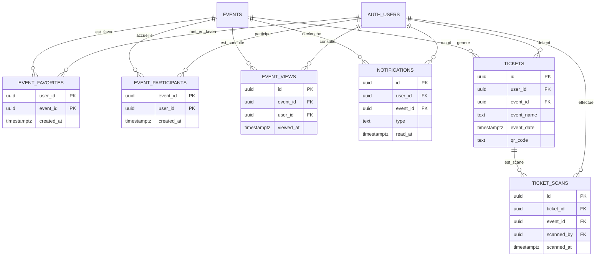
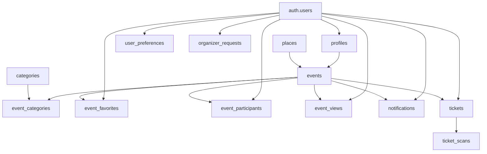

---
## `docs/06-base-de-donnees/schemas-mermaid.md`
---

# Schémas Mermaid de la base de données

## Objectif de cette section

Cette page regroupe des schémas Mermaid simplifiés de la base de données ONY.

L’objectif n’est pas de reproduire toute la DDL SQL brute, mais de fournir des vues lisibles et pédagogiques des grands sous-ensembles relationnels du projet.

Ces schémas complètent les sections précédentes :

- vue d’ensemble ;
- tables métier ;
- relations et logique métier ;
- règles de sécurité.

## Pourquoi plusieurs schémas

La base de données ONY reste de taille raisonnable, mais un schéma unique trop dense deviendrait vite illisible.

Le découpage en plusieurs vues permet de mieux faire apparaître :

- le pôle authentification et profil ;
- le cœur métier événementiel ;
- les interactions et la billetterie ;
- une vue transversale simplifiée.

## Schéma 1 — Authentification et profil

Ce premier schéma montre comment l’utilisateur authentifié est prolongé par plusieurs tables applicatives.

## Lecture du schéma

Ce bloc montre que `auth.users` reste la racine d’identité, tandis que les tables applicatives portent les informations métier, de personnalisation et d’interaction.

## Schéma 2 — Cœur métier événements

Ce second schéma se concentre sur les événements, leurs lieux, leurs catégories et leur organisateur.

## Lecture du schéma

Cette vue correspond au noyau du produit : un événement appartient à un lieu, peut relever de plusieurs catégories et peut être rattaché à un organisateur via `profiles`.

## Schéma 3 — Interactions et billetterie

Ce troisième schéma représente les usages utilisateur autour d’un événement.

## Lecture du schéma

Cette vue fait apparaître la progression fonctionnelle entre l’intérêt pour un événement, la détention d’un billet, puis le contrôle d’accès.

## Schéma 4 — Vue transverse simplifiée

Enfin, une vue plus compacte permet de retenir la structure générale.

