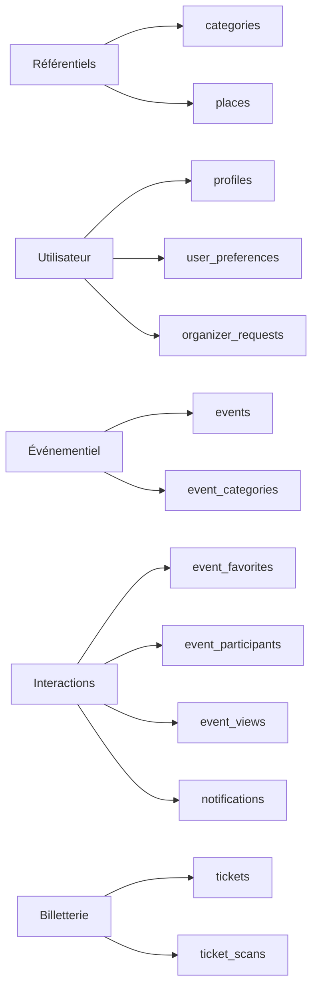

---
## `docs/06-base-de-donnees/tables-metier.md`

---

# Tables métier

## Objectif de cette section

Cette page décrit les principales tables métier de la base de données ONY.

L’objectif est de présenter leur rôle fonctionnel dans le produit, et non uniquement leur définition technique.

## Vue générale

La base repose sur un ensemble de tables relativement compact, organisé autour du cœur événementiel.

Les tables principales sont :

- `categories`
- `event_categories`
- `event_favorites`
- `event_participants`
- `event_views`
- `events`
- `notifications`
- `organizer_requests`
- `places`
- `profiles`
- `ticket_scans`
- `tickets`
- `user_preferences`

## `categories`

Cette table contient les catégories d’événements.

Elle sert à structurer l’exploration du catalogue, à alimenter les filtres et à soutenir la lisibilité de l’interface.

Champs principaux :

- `id`
- `name`
- `created_at`

## `event_categories`

Cette table de liaison associe les événements à leurs catégories.

Elle permet à un événement d’appartenir à plusieurs catégories et à une catégorie d’être utilisée par plusieurs événements.

Champs principaux :

- `event_id`
- `category_id`

## `event_favorites`

Cette table stocke les favoris d’un utilisateur sur des événements.

Elle porte une logique d’engagement léger, utile pour personnaliser l’expérience et retrouver des contenus appréciés.

Champs principaux :

- `user_id`
- `event_id`
- `created_at`

## `event_participants`

Cette table représente le lien entre un utilisateur et un événement auquel il participe ou qu’il rejoint dans un certain contexte fonctionnel.

Elle peut servir à matérialiser une forme d’inscription ou de rattachement au parcours événementiel.

Champs principaux :

- `event_id`
- `user_id`
- `created_at`

## `event_views`

Cette table trace les consultations d’événements.

Elle peut être utilisée pour :

- suivre l’intérêt utilisateur ;
- produire des statistiques ;
- enrichir ultérieurement la logique de recommandation ou de popularité.

Champs principaux :

- `id`
- `event_id`
- `user_id`
- `viewed_at`

## `events`

Il s’agit de la table centrale du produit.

Elle contient les événements eux-mêmes, avec leurs informations essentielles :

- titre ;
- description ;
- dates ;
- lieu ;
- visibilité ;
- capacité ;
- image ;
- organisateur ;
- prix.

Champs principaux :

- `id`
- `title`
- `description`
- `start_at`
- `end_at`
- `place_id`
- `visibility`
- `capacity`
- `image_url`
- `created_at`
- `organizer_id`
- `price`

## `notifications`

Cette table représente les notifications liées à l’activité événementielle.

Elle permet de rattacher un événement à un utilisateur destinataire et de suivre l’état de lecture.

Champs principaux :

- `id`
- `user_id`
- `event_id`
- `type`
- `read_at`
- `created_at`

## `organizer_requests`

Cette table porte les demandes de passage ou de justification côté organisateur.

Elle matérialise une étape importante dans le modèle de rôles du projet.

Champs principaux :

- `id`
- `user_id`
- `identifier`
- `identifier_type`
- `status`
- `created_at`

## `places`

Cette table contient les lieux des événements.

Elle centralise les informations utiles à la cartographie et à la présentation des événements.

Champs principaux :

- `id`
- `name`
- `address`
- `city`
- `postal_code`
- `latitude`
- `longitude`
- `created_at`

## `profiles`

Cette table étend l’utilisateur authentifié avec les informations applicatives visibles ou utiles au métier.

Elle permet notamment de stocker :

- identité d’affichage ;
- avatar ;
- téléphone ;
- bio ;
- rôle ;
- statut organisateur ;
- tranche d’âge.

Champs principaux :

- `id`
- `updated_at`
- `username`
- `full_name`
- `avatar_url`
- `website`
- `phone`
- `bio`
- `role`
- `organizer_verified`
- `age_group`

## `ticket_scans`

Cette table enregistre les scans de billets.

Elle permet d’assurer la traçabilité du contrôle d’accès à un événement.

Champs principaux :

- `id`
- `ticket_id`
- `event_id`
- `scanned_by`
- `scanned_at`

## `tickets`

Cette table matérialise les billets générés pour les utilisateurs.

Elle relie un billet à un utilisateur, à un événement et à des informations d’affichage ou de contrôle.

Champs principaux :

- `id`
- `user_id`
- `event_name`
- `event_date`
- `qr_code`
- `created_at`
- `event_id`
- `image_url`

## `user_preferences`

Cette table stocke les préférences utilisateur utiles à la personnalisation.

Elle permet notamment de porter :

- les catégories préférées ;
- la distance maximale ;
- l’activation des notifications ;
- la logique de suivi de localisation.

Champs principaux :

- `user_id`
- `categories`
- `max_distance`
- `notifications_enabled`
- `follow_location`
- `updated_at`

## Organisation fonctionnelle des tables

Ces tables peuvent être regroupées de la manière suivante :

### Référentiels et structure

- `categories`
- `places`

### Utilisateur et personnalisation

- `profiles`
- `user_preferences`
- `organizer_requests`

### Cœur événementiel

- `events`
- `event_categories`

### Interactions et engagement

- `event_favorites`
- `event_participants`
- `event_views`
- `notifications`

### Billetterie et contrôle

- `tickets`
- `ticket_scans`

## Point d’attention

Certaines tables traduisent un état métier mature, d’autres reflètent encore un produit en construction.
La documentation doit donc être lue comme une photographie fidèle du MVP structuré, mais encore évolutif.

## Schéma simplifié par familles

