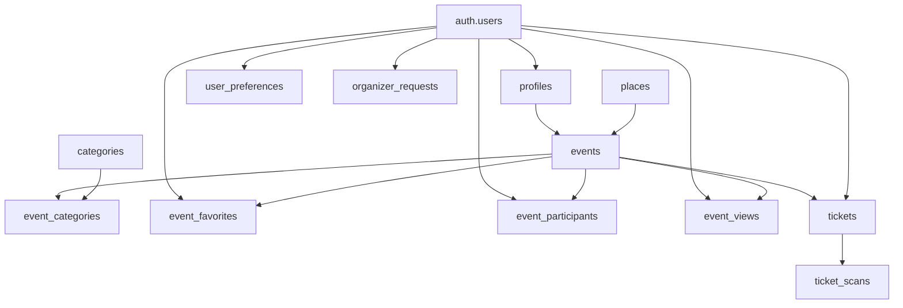

# Vue d’ensemble de la base de données

## Objectif de cette section

Cette section présente la structure générale de la base de données d’ONY.

L’objectif n’est pas seulement de lister des tables, mais de montrer comment la base soutient les grands besoins métier du produit :

- authentification et profil ;
- découverte d’événements ;
- organisation d’événements ;
- billetterie ;
- scan ;
- préférences utilisateur ;
- supervision fonctionnelle minimale.

## Technologie retenue

La base de données d’ONY repose sur PostgreSQL via Supabase.

Ce choix permet de bénéficier :

- d’un moteur relationnel robuste ;
- d’un service managé ;
- d’une intégration directe avec l’authentification ;
- de mécanismes de sécurité fins, notamment via les politiques RLS ;
- d’une bonne cohérence avec l’architecture générale du projet.

## Philosophie générale du modèle

Le modèle de données a été conçu autour d’un cœur métier simple :

- des utilisateurs ;
- des profils ;
- des événements ;
- des lieux ;
- des catégories ;
- des billets ;
- des interactions utilisateur.

L’objectif est de garder une base lisible, cohérente et suffisamment extensible pour faire évoluer le produit sans repartir de zéro.

## Grands ensembles fonctionnels

La base peut être lue en plusieurs blocs principaux.

### 1. Authentification et identité utilisateur

Ce bloc repose sur l’utilisateur authentifié Supabase, prolongé par des tables applicatives comme :

- `profiles`
- `user_preferences`
- `organizer_requests`

Il permet de distinguer l’identité technique, le profil visible et certains paramètres ou rôles métier.

### 2. Cœur métier événementiel

Le cœur du produit repose sur :

- `events`
- `places`
- `categories`
- `event_categories`

Ce noyau permet de décrire un événement, son lieu, sa classification et son rattachement à un organisateur.

### 3. Interactions utilisateur avec les événements

Plusieurs tables traduisent les interactions autour des événements :

- `event_favorites`
- `event_participants`
- `event_views`
- `notifications`

Elles permettent de suivre des usages concrets du produit sans alourdir la table principale des événements.

### 4. Billetterie et contrôle

Le parcours billet repose principalement sur :

- `tickets`
- `ticket_scans`

Ce bloc permet de rattacher un billet à un utilisateur et à un événement, puis de tracer les scans effectués.

## Cohérence relationnelle

La structure repose sur un modèle relationnel classique :

- des relations un-à-un ;
- des relations un-à-plusieurs ;
- des relations plusieurs-à-plusieurs.

Cette approche permet :

- de limiter la redondance ;
- d’assurer l’intégrité des liens ;
- de garder une lecture claire des responsabilités de chaque table.

## Logique applicative portée par la base

La base de données ne se contente pas de stocker des informations.
Elle structure aussi une partie de la logique métier du projet, notamment :

- qui organise un événement ;
- quelles catégories lui sont associées ;
- quels utilisateurs l’ont consulté, mis en favori ou rejoint ;
- quel billet correspond à quel événement ;
- quel scan a été effectué et par qui.

## Rôle de Supabase

Supabase joue plusieurs rôles à la fois :

- hébergement de la base PostgreSQL ;
- authentification ;
- exposition sécurisée des données ;
- support des politiques RLS ;
- simplification du backend pour un projet MVP.

Ce choix s’inscrit dans une logique de rapidité de développement et de réduction de la charge d’exploitation.

## Points forts de l’architecture actuelle

La base actuelle présente plusieurs avantages :

- structure lisible ;
- séparation claire des responsabilités ;
- bon alignement avec les parcours produit ;
- extensibilité correcte pour un MVP ;
- compatibilité avec une montée en maturité progressive.

## Limites actuelles ou points à surveiller

Comme tout modèle encore en évolution, cette base comporte aussi plusieurs points d’attention :

- certains flux organisateur restent encore en consolidation ;
- certaines règles métier vivent encore partiellement côté application ;
- la sécurité dépend fortement de la bonne définition des politiques d’accès ;
- certains besoins futurs pourront nécessiter des enrichissements de schéma.

## Schéma simplifié

