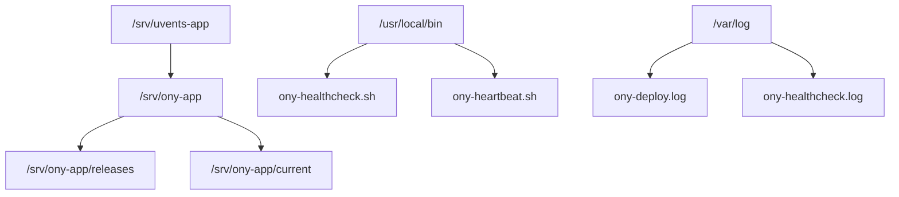

---
## `docs/07-infrastructure-deploiement/arborescence-serveurs.md`
---

# Arborescence et organisation côté serveurs

## Objectif de cette section

Cette page décrit l’organisation des fichiers et chemins importants sur les serveurs ONY.

L’objectif est de faciliter :

- la compréhension des déploiements ;
- le diagnostic ;
- le repérage des releases ;
- la maintenance des scripts ;
- le debug en cas d’incident.
## Principe général

La logique serveur repose sur une structure simple :

- un répertoire applicatif principal ;
- un dossier de releases ;
- un lien symbolique vers la release active ;
- des scripts utilitaires dans `/usr/local/bin` ;
- des logs techniques dédiés.

Cette structure s’inscrit dans une logique de déploiement atomique par versions.

## Répertoire principal

Le répertoire de référence côté ONY est :

```bash
/srv/ony-app
````

C’est le point d’ancrage principal pour les déploiements serveur.

## Alias de compatibilité

Un point très important concerne l’héritage de nommage entre Uvents et ONY.

Le chemin suivant subsiste comme alias de compatibilité :

```bash
/srv/uvents-app
```

Il pointe vers :

```bash
```mermaid
/srv/ony-app
```

Cet alias ne doit pas être supprimé tant que le dépôt GitLab et certains héritages de configuration n’ont pas été totalement alignés.

## Organisation interne de `/srv/ony-app`

Les chemins les plus importants sont les suivants :

### `/srv/ony-app/releases`

Ce dossier contient les releases déployées.

Chaque déploiement y crée une nouvelle version isolée, ce qui permet de conserver un historique local et de rendre possible un rollback rapide.

### `/srv/ony-app/current`

Ce lien symbolique pointe vers la release active.

La bascule de ce lien constitue l’un des éléments centraux du déploiement atomique. C’est également le premier point à vérifier lorsqu’un déploiement semble incohérent.

## Logs et fichiers d’exploitation

Plusieurs emplacements sont utiles pour le suivi opérationnel.

### Log de déploiement

```bash
/var/log/ony-deploy.log
```

Ce fichier conserve l’historique local des déploiements côté production.

### Log de healthcheck

```bash
/var/log/ony-healthcheck.log
```

Il est alimenté par le script `ony-healthcheck.sh` et permet de suivre l’état applicatif dans le temps.

## Scripts utilitaires

La documentation cite explicitement plusieurs scripts placés dans :

```bash
/usr/local/bin
```

Parmi eux :

* `ony-healthcheck.sh`
* `ony-heartbeat.sh`

Ces scripts participent au contrôle applicatif et à l’envoi de synthèses d’état.

## Contrôles utiles liés à l’arborescence

Les commandes suivantes font partie de la routine de vérification :

```bash
ls -lah /srv/ony-app
ls -lah /srv/ony-app/releases
readlink -f /srv/ony-app/current
ls -ld /srv/uvents-app
```

Ces commandes sont directement mentionnées dans la procédure d’exploitation pour vérifier la structure réelle du déploiement.

## Importance de cette organisation

Cette arborescence apporte plusieurs bénéfices :

* lisibilité ;
* isolation des versions ;
* rollback rapide ;
* limitation des déploiements destructifs ;
* facilité de diagnostic.

Elle constitue l’un des points forts de l’infrastructure ONY actuelle.

## Point de vigilance

Le plus grand risque n’est pas la complexité de l’arborescence, mais l’oubli de l’héritage historique.

Lors d’un diagnostic, il faut toujours garder en tête que :

* le projet s’appelle désormais ONY ;
* certains chemins ou dépôts conservent encore la référence Uvents ;
* l’état réel du serveur doit faire foi en priorité sur une ancienne doc devenue partiellement obsolète.

## Schéma simplifié



