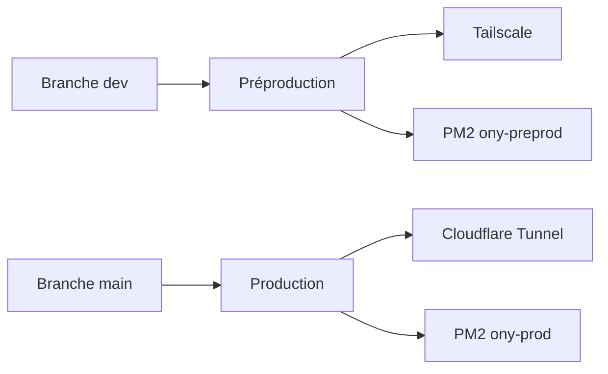

---
## `docs/07-infrastructure-deploiement/environnements.md`

---

# Environnements d’exécution

## Objectif de cette section

Cette page décrit les environnements d’exécution utilisés pour ONY.

L’objectif est de clarifier :

- le rôle de chaque environnement ;
- son niveau d’exposition ;
- son lien avec les branches Git ;
- les différences opérationnelles à retenir.

## Principe général

ONY repose sur une séparation nette entre préproduction et production.

Cette séparation permet :

- de tester avant exposition publique ;
- de limiter les risques ;
- de conserver une production stable ;
- de rapprocher au maximum les conditions de validation des conditions réelles d’exécution.

La documentation existante insiste justement sur cette cohérence entre les deux environnements.

## Préproduction

### Rôle

La préproduction sert d’environnement de validation.

Elle permet de tester :

- les nouvelles fonctionnalités ;
- les correctifs ;
- les ajustements d’interface ;
- les scripts de déploiement ;
- les comportements applicatifs avant passage en production.

### Lien avec Git

La préproduction est liée à la branche `dev`.

### Accès

La préproduction n’est pas exposée publiquement.
Son accès se fait via Tailscale, ce qui limite l’exposition réseau et réserve l’usage à l’équipe projet.

### Exécution

L’application y tourne sous PM2 dans un conteneur LXC dédié. Les commandes d’exploitation documentées montrent notamment l’usage de `pm2 info ony-preprod`, `pm2 logs ony-preprod` et de `curl http://localhost:3000/api/health` pour cet environnement.

## Production

### Rôle

La production constitue l’environnement stable destiné à l’usage réel.

Elle doit rester :

- disponible ;
- cohérente ;
- surveillée ;
- rollbackable rapidement en cas de problème.

### Lien avec Git

La production est liée à la branche `main`.

### Accès

La production est exposée publiquement via Cloudflare Tunnel, sans ouverture directe du service applicatif sur Internet. L’URL de production documentée est `https://ony.julienlesimple.pro/`.

### Exécution

Comme la préproduction, la production exécute l’application via PM2 dans un LXC dédié. La vérification opérationnelle passe notamment par `pm2 info ony-prod`, `pm2 logs ony-prod` et le contrôle du service `cloudflared`.

## Similarités entre les environnements

Les deux environnements partagent :

- la même logique applicative ;
- le même type d’exécution avec PM2 ;
- la même approche de déploiement atomique ;
- le même principe de vérification applicative via `/api/health` ;
- un rattachement à la même base de pratiques CI/CD.

## Différences principales

Les différences majeures portent surtout sur :

- la branche de référence ;
- le niveau d’exposition réseau ;
- la présence de Cloudflare côté production ;
- la nature des contrôles spécifiques à effectuer en exploitation.

## Tableau de synthèse

| Élément                     | Préproduction       | Production                       |
| ----------------------------- | -------------------- | -------------------------------- |
| Rôle                         | Validation           | Service stable                   |
| Branche cible                 | `dev`              | `main`                         |
| Exposition                    | Privée              | Publique                         |
| Accès principal              | Tailscale            | Cloudflare Tunnel                |
| Process PM2                   | `ony-preprod`      | `ony-prod`                     |
| Vérification complémentaire | `tailscale status` | `systemctl status cloudflared` |

Les éléments de ce tableau proviennent directement de la documentation de déploiement et des procédures de contrôle déjà établies.

## Point d’attention

Même si les environnements sont proches, ils ne doivent pas être confondus.

L’un sert à valider et expérimenter, l’autre à exposer un service fiable.
Toute évolution d’infrastructure ou de pipeline doit donc être pensée pour préserver cette distinction.

## Schéma simplifié

