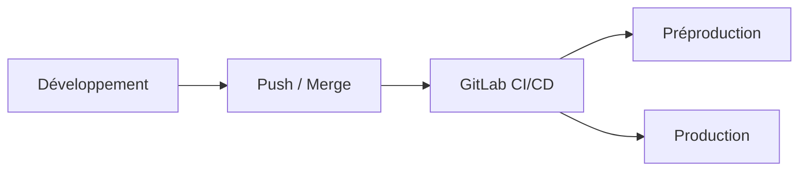

---

## `gitlab-ci-cd.md`
---

# Pipeline GitLab CI/CD

## Objectif de cette section

Cette page décrit le rôle de **GitLab CI/CD** dans le cycle de déploiement de **ONY**.

Elle permet de comprendre :

- la place du pipeline dans le projet ;
- son lien avec les branches ;
- son utilité dans la validation et la mise en ligne ;
- sa cohérence avec les environnements prévus.

## Rôle du pipeline

Le pipeline **GitLab CI/CD** permet d’automatiser une partie du cycle technique du projet.

Dans l’écosystème ONY, il s’inscrit dans une logique de professionnalisation du déploiement en reliant :

- le dépôt Git ;
- les branches de travail ;
- les étapes de validation ;
- les scripts de déploiement ;
- les environnements cibles.

Il participe à la réduction des manipulations manuelles répétitives et à une meilleure fiabilité des mises en ligne.

## Logique générale

Le pipeline intervient comme un enchaînement d’étapes automatisées après une action sur le dépôt, par exemple :

- un push ;
- une merge request ;
- une fusion sur une branche de référence.

Selon la stratégie retenue dans le dépôt, il peut servir à :

- exécuter des contrôles ;
- préparer une version ;
- déclencher un déploiement ;
- vérifier qu’un environnement a bien été mis à jour.

## Lien avec les branches

La documentation structure clairement deux environnements principaux dans l’infrastructure : **préproduction** et **production**.

Dans cette logique :

- la branche `dev` alimente la **préproduction** ;
- la branche `main` alimente la **production**.

Le pipeline CI/CD est donc un point de jonction entre le workflow Git et la réalité d’exploitation serveur.

## Intérêt du CI/CD

L’automatisation via GitLab apporte plusieurs bénéfices :

- meilleure reproductibilité des déploiements ;
- réduction du risque d’oubli manuel ;
- exécution cohérente d’une même procédure ;
- meilleure traçabilité des opérations ;
- base plus saine pour faire évoluer le niveau de qualité du projet.

Cela permet également de mieux distinguer :

- ce qui relève du code source ;
- ce qui relève de l’intégration ;
- ce qui relève de l’exploitation.

## Ce que le pipeline peut couvrir

Selon son niveau de maturité, le pipeline peut inclure :

- des vérifications de cohérence ;
- des étapes de build ;
- des contrôles de qualité ;
- des appels à des scripts de déploiement ;
- des validations post-déploiement.

L’idée n’est pas seulement d’automatiser pour automatiser, mais de fiabiliser les étapes les plus sensibles.

## Runner et exécution

Le fonctionnement concret du pipeline repose sur un **runner GitLab** capable d’exécuter les jobs prévus.

Ce runner peut être hébergé dans l’infrastructure du projet et configuré pour :

- lancer les commandes nécessaires ;
- accéder aux scripts utiles ;
- pousser le déploiement vers l’environnement cible ;
- produire des logs d’exécution.

Le runner joue donc un rôle central dans la chaîne CI/CD.

## Place dans le cycle de déploiement

Le pipeline s’insère entre la validation du code et sa mise à disposition :

Dans la pratique, toutes les branches ne doivent pas déclencher les mêmes actions.
La logique d’automatisation doit respecter le niveau de criticité de l’environnement cible.

Point de vigilance

Un pipeline ne doit jamais être perçu comme une garantie absolue de bon fonctionnement.

Même si le job passe avec succès, cela ne prouve pas à lui seul que :

l’application fonctionne fonctionnellement ;

les dépendances externes répondent correctement ;

l’environnement distant est complètement sain ;

l’expérience côté utilisateur est conforme.

Le pipeline doit donc être articulé avec :

des healthchecks ;

de la journalisation ;

des tests ;

une procédure de rollback.

Cohérence documentaire

La présence d’une section dédiée dans la structure Docusaurus confirme que le pipeline GitLab CI/CD fait partie intégrante de la documentation technique cible du projet.

Il doit donc être documenté non seulement comme un outil de build, mais comme une brique d’exploitation et de mise en production.

À retenir

GitLab CI/CD constitue une brique clé dans la structuration technique d’ONY.

Il permet de relier :

le workflow Git ;

les environnements ;

les scripts de déploiement ;

la logique de mise en ligne.

Il participe à rendre les déploiements plus fiables, plus reproductibles et plus lisibles.