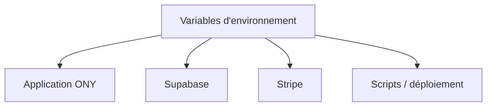

---
## `variables-denvironnement.md`

---

# Variables d’environnement

## Objectif de cette section

Cette page présente le rôle des **variables d’environnement** dans le fonctionnement de **ONY**.

Elle vise à expliquer :

- pourquoi elles sont nécessaires ;
- quels types d’informations elles portent ;
- pourquoi elles ne doivent pas être codées en dur ;
- quel est leur rôle dans la séparation des environnements.

## Rôle des variables d’environnement

Les variables d’environnement permettent d’injecter dans l’application des informations de configuration sans les inscrire directement dans le code source.

Elles servent notamment à transmettre :

- des URL de services ;
- des clés d’intégration ;
- des secrets ;
- des paramètres spécifiques à un environnement ;
- des éléments de configuration liés au runtime.

Elles constituent donc une brique essentielle dans la portabilité et la sécurité du projet.

## Pourquoi ne pas coder ces valeurs en dur

Le fait d’écrire directement dans le code des informations sensibles ou spécifiques à un environnement pose plusieurs problèmes :

- exposition potentielle de secrets ;
- difficulté à changer d’environnement ;
- risque de fuite dans le dépôt Git ;
- faible maintenabilité ;
- mélange entre logique métier et configuration technique.

L’usage de variables d’environnement permet d’éviter ces dérives.

## Lien avec les environnements

La documentation de l’infrastructure distingue explicitement plusieurs environnements, notamment la préproduction et la production.

Les variables d’environnement permettent précisément d’adapter une même base applicative à ces contextes différents, sans dupliquer inutilement le code.

Elles rendent possible :

- un pointage différent vers les services ;
- des comportements adaptés selon l’environnement ;
- une séparation claire entre les contextes techniques.

## Familles de variables concernées

Dans le cadre d’ONY, plusieurs grandes familles de variables peuvent être concernées.

### Variables liées à Supabase

Elles permettent de connecter l’application à la couche de données et d’authentification.

On y retrouve généralement :

- l’URL du projet ;
- les clés publiques nécessaires côté application ;
- éventuellement d’autres paramètres de connexion ou de configuration.

### Variables liées à Stripe

Elles permettent de configurer la couche de paiement.

Cela peut inclure :

- des clés publiques ;
- des clés secrètes ;
- des secrets de webhook ;
- des paramètres liés aux environnements de test ou de production.

### Variables applicatives

Certaines variables pilotent le comportement général de l’application :

- URL publique ;
- mode d’exécution ;
- paramètres liés au build ;
- références utilisées par certains scripts.

### Variables de déploiement

Certaines variables sont utilisées plus spécifiquement côté serveur ou pipeline, par exemple pour :

- exécuter un script ;
- cibler un environnement ;
- injecter une configuration au moment du déploiement ;
- permettre au runner ou au serveur d’accéder aux bonnes valeurs.

## Sensibilité des données

Toutes les variables n’ont pas le même niveau de sensibilité.

Il faut distinguer :

- les variables publiques, conçues pour être exposées côté client ;
- les variables privées, qui ne doivent jamais être divulguées ;
- les secrets critiques, qui doivent être manipulés avec encore plus de précaution.

Cette distinction est particulièrement importante dans un projet web moderne où certaines variables peuvent être injectées côté frontend.

## Bonnes pratiques

Les bonnes pratiques attendues sont les suivantes :

- ne jamais versionner les secrets dans le dépôt ;
- séparer clairement les valeurs selon les environnements ;
- documenter le rôle des variables sans exposer leur contenu réel ;
- éviter les doublons ou les noms ambigus ;
- limiter au strict nécessaire les variables réellement accessibles côté client.

## Point de vigilance sur l’historique du projet

Le projet ONY conserve encore certains héritages de nommage liés à son ancien nom **Uvents**.

Cela peut également se retrouver dans :

- certains noms de fichiers d’environnement ;
- certaines clés historiques ;
- certains scripts de déploiement.

Lors de l’harmonisation documentaire, il faut distinguer :

- ce qui est encore utilisé pour compatibilité ;
- ce qui devrait progressivement être renommé ;
- ce qui constitue seulement un héritage ancien.

## Ce que cette page documente

Cette page documente le **rôle** et la **logique** des variables d’environnement.

Elle ne doit pas exposer :

- les vraies valeurs ;
- les secrets ;
- les clés sensibles ;
- les identifiants confidentiels.

La documentation doit rester utile sans devenir une fuite d’information.

## Schéma simplifié

