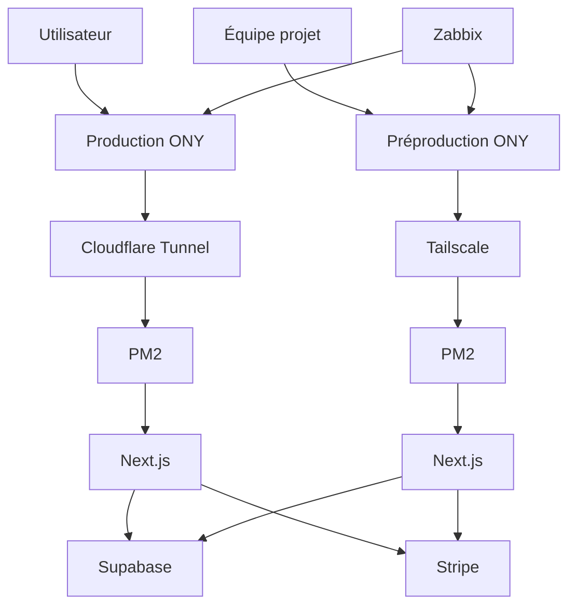

---
## `docs/07-infrastructure-deploiement/vue-infra.md`

---

# Vue d’ensemble de l’infrastructure

## Objectif de cette section

Cette section présente l’infrastructure de déploiement d’ONY dans sa logique d’ensemble.

L’objectif est de montrer :

- où l’application s’exécute ;
- comment les environnements sont séparés ;
- quels composants assurent l’exposition, l’exécution et la supervision ;
- pourquoi cette architecture a été retenue.

## Philosophie générale

L’infrastructure ONY repose sur une logique auto-hébergée, pensée pour un MVP sérieux mais encore maîtrisable.

Le choix effectué a été de conserver :

- un fort contrôle sur l’environnement ;
- une séparation claire entre préproduction et production ;
- une chaîne de déploiement lisible ;
- des coûts réduits ;
- une bonne compréhension de bout en bout du fonctionnement réel.

Cette orientation est cohérente avec les arbitrages déjà exposés dans la documentation technique du projet.

## Socle d’hébergement

Le socle principal repose sur un serveur Proxmox VE.

Cet hôte centralise plusieurs conteneurs LXC, dont ceux utilisés pour ONY et pour la supervision Zabbix. La documentation de déploiement mentionne explicitement ce rôle central du nœud Proxmox dans l’architecture.

## Deux environnements principaux pour ONY

L’application ONY repose sur deux environnements distincts :

- une préproduction ;
- une production.

Ces deux environnements partagent la même logique applicative générale, ce qui facilite les tests, les validations et la reproductibilité des déploiements. Cette cohérence entre environnements est explicitement recherchée dans la documentation existante.

## Préproduction

La préproduction est hébergée dans un conteneur LXC dédié.

Elle est liée à la branche `dev` et sert de zone de validation technique avant passage vers la production. Son accès est volontairement restreint via Tailscale.

## Production

La production est elle aussi hébergée dans un conteneur LXC dédié.

Elle est liée à la branche `main` et constitue l’environnement stable exposé publiquement. L’exposition passe par Cloudflare Tunnel, sans publication directe du port applicatif sur Internet.

## Chaîne de service applicative

Dans les deux environnements, l’application repose principalement sur :

- Next.js pour l’application ;
- PM2 pour l’exécution du process ;
- GitLab CI/CD pour les déploiements ;
- des scripts de déploiement atomique par releases ;
- Supabase Cloud pour les données et l’authentification ;
- Stripe pour la partie paiement ;
- des scripts locaux de supervision applicative ;
- Zabbix pour la supervision infrastructurelle.

## Exposition réseau

Les deux environnements n’ont pas le même niveau d’exposition.

### Production

La production suit le chemin :

Internet → Cloudflare DNS → Cloudflare Tunnel → `localhost:3000` → PM2 → Next.js. 

### Préproduction

La préproduction suit une logique d’accès privé via Tailscale vers le service applicatif en écoute sur le port 3000.

## Déploiement

Le mode de déploiement de référence repose sur :

- une pipeline GitLab ;
- un build et un déploiement côté serveur ;
- un système de releases horodatées ;
- un symlink `current` pointant vers la version active ;
- une capacité de rollback rapide en cas d’échec.

La documentation de déploiement indique clairement que cette approche atomique par releases et symlink `current` est la méthode de référence.

## Monitoring et exploitation

L’exploitation repose sur deux niveaux complémentaires :

- Zabbix pour la couche machine, disponibilité, CPU, RAM, disque et réseau ;
- des scripts locaux et le endpoint `/api/health` pour la vérification applicative.

Cette combinaison permet de distinguer :

- un problème d’infrastructure ;
- un problème de process ;
- un problème applicatif ;
- un problème de déploiement.

## Choix d’architecture

Cette infrastructure a été retenue parce qu’elle permet :

- un coût maîtrisé ;
- une bonne isolation ;
- une compréhension fine du fonctionnement ;
- une flexibilité suffisante pour un prototype avancé ;
- une séparation propre entre validation et exposition publique. 

## Point d’attention sur le renommage

Un héritage important doit être documenté : le projet s’appelle désormais ONY, mais certains éléments historiques conservent encore le nom Uvents.

La documentation de déploiement précise notamment que :

- les serveurs et scripts portent désormais le nom ONY ;
- le dépôt GitLab de référence reste encore historiquement nommé `uvents-app` ;
- le chemin `/srv/uvents-app` subsiste comme alias de compatibilité vers `/srv/ony-app`.

## Schéma simplifié

