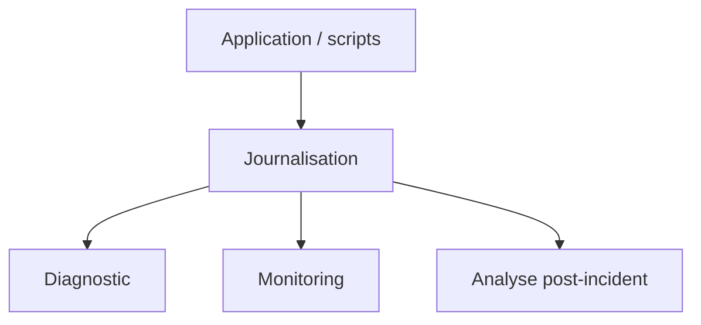

---
## `journalisation.md`
---

# Journalisation

## Objectif de cette section

Cette page présente le rôle de la **journalisation** dans l’exploitation de **ONY**.

Elle vise à expliquer :

- pourquoi les logs sont indispensables ;
- quels types de journaux peuvent exister ;
- comment ils aident au diagnostic ;
- quelles bonnes pratiques adopter pour qu’ils restent réellement utiles.

## Rôle de la journalisation

La journalisation consiste à conserver des traces d’exécution, d’événements ou d’opérations significatives.

Dans ONY, elle joue un rôle central pour :

- comprendre ce qui s’est passé ;
- diagnostiquer une anomalie ;
- suivre un déploiement ;
- vérifier le résultat d’un healthcheck ;
- identifier le moment d’apparition d’un problème.

Sans logs exploitables, le debug devient beaucoup plus lent et incertain.

## Types de journaux concernés

Plusieurs catégories de logs peuvent être utiles dans l’exploitation du projet.

### Logs applicatifs

Ils permettent d’observer ce que fait l’application elle-même.

Ils sont utiles pour repérer :

- une erreur d’exécution ;
- un comportement inattendu ;
- une route qui échoue ;
- un message répété anormalement.

### Logs de déploiement

Ils servent à conserver une trace des opérations réalisées lors de la mise à jour d’une version.

Ils permettent notamment de savoir :

- quand un déploiement a été lancé ;
- quelles étapes ont été passées ;
- à quel moment une erreur s’est produite ;
- si une bascule a bien eu lieu.

### Logs de healthcheck

Ils permettent de garder un historique des vérifications automatiques réalisées après déploiement ou pendant l’exploitation.

Ils sont particulièrement utiles pour confirmer :

- qu’un service répondait encore ;
- qu’un échec s’est produit à un instant précis ;
- qu’une dégradation est apparue après une action donnée.

## Qualité attendue des logs

Un bon log doit être :

- lisible ;
- daté ;
- contextualisé ;
- suffisamment précis ;
- pas inutilement bruyant.

L’objectif n’est pas de tout journaliser, mais de journaliser ce qui aide réellement à comprendre.

## Utilité dans le diagnostic

La journalisation est l’un des premiers outils mobilisés lorsqu’un incident survient.

Elle permet de :

- retrouver l’ordre des événements ;
- relier un symptôme à une opération ;
- isoler une erreur significative ;
- éviter de diagnostiquer à l’aveugle.

Dans beaucoup de cas, les logs constituent le point d’entrée le plus utile pour comprendre un problème.

## Risques d’une mauvaise journalisation

Une journalisation mal pensée devient rapidement peu utile.

Les principaux écueils sont :

- des logs trop pauvres ;
- des logs trop verbeux ;
- l’absence de contexte ;
- des messages non datés ou peu explicites ;
- des erreurs noyées dans du bruit.

Il faut donc chercher un bon niveau de détail, sans excès.

## Lien avec les autres briques d’exploitation

La journalisation complète naturellement :

- le monitoring ;
- les alertes ;
- PM2 ;
- les procédures de diagnostic ;
- le rollback.

Ces briques sont plus efficaces lorsqu’elles reposent sur des traces fiables et lisibles.

## Exemples de journaux utiles

Dans l’écosystème ONY, certains journaux peuvent avoir une importance particulière, notamment :

- les logs applicatifs remontés via PM2 ;
- les logs de déploiement ;
- les logs de healthcheck.

L’important est moins la quantité de fichiers que la capacité à retrouver rapidement l’information pertinente.

## Vue simplifiée

