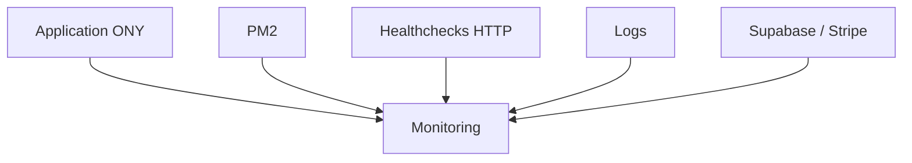

# Monitoring

## Objectif de cette section

Cette page présente la logique de **monitoring** mise en place ou visée pour **ONY**.

L’objectif est d’expliquer :

- ce qu’il faut surveiller ;
- pourquoi cette surveillance est importante ;
- quelles briques peuvent être observées ;
- en quoi le monitoring complète les autres outils d’exploitation.

## Rôle du monitoring

Le monitoring permet de suivre l’état général du projet en exploitation.

Il ne s’agit pas seulement de savoir si un processus tourne, mais de vérifier plus largement si l’application reste exploitable dans de bonnes conditions.

Dans le cadre d’ONY, le monitoring sert notamment à :

- détecter une indisponibilité ;
- repérer un comportement anormal ;
- identifier une dégradation progressive ;
- faciliter le diagnostic en cas d’incident ;
- améliorer la réactivité face à un problème réel.

## Ce qu’il faut surveiller

Le monitoring d’ONY peut s’organiser autour de plusieurs niveaux.

### Disponibilité applicative

Le premier niveau consiste à vérifier que l’application répond réellement.

Cela peut inclure :

- la réponse de la page principale ;
- la disponibilité de certaines routes clés ;
- la présence d’un code HTTP attendu ;
- un temps de réponse raisonnable.

### État du processus

L’application étant supervisée par **PM2**, il est important de surveiller également :

- la présence du processus ;
- les redémarrages anormaux ;
- l’arrêt inattendu du service ;
- les erreurs visibles dans les journaux.

### Santé des dépendances externes

ONY dépend aussi de services externes, notamment :

- **Supabase** ;
- **Stripe**.

Même si ces services ne sont pas hébergés localement, leur indisponibilité ou une mauvaise configuration peut impacter directement le fonctionnement applicatif.

### État du serveur

Un minimum de suivi système reste pertinent, par exemple :

- charge machine ;
- mémoire disponible ;
- espace disque ;
- saturation éventuelle ;
- stabilité générale du conteneur ou de l’hôte.

## Pourquoi le monitoring est nécessaire

Sans monitoring, un incident peut passer inaperçu jusqu’à ce qu’un utilisateur ou l’équipe projet le constate manuellement.

Le monitoring apporte plusieurs bénéfices :

- meilleure visibilité sur l’état réel du service ;
- détection plus rapide des anomalies ;
- capacité à réagir avant qu’un problème ne dure trop longtemps ;
- base plus solide pour comprendre les incidents ;
- meilleure professionnalisation de l’exploitation.

## Monitoring et healthcheck

Dans ONY, le monitoring ne doit pas être limité à une simple lecture d’état système.

Il doit idéalement être complété par des **healthchecks** permettant de vérifier qu’une version déployée répond correctement après mise en ligne.

Cela permet de mieux distinguer :

- un service qui tourne ;
- un service réellement fonctionnel.

## Niveaux de maturité possibles

Le monitoring peut évoluer par étapes.

### Niveau minimal

Le niveau minimal consiste à vérifier :

- que le service répond ;
- que PM2 indique un état correct ;
- que les logs ne montrent pas d’erreur évidente.

### Niveau intermédiaire

À un niveau plus structuré, on peut ajouter :

- des scripts de contrôle automatisés ;
- des checks périodiques ;
- une meilleure lecture des erreurs ;
- des journaux d’état plus propres.

### Niveau avancé

À terme, le monitoring peut intégrer :

- une supervision centralisée ;
- des alertes automatiques ;
- des indicateurs applicatifs plus détaillés ;
- une vision plus continue de la santé du service.

## Ce que le monitoring ne remplace pas

Le monitoring est indispensable, mais il ne remplace pas :

- les tests ;
- les logs ;
- les procédures de diagnostic ;
- les revues post-incident ;
- les vérifications fonctionnelles.

Il constitue une brique de surveillance, pas une preuve absolue de qualité.

## Vue simplifiée

