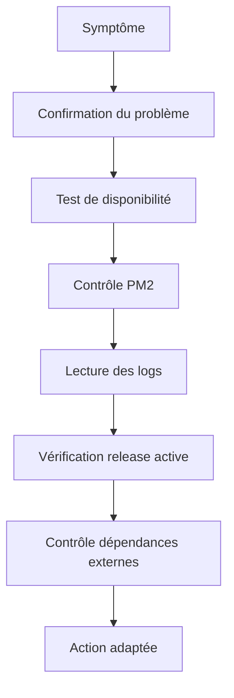

---
## `procedures-de-diagnostic.md`
---

# Procédures de diagnostic

## Objectif de cette section

Cette page décrit une méthode simple et structurée de **diagnostic** pour **ONY**.

L’objectif est de fournir une démarche claire lorsqu’un incident, une anomalie ou un doute apparaît en exploitation.

## Principe général

Lorsqu’un problème survient, il est important de ne pas diagnostiquer au hasard.

Une procédure de diagnostic sert à :

- structurer l’analyse ;
- éviter les conclusions trop rapides ;
- réduire le temps de recherche ;
- limiter les manipulations inutiles ;
- conserver une logique reproductible.

## Point de départ

Un diagnostic commence généralement par un symptôme.

Ce symptôme peut être par exemple :

- une page inaccessible ;
- une erreur visible côté utilisateur ;
- un déploiement qui semble ne pas avoir pris effet ;
- un processus arrêté ;
- un comportement incohérent après une modification.

Le premier travail consiste à qualifier ce symptôme le plus précisément possible.

## Étape 1 — Confirmer le problème

Avant toute action, il faut vérifier que le problème est réel, reproductible et actuel.

Cela implique notamment de répondre à quelques questions simples :

- que se passe-t-il exactement ?
- depuis quand ?
- sur quel environnement ?
- le problème est-il permanent ou intermittent ?
- concerne-t-il tout le service ou une partie seulement ?

Cette étape évite de diagnostiquer un problème flou ou déjà disparu.

## Étape 2 — Vérifier la disponibilité applicative

Le premier contrôle concret consiste à vérifier si l’application répond.

Il faut déterminer :

- si le service est joignable ;
- si le domaine répond correctement ;
- si le code HTTP est cohérent ;
- si la page ou la route attendue est réellement accessible.

Cela permet de distinguer rapidement :

- une indisponibilité totale ;
- un problème partiel ;
- un défaut plus fonctionnel qu’infrastructurel.

## Étape 3 — Contrôler le processus

Si l’application ne répond pas ou répond mal, il faut vérifier l’état du processus supervisé par PM2.

L’objectif est de savoir :

- si le processus tourne ;
- s’il a crashé ;
- s’il redémarre en boucle ;
- s’il semble stable.

Cette étape aide à déterminer si le problème vient de l’exécution applicative elle-même.

## Étape 4 — Lire les logs

Les logs constituent l’une des sources les plus importantes dans un diagnostic.

Il faut consulter en priorité :

- les logs applicatifs ;
- les logs de déploiement ;
- les logs de healthcheck ;
- les éventuels messages remontés par les scripts.

La lecture des logs doit être chronologique et contextualisée.

Il faut chercher :

- la première erreur significative ;
- le moment où le problème apparaît ;
- la répétition éventuelle d’un même message ;
- le lien entre une opération récente et le symptôme observé.

## Étape 5 — Vérifier la version active

En cas de doute après déploiement, il faut contrôler :

- la release active ;
- la cohérence du lien `current` ;
- la présence de la version attendue ;
- l’état général de l’arborescence.

Cette étape est importante pour éviter de diagnostiquer une mauvaise version déployée comme un bug applicatif.

## Étape 6 — Examiner le contexte externe

Si le processus tourne et que les logs locaux ne suffisent pas, il faut vérifier les dépendances externes.

Dans le cas d’ONY, cela peut concerner :

- Supabase ;
- Stripe ;
- la configuration réseau ;
- les variables d’environnement ;
- un problème de domaine ou d’exposition.

## Étape 7 — Décider de l’action

Une fois la cause probable identifiée, plusieurs réponses sont possibles :

- corriger immédiatement ;
- redémarrer le service ;
- relancer une vérification ;
- revenir à une version précédente ;
- documenter l’incident pour traitement plus structuré.

L’important est de ne pas multiplier les actions simultanées sans logique.

## Bonnes pratiques de diagnostic

Une bonne procédure de diagnostic repose sur quelques principes simples :

- partir du symptôme réel ;
- aller du plus probable au plus vérifiable ;
- éviter les manipulations destructives trop tôt ;
- lire les logs avant de modifier ;
- garder une trace de ce qui a été testé.

## Erreurs fréquentes à éviter

Certaines erreurs compliquent inutilement les diagnostics :

- redémarrer immédiatement sans lecture préalable ;
- modifier plusieurs éléments à la fois ;
- oublier l’environnement concerné ;
- conclure trop vite à un problème de code ;
- ne pas vérifier la version réellement active.

## Vue simplifiée

