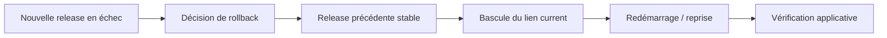

---
## `rollback.md`
---

# Rollback

## Objectif de cette section

Cette page présente le principe de **rollback** dans l’exploitation de **ONY**.

L’objectif est d’expliquer :

- ce qu’est un rollback ;
- dans quels cas il peut être nécessaire ;
- sur quoi il repose techniquement ;
- pourquoi il constitue une sécurité importante dans le cycle de déploiement.

## Définition

Un rollback consiste à revenir à une version précédente de l’application lorsqu’une version nouvellement déployée provoque un problème.

Cette opération permet de restaurer plus rapidement un état fonctionnel connu, sans attendre nécessairement une correction immédiate de la version défaillante.

## Pourquoi le rollback est important

Le rollback est un mécanisme essentiel dans une logique d’exploitation sérieuse.

Il permet :

- de limiter la durée d’un incident ;
- de réduire l’impact d’un déploiement problématique ;
- de restaurer un service stable plus rapidement ;
- de conserver une marge de sécurité lors des mises en ligne.

Il s’inscrit directement dans la logique de déploiement atomique mise en place dans l’infrastructure.

## Lien avec les releases

Le rollback est rendu possible par l’organisation en releases distinctes.

Puisque chaque version déployée est stockée séparément, il devient possible de :

- identifier une version antérieure stable ;
- rebasculer le lien symbolique `current` ;
- redémarrer l’application sur cette version précédente.

Cette approche rend le retour arrière plus propre qu’un écrasement manuel.

## Cas typiques de rollback

Un rollback peut être envisagé dans plusieurs situations :

- l’application ne démarre pas correctement après déploiement ;
- une fonctionnalité critique est cassée ;
- une erreur importante apparaît immédiatement après mise en ligne ;
- un healthcheck échoue après publication ;
- un comportement grave est constaté en production.

Le rollback ne remplace pas la correction, mais il permet de restaurer le service plus vite.

## Décision de rollback

Le rollback doit rester une décision raisonnée.

Il faut éviter de revenir en arrière sans vérifier au minimum :

- le symptôme observé ;
- la version déployée ;
- le lien temporel entre le déploiement et l’incident ;
- la disponibilité d’une version antérieure réputée stable.

L’objectif n’est pas de rollbacker au moindre doute, mais de le faire lorsque cela constitue la réponse la plus sûre et la plus rapide.

## Étapes générales

La logique générale d’un rollback est la suivante :

1. identifier qu’une version récemment déployée pose problème ;
2. confirmer qu’une release antérieure exploitable existe ;
3. rebasculer le lien `current` vers cette release ;
4. relancer ou reprendre l’exécution applicative ;
5. vérifier que l’application répond à nouveau correctement.

## Vérifications après rollback

Après un rollback, il ne suffit pas de constater que le processus tourne.

Il faut vérifier :

- que l’application répond ;
- que la bonne version est bien active ;
- que les fonctionnalités critiques sont revenues à un état acceptable ;
- que les logs ne montrent pas d’anomalie persistante.

Cette étape est indispensable pour confirmer le succès réel du retour arrière.

## Limites

Le rollback est très utile, mais il a aussi des limites.

Il ne garantit pas à lui seul :

- la résolution d’un problème externe ;
- la compatibilité avec un changement non réversible ;
- la disparition immédiate de toutes les erreurs ;
- la correction de données déjà impactées.

C’est une solution opérationnelle de restauration, pas une analyse de fond du problème.

## Place dans l’exploitation

Le rollback s’articule avec :

- le pipeline de déploiement ;
- le déploiement atomique ;
- les logs ;
- le monitoring ;
- les procédures de diagnostic.

Il constitue une réponse rapide lorsqu’un changement récent a dégradé le service.

## Vue simplifiée

