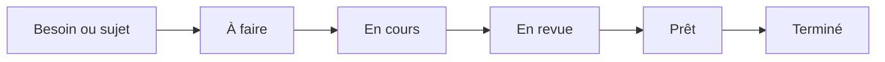

---
## `board-et-statuts.md`
---

# Board et statuts

## Objectif de cette section

Cette page présente la logique du **board projet** et des **statuts de suivi** utilisés pour **ONY**.

Elle permet d’expliquer :

- comment les tâches sont organisées ;
- à quoi servent les différents statuts ;
- pourquoi ce suivi est utile ;
- comment il s’articule avec le workflow Git.

## Rôle du board

Le board permet de visualiser l’avancement du projet de manière simple et opérationnelle.

Il sert notamment à :

- lister les sujets à traiter ;
- prioriser les travaux ;
- suivre ce qui est en cours ;
- distinguer ce qui reste à faire de ce qui est terminé ;
- améliorer la lisibilité du projet au quotidien.

Il constitue un outil de pilotage léger mais structurant.

## Intérêt des statuts

Les statuts associés au board servent à représenter l’état réel d’un sujet dans le cycle de travail.

Ils permettent de mieux comprendre :

- ce qui n’a pas encore commencé ;
- ce qui est en cours ;
- ce qui est en attente de validation ;
- ce qui peut être considéré comme terminé.

Sans statuts clairs, le board perd rapidement sa valeur de pilotage.

## Logique générale attendue

Dans un workflow projet structuré, les statuts doivent refléter le chemin réel d’une tâche.

Une logique simple peut s’appuyer sur des états du type :

- à faire ;
- en cours ;
- en revue ;
- prêt ;
- terminé.

L’important n’est pas seulement le nom du statut, mais le fait qu’il ait un sens opérationnel clair.

## Lien avec Git et les Merge Requests

Le board ne doit pas être déconnecté du reste du workflow.

Il doit rester cohérent avec :

- les branches de travail ;
- les Merge Requests ;
- les validations ;
- les mises en ligne.

Une tâche marquée comme terminée doit idéalement correspondre à un état réel du projet, et pas seulement à une impression d’avancement.

## Ce que le board apporte au projet

Un board bien utilisé apporte plusieurs bénéfices :

- meilleure vision d’ensemble ;
- priorisation plus simple ;
- réduction de l’oubli des sujets ;
- continuité de travail plus lisible ;
- meilleur suivi de l’avancement réel.

Il aide aussi à garder une trace de la dynamique du projet dans le temps.

## Risques d’un mauvais usage

Un board peut vite perdre son intérêt si :

- les statuts ne sont pas mis à jour ;
- les colonnes ne correspondent à rien de concret ;
- trop d’éléments stagnent sans clarification ;
- les tâches sont floues ;
- l’outil devient décoratif au lieu d’être opérationnel.

Il doit donc rester simple, lisible et ancré dans le travail réel.

## Place dans le workflow ONY

Le board joue un rôle de pilotage entre l’idée et la mise en production.

