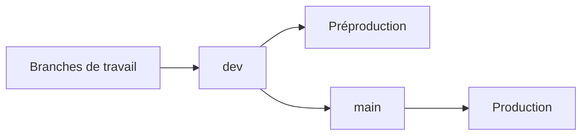

---
## `branches.md`

---

# Stratégie de branches

## Objectif de cette section

Cette page présente la logique de **branches Git** utilisée pour **ONY**.

Elle permet de comprendre :

- pourquoi les branches sont structurantes dans le projet ;
- quel rôle joue chaque branche principale ;
- comment elles s’articulent avec les environnements ;
- en quoi elles participent à la qualité du cycle de développement.

## Principe général

Les branches permettent de séparer les états du projet selon leur niveau de stabilité et leur usage.

Dans ONY, elles jouent un rôle central pour distinguer :

- le travail en cours ;
- les évolutions en validation ;
- la version stable exposée.

Cette organisation évite de confondre expérimentation, intégration et publication.

## Branches principales

La documentation d’infrastructure établit déjà un lien clair entre branches et environnements :

 - `dev` pour la **préproduction** ;
 - `main` pour la **production**.

Cette relation est importante, car elle relie directement le workflow Git au fonctionnement réel de l’infrastructure.

## Branche `dev`

La branche `dev` sert de point d’intégration pour les évolutions en cours de validation.

Elle a vocation à regrouper :

- les nouvelles fonctionnalités ;
- les correctifs en attente de stabilisation ;
- les changements destinés à être vérifiés en préproduction.

Elle représente donc une branche active, évolutive, mais pas encore considérée comme version de référence publique.

## Branche `main`

La branche `main` correspond à la version stable destinée à la production.

Elle doit rester plus contrôlée, car elle reflète l’état de référence du projet exposé publiquement.

Les changements qui y arrivent doivent donc avoir déjà passé un niveau suffisant de vérification.

## Branches de travail

Autour des branches principales, des branches de travail peuvent être utilisées pour développer une fonctionnalité, corriger un problème ou isoler une évolution spécifique.

Cette pratique permet :

- de travailler proprement ;
- de limiter les conflits ;
- de préserver `dev` et `main` ;
- de mieux relire les changements avant intégration.

## Intérêt de cette stratégie

Une stratégie de branches claire apporte plusieurs bénéfices :

- meilleure lisibilité du cycle de développement ;
- alignement plus simple avec les environnements ;
- intégration progressive des changements ;
- réduction du risque d’envoyer trop tôt un code instable en production.

Elle constitue une base importante pour un workflow de projet propre.

## Lien avec la préproduction et la production

Le lien entre branches et environnements est un point structurant du projet.

Il permet de dire concrètement :

- ce qui est en cours de validation ;
- ce qui est réellement publié ;
- quelle branche doit être observée selon l’environnement concerné.

Cette cohérence entre Git et l’exploitation renforce la compréhension globale du système.

## Bonnes pratiques

Quelques règles simples permettent de garder une stratégie de branches saine :

- éviter les commits directs désorganisés sur `main` ;
- limiter les écarts trop longs entre branches ;
- intégrer les changements avec une logique claire ;
- maintenir un passage lisible entre développement, validation et publication.

## Vue simplifiée

