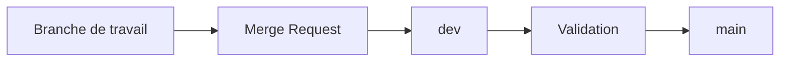

---
## `merge-requests.md`
---

# Merge Requests

## Objectif de cette section

Cette page présente le rôle des **Merge Requests** dans le workflow de **ONY**.

L’objectif est d’expliquer :

- pourquoi elles sont importantes ;
- à quoi elles servent concrètement ;
- comment elles améliorent l’intégration des changements ;
- en quoi elles participent à la qualité du projet.

## Définition

Une Merge Request permet de proposer l’intégration d’une branche dans une autre, de manière explicite et relisible.

Elle offre un cadre de validation avant fusion.

Dans un projet comme ONY, elle permet de ne pas faire transiter les évolutions de manière opaque ou brutale entre les branches.

## Rôle dans le projet

Les Merge Requests servent notamment à :

- présenter un changement ;
- garder une trace claire de ce qui est modifié ;
- relire avant intégration ;
- structurer le passage entre branches ;
- faciliter le lien entre développement, validation et publication.

Elles participent donc à la discipline globale du workflow.

## Pourquoi elles sont utiles

L’intérêt principal d’une Merge Request n’est pas seulement de fusionner du code.

Elle permet aussi de :

- documenter l’intention d’une évolution ;
- centraliser les remarques ;
- mieux comprendre un changement après coup ;
- éviter certaines intégrations trop rapides ou mal relues.

Dans un projet qui évolue régulièrement, cette étape améliore fortement la lisibilité.

## Lien avec les branches

Dans la stratégie actuelle, les Merge Requests jouent un rôle logique entre :

- les branches de travail ;
- `dev` ;
- éventuellement `main`.

Elles matérialisent donc les passages importants du cycle de vie du code.

## Ce qu’une Merge Request devrait idéalement contenir

Une Merge Request utile doit rester claire et exploitable.

Elle devrait permettre de comprendre :

- ce qui a changé ;
- pourquoi le changement a été fait ;
- quel impact il peut avoir ;
- comment il a été vérifié ;
- ce qu’il faudra surveiller après intégration si nécessaire.

Même dans un petit projet, cette discipline améliore beaucoup la maintenance future.

## Apport pour la qualité

Les Merge Requests soutiennent directement la qualité du projet, car elles favorisent :

- la relecture ;
- l’explicitation des changements ;
- une meilleure traçabilité ;
- une intégration plus maîtrisée.

Elles sont particulièrement utiles lorsqu’un changement touche :

- l’infrastructure ;
- le déploiement ;
- les parcours critiques ;
- la sécurité ;
- les dépendances externes.

## Limites

Une Merge Request ne garantit pas à elle seule la qualité d’un changement.

Elle reste un cadre de validation, mais elle doit être accompagnée par :

- des tests ;
- une vérification fonctionnelle ;
- un minimum de relecture réelle ;
- une bonne compréhension du contexte.

Sans cela, elle peut devenir une simple formalité.

## Place dans le workflow ONY

Les Merge Requests s’insèrent naturellement dans la logique suivante :

