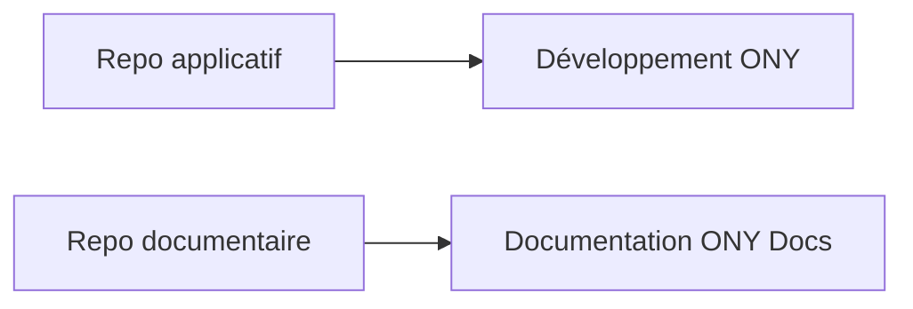

# Repositories

## Objectif de cette section

Cette page présente l’organisation des **dépôts Git** utilisés dans le cadre du projet **ONY**.

L’objectif est de clarifier :

- quels dépôts existent ;
- leur rôle respectif ;
- pourquoi cette séparation est utile ;
- comment ils s’insèrent dans le workflow global du projet.

## Principe général

Le projet ONY s’appuie sur une séparation claire entre plusieurs espaces de travail versionnés.

Cette séparation permet de distinguer :

- le code applicatif ;
- la documentation ;
- les logiques de contribution ;
- les flux de publication.

Elle évite de mélanger dans un même dépôt des contenus ayant des cycles de vie, des usages et des contraintes différents.

## Dépôt applicatif

Le premier dépôt principal est le dépôt de l’application.

Il contient notamment :

- le code source de l’application ;
- les composants frontend ;
- les éléments liés à l’exécution ;
- les scripts utiles au fonctionnement et au déploiement ;
- les fichiers de configuration techniques.

Ce dépôt constitue la base de développement du produit ONY.

Dans la configuration actuelle de la documentation, ce dépôt est référencé comme dépôt GitLab applicatif.

## Dépôt documentaire

Le second dépôt principal est le dépôt de documentation.

Il contient :

- les pages Docusaurus ;
- la structure de navigation ;
- les fichiers de configuration de la documentation ;
- les contenus techniques, fonctionnels et d’exploitation ;
- les éléments destinés à capitaliser le fonctionnement du projet.

Ce dépôt permet de faire évoluer la documentation indépendamment du code applicatif.

Il est lui aussi explicitement référencé dans la configuration actuelle de la documentation.

## Pourquoi séparer application et documentation

La séparation des dépôts présente plusieurs avantages :

- meilleure lisibilité ;
- maintenance facilitée ;
- historique plus propre ;
- contributions mieux ciblées ;
- réduction du bruit dans les commits.

Le code source et la documentation n’évoluent pas toujours au même rythme, ni selon les mêmes priorités.
Les dissocier permet donc une gestion plus claire du projet.

## Cohérence avec la documentation ONY

La structure Docusaurus confirme que le dépôt documentaire est une brique à part entière du projet, et pas un simple ajout secondaire. Le site est configuré comme une documentation technique, fonctionnelle et d’exploitation du projet ONY.

Cette séparation s’inscrit donc dans une logique documentaire assumée.

## Bonnes pratiques attendues

L’organisation en plusieurs dépôts suppose quelques règles simples :

- chaque dépôt doit avoir un périmètre clair ;
- les modifications doivent être faites dans le bon espace ;
- les messages de commit doivent rester explicites ;
- les liens entre code et doc doivent être maintenus ;
- la documentation doit suivre les évolutions réellement en place.

## Point d’attention

Le projet conserve encore un héritage de nommage lié à **Uvents**, visible dans certains noms de dépôts, URLs ou références historiques. Cela ne remet pas en cause l’organisation actuelle, mais il faut garder à l’esprit que :

- le nom métier et documentaire de référence est **ONY** ;
- certaines traces techniques plus anciennes peuvent encore utiliser **Uvents**.

## Vue simplifiée

