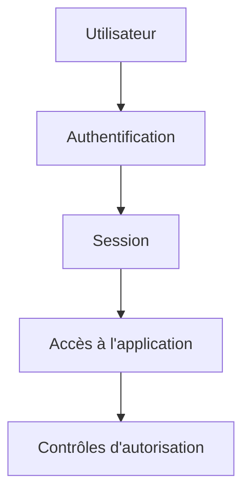

# Authentification

## Objectif de cette section

Cette page présente l’**authentification** sous l’angle de la **sécurité** dans le projet **ONY**.

L’objectif n’est pas de décrire les écrans ou les parcours applicatifs de connexion, mais d’expliquer :

- le rôle de l’authentification dans la protection du système ;
- les garanties attendues ;
- les points de vigilance ;
- son articulation avec la gestion de session et le contrôle d’accès.

## Définition

L’authentification consiste à vérifier qu’un utilisateur est bien celui qu’il prétend être.

Elle représente la première barrière logique d’accès à l’application et conditionne l’ouverture d’une session sécurisée.

Dans ONY, elle constitue donc une brique essentielle de la protection des espaces utilisateurs, des données personnelles et des actions sensibles.

## Rôle de sécurité

Du point de vue sécurité, l’authentification permet de :

- limiter l’accès aux fonctionnalités réservées ;
- empêcher un accès non autorisé à des données privées ;
- associer les actions à une identité reconnue ;
- poser la base des contrôles d’autorisation ;
- réduire le risque d’accès anonyme à des zones protégées.

Elle ne suffit pas à elle seule à sécuriser toute l’application, mais elle reste un prérequis fondamental.

## Authentification et session

Une authentification réussie ne vaut que si elle débouche sur une gestion de session cohérente.

Cela implique notamment :

- une session correctement créée ;
- une conservation maîtrisée de l’état de connexion ;
- une invalidation correcte lors de la déconnexion ;
- une vérification fiable du statut authentifié côté application.

Un système d’authentification n’est réellement solide que si la session qui en découle est elle-même correctement gérée.

## Points de vigilance

Plusieurs points de vigilance doivent être pris en compte.

### Protection des identifiants

Les informations sensibles liées à l’authentification ne doivent jamais être exposées inutilement.

Cela implique notamment :

- de ne pas stocker d’informations sensibles en clair ;
- de ne pas journaliser des données confidentielles ;
- de limiter la diffusion de tout élément permettant d’usurper une identité.

### Robustesse du mécanisme

Le mécanisme retenu doit éviter les faiblesses classiques, par exemple :

- sessions non invalidées ;
- contrôles insuffisants côté client ;
- dépendance à une simple apparence d’état connecté ;
- absence de vérification réelle côté backend ou service de données.

### Cohérence des contrôles

Une zone protégée ne doit pas être considérée comme sécurisée uniquement parce qu’elle n’est pas visible dans l’interface.

La sécurité doit reposer sur un vrai contrôle d’accès et non sur une simple dissimulation dans le frontend.

## Risques couverts

Une authentification correctement implémentée aide à réduire plusieurs risques :

- accès non autorisé à un compte ;
- consultation illégitime de données personnelles ;
- usurpation d’identité applicative ;
- usage de fonctionnalités réservées sans droit réel ;
- confusion entre utilisateur connecté et utilisateur autorisé.

## Ce que l’authentification ne couvre pas seule

L’authentification ne doit pas être confondue avec la sécurité complète de l’application.

Elle ne garantit pas à elle seule :

- qu’un utilisateur a le droit d’accéder à toutes les ressources ;
- qu’une donnée affichée est correctement filtrée ;
- qu’un secret applicatif est protégé ;
- qu’une action métier sensible est correctement encadrée.

Elle doit être complétée par :

- l’autorisation ;
- la gestion des secrets ;
- la protection des variables d’environnement ;
- la limitation de l’exposition réseau ;
- la protection des données sensibles.

## Bonnes pratiques

Les bonnes pratiques attendues autour de l’authentification sont les suivantes :

- ne jamais se reposer uniquement sur le frontend ;
- vérifier réellement l’état d’authentification ;
- limiter l’exposition d’informations sensibles ;
- bien gérer la création et la fin de session ;
- documenter clairement le périmètre protégé.

## Lien avec le reste de la sécurité

Dans la structure documentaire, l’authentification ne doit pas être vue comme un sujet isolé.

Elle s’inscrit dans un ensemble plus large comprenant :

- l’autorisation ;
- les secrets et variables d’environnement ;
- la sécurité du paiement ;
- la protection des données personnelles ;
- l’exposition réseau.

Elle constitue la première étape logique, mais pas la seule.

## Vue simplifiée

